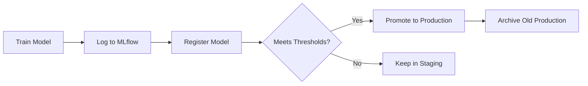
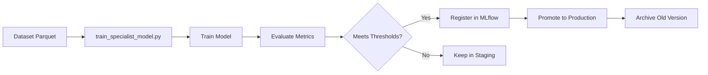
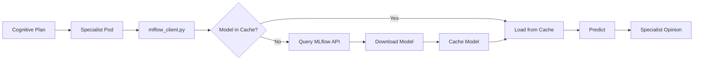
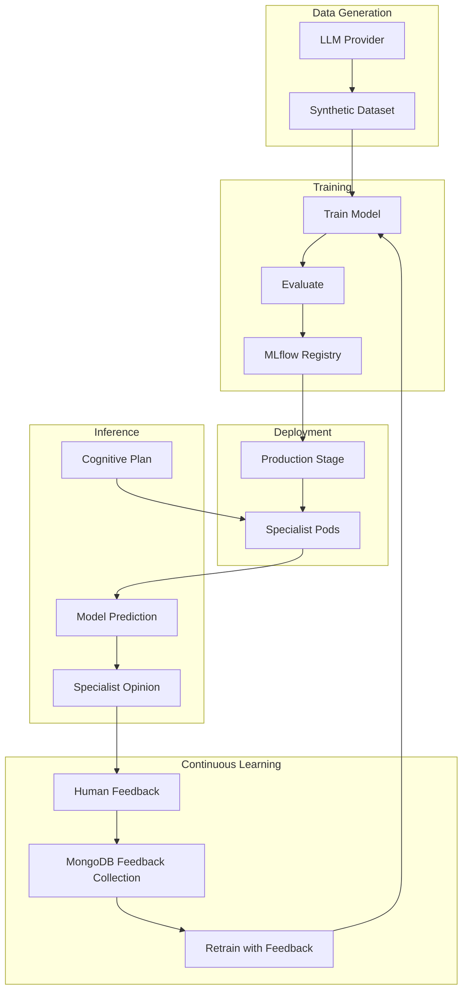

# ML Pipeline - Neural Hive Mind Specialist Models

## 1. Visão Geral

O Neural Hive Mind utiliza um pipeline de Machine Learning para treinar e gerenciar modelos de avaliação para 5 especialistas distintos:

- **Technical Specialist**: Avalia viabilidade técnica e complexidade de implementação
- **Business Specialist**: Analisa valor de negócio, ROI e alinhamento estratégico
- **Behavior Specialist**: Avalia UX, comportamento do usuário e usabilidade
- **Evolution Specialist**: Analisa escalabilidade, manutenibilidade e débito técnico
- **Architecture Specialist**: Avalia design de arquitetura, padrões e integração

### Arquitetura de Treinamento/Inferência

Cada especialista utiliza modelos de Machine Learning (Random Forest, Gradient Boosting ou Neural Networks) para avaliar planos cognitivos e emitir opiniões estruturadas. Os modelos são:

- **Treinados** com datasets sintéticos gerados por LLMs (GPT-4, Claude, Ollama)
- **Versionados** e **rastreados** no MLflow Model Registry
- **Promovidos** automaticamente quando atingem thresholds de qualidade
- **Carregados** em runtime pelos pods de especialistas via `mlflow_client.py`
- **Validados** continuamente com feedback humano (continuous learning)

## 2. Quick Start

### CLI Unificado (Recomendado)

O CLI `ml.sh` consolida todas as operacoes ML em um unico ponto de entrada:

```bash
# Gerar datasets
./ml.sh generate-dataset --all

# Treinar todos os modelos
./ml.sh train --all

# Validar modelos
./ml.sh validate --all

# Verificar status
./ml.sh status --all --verbose

# Promover modelo
./ml.sh promote --model technical-evaluator --version 3

# Re-treinar com feedback
./ml.sh retrain --specialist business --hyperparameter-tuning

# Rollback
./ml.sh rollback --specialist evolution --reason "Alta latencia"
```

### Scripts Individuais (Legado)

> **AVISO**: Os scripts individuais estao sendo descontinuados. Use `ml.sh` acima.

```bash
# Gerar Datasets com IA
cd ml_pipelines/training
./generate_all_datasets.sh

# Treinar Todos os Modelos
./train_all_specialists.sh

# Validar Modelos Carregados
./validate_models_loaded.sh

# Verificar Status dos Modelos
cd ml_pipelines/scripts
./check_model_status.sh --all
```

### Mapeamento de Scripts Antigos para CLI

| Script Antigo | Comando Novo |
|---------------|--------------|
| `train_all_specialists.sh` | `ml.sh train --all` |
| `train_specialist_model.py --specialist-type TYPE` | `ml.sh train --specialist TYPE` |
| `retrain_specialist.sh --specialist TYPE` | `ml.sh retrain --specialist TYPE` |
| `check_model_status.sh --all` | `ml.sh status --all` |
| `rollback_model.sh --specialist TYPE` | `ml.sh rollback --specialist TYPE` |
| `generate_all_datasets.sh` | `ml.sh generate-dataset --all` |
| `validate_models_loaded.sh` | `ml.sh validate --all` |

## 3. Geração de Datasets com IA

Os datasets de treinamento são gerados **sinteticamente** usando LLMs (Large Language Models) para criar exemplos realistas de planos cognitivos e suas avaliações esperadas.

### Providers Suportados

- **OpenAI** (GPT-4, GPT-3.5-turbo): Melhor qualidade, requer API key
- **Anthropic** (Claude): Alta qualidade, alternativa ao OpenAI
- **Ollama** (Llama 3, Mistral, etc.): Gratuito, execução local

### Estrutura de Features

Cada exemplo gerado contém **26+ dimensões** de features estruturadas:

**Technical Features** (9):
- `complexity_score`, `technical_debt`, `code_quality`, `test_coverage`
- `performance_impact`, `security_risk`, `integration_complexity`
- `technical_feasibility`, `tech_stack_alignment`

**Business Features** (8):
- `business_value`, `roi_score`, `strategic_alignment`, `market_demand`
- `competitive_advantage`, `revenue_impact`, `cost_efficiency`, `customer_satisfaction`

**Behavioral Features** (5):
- `user_experience`, `accessibility`, `usability_score`, `user_engagement`
- `adoption_rate`

**Evolution Features** (4):
- `scalability`, `maintainability`, `extensibility`, `future_proof`

Veja [training/README_DATASET_GENERATION.md](training/README_DATASET_GENERATION.md) para detalhes completos sobre prompts, schemas e distribuição de labels.

### Labels e Distribuição Recomendada

Cada exemplo é rotulado com uma das 4 recomendações:

- **approve** (40%): Plano de alta qualidade, pronto para execução
- **approve_with_conditions** (30%): Bom, mas requer ajustes menores
- **review_required** (20%): Necessita revisão mais profunda
- **reject** (10%): Não viável ou de baixa qualidade

### Comandos Básicos

```bash
# Gerar dataset para um especialista específico
cd ml_pipelines/training
python3 generate_training_datasets.py \
  --specialist-type technical \
  --provider openai \
  --num-examples 1000

# Gerar todos os datasets de uma vez
./generate_all_datasets.sh
```

**Referência completa**: [training/README_DATASET_GENERATION.md](training/README_DATASET_GENERATION.md)

## 4. Treinamento de Modelos

### Convenção de Nomes

- **Modelos**: `{specialist_type}-evaluator` (ex: `technical-evaluator`)
- **Experimentos MLflow**: `{specialist_type}-specialist` (ex: `technical-specialist`)

### Thresholds de Promoção

Para um modelo ser promovido automaticamente para **Production**, ele deve atingir:

| Métrica | Threshold |
|---------|-----------|
| **Precision** | ≥ 0.75 |
| **Recall** | ≥ 0.70 |
| **F1 Score** | ≥ 0.72 |
| **Improvement** | ≥ 5% vs baseline |

Se já existe um modelo em Production, o novo modelo deve ser **pelo menos 5% melhor** em F1 score.

### Tipos de Modelos Suportados

- **random_forest** (default): Robusto, rápido, bom para features categóricas
- **gradient_boosting**: Melhor accuracy, mais lento
- **neural_network**: Para datasets grandes (>10k exemplos)

### Scripts Disponíveis

#### Treinar Modelo Individual
```bash
cd ml_pipelines/training
python3 train_specialist_model.py \
  --specialist-type technical \
  --model-type random_forest \
  --hyperparameter-tuning
```

#### Treinar Todos os Especialistas
```bash
cd ml_pipelines/training
./train_all_specialists.sh
```

#### Re-treinar com Opções Customizadas
```bash
cd ml_pipelines/scripts
./retrain_specialist.sh \
  --specialist technical \
  --model-type gradient_boosting \
  --hyperparameter-tuning
```

### Integração com MLflow

Durante o treinamento:

1. **Tracking**: Métricas, parâmetros e artefatos são logados no MLflow
2. **Model Registry**: Modelo é registrado como `{specialist}-evaluator`
3. **Auto-promotion**: Se thresholds forem atingidos, modelo vai para **Production**
4. **Baseline Comparison**: Compara com versão atual em Production (se existir)

Localização: `http://mlflow.mlflow:5000`

## 5. Registro e Promoção no MLflow

### Fluxo de Registro de Modelos



### Stages do MLflow

- **Production**: Modelo ativo, carregado pelos especialistas em runtime
- **Staging**: Modelo candidato, aguardando promoção
- **Archived**: Versões antigas, preservadas para histórico/rollback

### Critérios de Promoção Automática

Um modelo é promovido automaticamente se:

1. **Thresholds absolutos** são atingidos (precision ≥ 0.75, recall ≥ 0.70, f1 ≥ 0.72)
2. **Melhoria relativa** ≥ 5% vs baseline (se já existe modelo em Production)
3. **Sem degradação** em nenhuma métrica crítica

### Promoção Manual via MLflow UI

Se um modelo em Staging for promissor mas não atingiu auto-promoção:

```bash
# Port-forward para acessar MLflow UI
kubectl port-forward -n mlflow svc/mlflow 5000:5000

# Acesse http://localhost:5000
# Navegue até Models > {specialist}-evaluator > Version X
# Clique em "Transition to" > "Production"
```

### Localização do MLflow

- **Namespace Kubernetes**: `mlflow`
- **Service**: `mlflow.mlflow:5000`
- **UI**: `http://mlflow.mlflow:5000` (dentro do cluster)
- **Port-forward**: `kubectl port-forward -n mlflow svc/mlflow 5000:5000`

## 6. Scripts de Manutenção

Utilitários bash em `ml_pipelines/scripts/` para operações comuns:

### check_model_status.sh

Verifica status de modelos no MLflow (versões, stages, métricas).

```bash
# Verificar todos os especialistas
./check_model_status.sh --all

# Verificar especialista específico com detalhes
./check_model_status.sh --specialist technical --verbose

# Output JSON para parsing
./check_model_status.sh --all --format json
```

**Funcionalidades**:
- Lista versões em Production, Staging, Archived
- Mostra métricas (precision, recall, f1, accuracy)
- Compara versões e recomenda promoção
- Health check integrado (MLflow + pods K8s)

### retrain_specialist.sh

Re-treina especialista específico com opções customizadas.

```bash
# Re-treinar technical com defaults
./retrain_specialist.sh --specialist technical

# Re-treinar com hyperparameter tuning
./retrain_specialist.sh --specialist business \
  --hyperparameter-tuning \
  --model-type gradient_boosting

# Forçar re-treino sem promoção automática
./retrain_specialist.sh --specialist behavior \
  --force-retrain \
  --promote-if-better false
```

**Funcionalidades**:
- Pre-flight checks (MLflow, MongoDB, datasets)
- Análise de necessidade de re-treino
- Comparação pós-treinamento com baseline
- Logging e auditoria
- Sugestão de restart de pods

### rollback_model.sh

Faz rollback de modelo em Production para versão anterior.

```bash
# Rollback para versão anterior
./rollback_model.sh --specialist technical \
  --reason "High latency in production"

# Rollback para versão específica
./rollback_model.sh --specialist business \
  --to-version 3 \
  --reason "Regression in accuracy"

# Rollback de todos os especialistas (emergência)
./rollback_model.sh --all \
  --reason "Emergency rollback after deployment"
```

**Funcionalidades**:
- Validações pré-rollback (versão existe, métricas)
- Análise de impacto (comparação de métricas)
- Confirmação interativa (desabilitável com `--force`)
- Auditoria completa (logs + tags no MLflow)
- Sugestão de restart de pods

## 7. Validação e Troubleshooting

### Validar Modelos Carregados

```bash
cd ml_pipelines/training
./validate_models_loaded.sh
```

Verifica se:
- Pods de especialistas estão rodando (1/1 Ready)
- Endpoint `/status` retorna `model_loaded: true`
- Versão do modelo em memória corresponde à versão em Production no MLflow

### Problemas Comuns e Soluções

#### 🔴 MLflow Não Conectado

**Sintoma**: Logs mostram `Failed to connect to MLflow` ou timeout

**Diagnóstico**:
```bash
# Verificar se MLflow está rodando
kubectl get pods -n mlflow

# Testar conectividade
curl -f http://mlflow.mlflow:5000/health
```

**Solução**:
```bash
# Reiniciar MLflow
kubectl rollout restart deployment/mlflow -n mlflow

# Verificar logs
kubectl logs -n mlflow deployment/mlflow --tail=50
```

#### 🔴 Modelo Não Carregado pelo Especialista

**Sintoma**: `/status` retorna `model_loaded: false`

**Diagnóstico**:
```bash
# Verificar logs do especialista
kubectl logs -n semantic-translation deployment/specialist-technical --tail=100 | grep -i "model"

# Verificar se modelo existe no MLflow
ml_pipelines/scripts/check_model_status.sh --specialist technical
```

**Solução**:
```bash
# Reiniciar pod para forçar reload
kubectl rollout restart deployment/specialist-technical -n semantic-translation

# Verificar carregamento após restart
ml_pipelines/training/validate_models_loaded.sh
```

#### 🔴 Specialist Technical 0/1 NOT READY

**Sintoma**: Pod nunca fica Ready, restart loops

**Diagnóstico**: Veja análise completa em `/tmp/ANALISE_SPECIALIST_TECHNICAL.md`

**Causas Comuns**:
- Liveness probe falhando (MongoDB não acessível)
- Model loading timeout
- Dependências faltando (protobuf, grpcio)

**Solução Rápida**:
```bash
# Verificar eventos do pod
kubectl describe pod -n semantic-translation -l app=specialist-technical

# Verificar logs de startup
kubectl logs -n semantic-translation -l app=specialist-technical --tail=200

# Ajustar probes se necessário (values.yaml)
```

#### 🔴 Datasets Ausentes

**Sintoma**: `train_specialist_model.py` falha com `FileNotFoundError`

**Solução**:
```bash
# Gerar datasets
cd ml_pipelines/training
./generate_all_datasets.sh

# Verificar arquivos gerados
ls -lh /data/training/specialist_*.parquet
```

### Comandos de Diagnóstico

```bash
# Status geral do cluster
kubectl get pods -A | grep -E "(mlflow|specialist|semantic)"

# Health checks de especialistas
for specialist in technical business behavior evolution architecture; do
  kubectl exec -n semantic-translation deployment/specialist-$specialist -- \
    curl -s http://localhost:8080/status | jq .
done

# Queries MLflow API
curl -s http://mlflow.mlflow:5000/api/2.0/mlflow/registered-models/list | jq .

# Logs de treinamento
tail -f ml_pipelines/scripts/logs/retrain_*.log
```

### Referências de Troubleshooting

- [/tmp/ANALISE_SPECIALIST_TECHNICAL.md](../../tmp/ANALISE_SPECIALIST_TECHNICAL.md): Análise profunda do Specialist Technical NOT READY
- [OPERATIONAL_GUIDE.md](../OPERATIONAL_GUIDE.md): Guia operacional completo
- [docs/RESOURCE_TUNING_GUIDE.md](../docs/RESOURCE_TUNING_GUIDE.md): Tuning de recursos

## 8. Análise de Modelos

### Jupyter Notebook

Análise exploratória interativa disponível em:

```
ml_pipelines/notebooks/model_analysis.ipynb
```

**Funcionalidades**:

- **Status Atual**: Tabela com versões, stages e métricas de todos os especialistas
- **Comparação de Versões**: Production vs Staging com cálculo de deltas
- **Evolução Temporal**: Line plots mostrando evolução de métricas ao longo das versões
- **Feature Importance**: Top 15 features mais importantes (para modelos tree-based)
- **Confusion Matrix**: Heatmap de confusion matrix por especialista
- **Distribuição de Predições**: Histogramas de confidence e risk scores
- **Comparação Cross-Specialist**: Boxplots e correlações entre especialistas
- **Feedback Humano**: Agreement rate (human vs model) ao longo do tempo
- **Recomendações Automatizadas**: Lista priorizada de ações (retrain, promote, rollback)
- **Export de Relatório**: Gera HTML com todos os plots e tabelas

### Executar Notebook

```bash
# Instalar Jupyter (se não instalado)
pip install jupyter pandas matplotlib seaborn mlflow scikit-learn

# Iniciar Jupyter
cd ml_pipelines/notebooks
jupyter notebook model_analysis.ipynb

# Port-forward MLflow (se necessário)
kubectl port-forward -n mlflow svc/mlflow 5000:5000
```

### Relatórios Gerados

Relatórios HTML são salvos em:

```
ml_pipelines/notebooks/reports/model_analysis_{timestamp}.html
```

Incluem:
- Timestamp de geração
- Versões analisadas
- Plots interativos
- Tabelas de métricas
- Recomendações priorizadas

## 9. Integração com Kubernetes

### Como Modelos São Carregados

Os pods de especialistas carregam modelos em runtime via `mlflow_client.py`:

```python
from neural_hive_specialists.mlflow_client import MLflowClient

client = MLflowClient(
    tracking_uri="http://mlflow.mlflow:5000",
    model_name="technical-evaluator"
)

# Carrega modelo em Production
model = client.load_production_model()
```

**Fluxo**:
1. Pod inicia, `mlflow_client.py` é inicializado
2. Query MLflow API para buscar versão em Production
3. Download do modelo (pickle) para `/tmp/mlflow_cache/`
4. Carregamento em memória com circuit breaker
5. Cache válido por 1h (configurável)
6. Fallback para cache expirado se MLflow não acessível

### Health Checks

Especialistas expõem endpoints para validação:

#### /status
```bash
curl http://specialist-technical.semantic-translation:8080/status
```

Retorna:
```json
{
  "status": "healthy",
  "model_loaded": true,
  "model_version": "5",
  "model_name": "technical-evaluator",
  "last_model_update": "2025-01-15T10:30:00Z",
  "cache_valid": true
}
```

#### /ready
```bash
curl http://specialist-technical.semantic-translation:8080/ready
```

Usado por Kubernetes readiness probe. Retorna 200 se modelo carregado.

### Reiniciar Pods para Forçar Reload

Após promoção de um novo modelo ou rollback:

```bash
# Reiniciar especialista específico
kubectl rollout restart deployment/specialist-technical -n semantic-translation

# Reiniciar todos os especialistas
for specialist in technical business behavior evolution architecture; do
  kubectl rollout restart deployment/specialist-$specialist -n semantic-translation
done

# Verificar reload
ml_pipelines/training/validate_models_loaded.sh
```

### Namespace

Todos os especialistas rodam no namespace:

```
semantic-translation
```

**Deployments**:
- `specialist-technical`
- `specialist-business`
- `specialist-behavior`
- `specialist-evolution`
- `specialist-architecture`

## 10. Arquitetura e Fluxo

### Fluxo de Geração de Datasets

```mermaid
graph LR
    A[LLM Provider] -->|Prompt| B[generate_training_datasets.py]
    B -->|JSON Response| C[Feature Extraction]
    C -->|26+ dimensions| D[Parquet File]
    D --> E[/data/training/specialist_*.parquet]
```

**Providers**: OpenAI GPT-4, Anthropic Claude, Ollama Llama 3

### Fluxo de Treinamento



**Models**: Random Forest, Gradient Boosting, Neural Network

### Fluxo de Inferência



**Circuit Breaker**: Fallback para cache expirado se MLflow não acessível

### Pipeline Completo (End-to-End)



## 11. Monitoramento de Performance & Auto-Retrain

Sistema automatizado de monitoramento de performance de modelos e retreinamento baseado em degradação detectada.

### Componentes

- **ModelPerformanceMonitor**: Consulta métricas MLflow e feedback MongoDB
- **AutoRetrainOrchestrator**: Trigger dataset generation e retreinamento automático
- **K8s CronJob**: Execução automatizada a cada 6 horas

### Quick Start

```bash
# Verificar performance de um specialist
python ml_pipelines/monitoring/model_performance_monitor.py --specialist-type technical

# Trigger auto-retrain (se necessário)
python ml_pipelines/monitoring/auto_retrain.py --specialist-type technical

# Deploy CronJob automatizado
kubectl apply -f ml_pipelines/k8s/model-monitor-cronjob.yaml
```

### Thresholds

- **Precision**: ≥ 0.75
- **Recall**: ≥ 0.70
- **F1 Score**: ≥ 0.72
- **Feedback Avg**: ≥ 0.6

### Monitoramento

- **Dashboard**: Grafana → "Continuous Learning - Feedback & Retraining"
- **Alertas**: Prometheus → `model-performance-alerts.yaml`
- **Logs**: `kubectl logs -n ml-pipelines -l app=model-performance-monitor`

### Documentação

Consulte [monitoring/README.md](monitoring/README.md) para documentação completa sobre:
- Como funciona o monitoring flow e auto-retrain flow
- Configuração de LLM providers (Ollama/OpenAI/Anthropic)
- Notificações Slack/Email
- Troubleshooting e problemas comuns
- Integração com sistemas existentes

---

## 12. Referências

### Documentação Interna

- **[training/README_DATASET_GENERATION.md](training/README_DATASET_GENERATION.md)**: Documentação completa sobre geração de datasets com LLMs
- **[train_specialist_model.py](training/train_specialist_model.py)**: Script principal de treinamento (linhas 1-700+)
- **[libraries/python/neural_hive_specialists/mlflow_client.py](../libraries/python/neural_hive_specialists/mlflow_client.py)**: Cliente MLflow com circuit breaker e cache
- **[OPERATIONAL_GUIDE.md](../OPERATIONAL_GUIDE.md)**: Guia operacional completo do Neural Hive Mind
- **[CONTINUOUS_LEARNING_GUIDE.md](../CONTINUOUS_LEARNING_GUIDE.md)**: Continuous learning com feedback humano
- **[docs/ml/PREDICTIVE_MODELS_GUIDE.md](../docs/ml/PREDICTIVE_MODELS_GUIDE.md)**: Guia de modelos preditivos

### Schemas Avro

- **[schemas/avro/cognitive-plan.avsc](../schemas/avro/cognitive-plan.avsc)**: Schema de plano cognitivo (input para especialistas)
- **[schemas/avro/specialist-opinion.avsc](../schemas/avro/specialist-opinion.avsc)**: Schema de opinião de especialista (output dos modelos)

### Documentação Externa

- **[MLflow Documentation](https://mlflow.org/docs/latest/index.html)**: Documentação oficial do MLflow
- **[MLflow Model Registry](https://mlflow.org/docs/latest/model-registry.html)**: Gerenciamento de modelos
- **[MLflow Tracking API](https://mlflow.org/docs/latest/tracking.html)**: API de tracking
- **[Scikit-learn Documentation](https://scikit-learn.org/stable/)**: Documentação do scikit-learn

### Scripts e Ferramentas

- **[scripts/check_model_status.sh](scripts/check_model_status.sh)**: Verificar status de modelos
- **[scripts/retrain_specialist.sh](scripts/retrain_specialist.sh)**: Re-treinar especialista
- **[scripts/rollback_model.sh](scripts/rollback_model.sh)**: Fazer rollback de modelo
- **[notebooks/model_analysis.ipynb](notebooks/model_analysis.ipynb)**: Análise exploratória de modelos
- **[training/validate_models_loaded.sh](training/validate_models_loaded.sh)**: Validar modelos carregados

---

**Última atualização**: 2025-01-22
**Versão**: 1.0.0
**Mantenedores**: Neural Hive Mind Team
