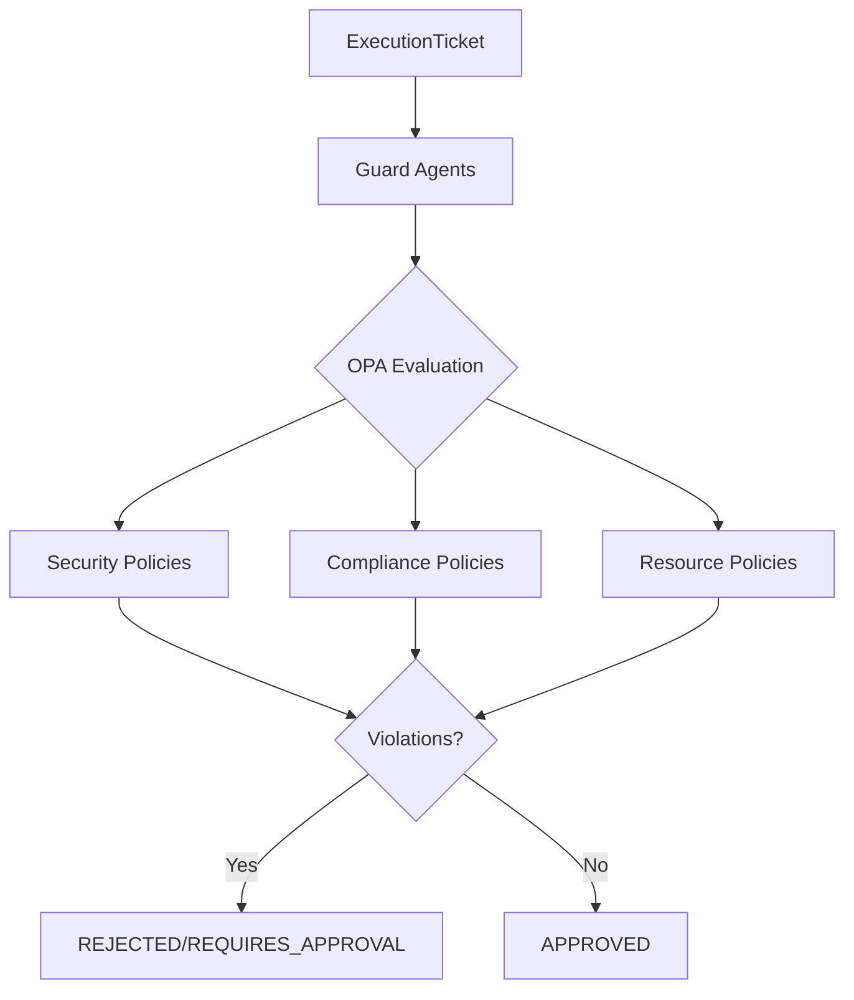
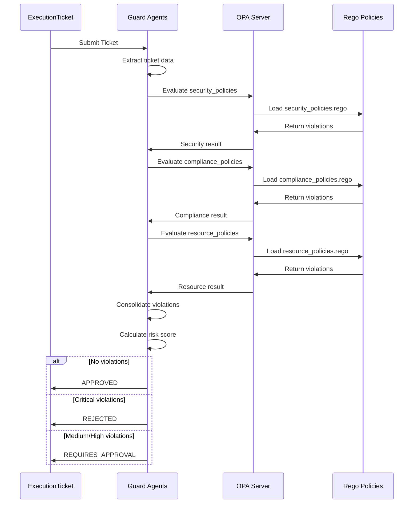

# Guard Agents OPA Policies

OPA Gatekeeper policies for validating ExecutionTickets in the Neural Hive Mind Guard Agents service. These policies provide comprehensive security, compliance, and resource validation to ensure proactive guardrail enforcement.

## Overview

The Guard Agents OPA policies evaluate incoming ExecutionTickets against a comprehensive set of rules covering:

- **Security Policies**: Container security, network policies, image security, secret management
- **Compliance Policies**: PII handling, data retention, audit requirements, regulatory compliance (GDPR, HIPAA, PCI-DSS, SOX)
- **Resource Policies**: CPU/memory limits, quotas, efficiency, scaling requirements

## Architecture



## Validation Flow



## Policies

### Security Policies (`security_policies.rego`)

Validates container security, network policies, image security, and secret management.

| Rule | Severity | Description |
|------|----------|-------------|
| `privileged_container` | CRITICAL | Detects containers running in privileged mode |
| `root_user` | HIGH | Detects containers running as root user |
| `host_network` | CRITICAL | Detects containers using host network namespace |
| `host_pid` | HIGH | Detects containers using host PID namespace |
| `host_ipc` | HIGH | Detects containers using host IPC namespace |
| `dangerous_capabilities` | CRITICAL | Detects dangerous Linux capabilities (SYS_ADMIN, NET_ADMIN, SYS_PTRACE) |
| `missing_network_policy` | HIGH | Detects missing NetworkPolicy in production |
| `unrestricted_egress` | MEDIUM | Detects NetworkPolicy with unrestricted egress |
| `unrestricted_ingress` | MEDIUM | Detects NetworkPolicy with unrestricted ingress |
| `insecure_protocol` | HIGH | Detects use of insecure protocols (HTTP, FTP, Telnet) |
| `unsigned_image` | HIGH | Detects unsigned container images |
| `unscanned_image` | MEDIUM | Detects container images without vulnerability scans |
| `high_severity_vulnerabilities` | HIGH | Detects images with HIGH/CRITICAL vulnerabilities |
| `latest_tag` | MEDIUM | Detects use of :latest tag in production |
| `hardcoded_secret` | CRITICAL | Detects hardcoded secrets in configuration |
| `missing_vault_integration` | HIGH | Detects missing Vault integration for sensitive secrets |
| `secret_in_env` | MEDIUM | Detects secrets passed via environment variables |

### Compliance Policies (`compliance_policies.rego`)

Validates PII handling, data retention, audit requirements, and regulatory compliance.

| Rule | Severity | Description |
|------|----------|-------------|
| `pii_without_encryption` | CRITICAL | Detects PII data without encryption at rest |
| `pii_without_classification` | HIGH | Detects PII data without proper data classification |
| `pii_cross_region` | CRITICAL | Detects PII cross-region transfer without approval |
| `pii_retention` | HIGH | Detects PII retention beyond allowed period |
| `missing_retention_policy` | MEDIUM | Detects missing data retention policy |
| `excessive_retention_period` | MEDIUM | Detects data retention exceeding limits |
| `missing_deletion_mechanism` | LOW | Detects missing automatic deletion mechanism |
| `missing_audit_logging` | HIGH | Detects missing audit logging for critical operations |
| `insufficient_audit_retention` | MEDIUM | Detects audit log retention below required minimum |
| `missing_audit_trail` | HIGH | Detects missing audit trail for critical actions |
| `gdpr_violation` | CRITICAL | Detects GDPR compliance violations |
| `hipaa_violation` | CRITICAL | Detects HIPAA compliance violations |
| `pci_dss_violation` | CRITICAL | Detects PCI-DSS compliance violations |
| `sox_violation` | HIGH | Detects SOX compliance violations |

### Resource Policies (`resource_policies.rego`)

Validates CPU/memory limits, resource quotas, efficiency, and scaling requirements.

| Rule | Severity | Description |
|------|----------|-------------|
| `missing_cpu_limits` | MEDIUM | Detects containers without CPU limits |
| `missing_memory_limits` | MEDIUM | Detects containers without memory limits |
| `excessive_cpu_request` | HIGH | Detects CPU requests exceeding per-container maximum |
| `excessive_memory_request` | HIGH | Detects memory requests exceeding per-container maximum |
| `cpu_limit_exceeds_quota` | HIGH | Detects CPU limits exceeding namespace quota |
| `memory_limit_exceeds_quota` | HIGH | Detects memory limits exceeding namespace quota |
| `namespace_quota_exceeded` | CRITICAL | Detects deployment exceeding namespace quota |
| `pod_count_quota_exceeded` | HIGH | Detects deployment exceeding pod count quota |
| `storage_quota_exceeded` | HIGH | Detects deployment exceeding storage quota |
| `service_quota_exceeded` | MEDIUM | Detects deployment exceeding service quota |
| `low_cpu_utilization` | LOW | Detects consistently low CPU utilization (<20%) |
| `low_memory_utilization` | LOW | Detects consistently low memory utilization (<20%) |
| `oversized_request` | MEDIUM | Detects requests significantly larger than utilization |
| `missing_hpa` | MEDIUM | Detects missing HPA in production |
| `insufficient_replicas` | HIGH | Detects insufficient replicas in production |
| `excessive_replicas` | MEDIUM | Detects excessive replicas |

## Severity Levels

| Level | Description | Action |
|-------|-------------|--------|
| **CRITICAL** | Severe security or compliance risk | Immediate rejection |
| **HIGH** | Significant risk requiring attention | Rejection or requires approval |
| **MEDIUM** | Moderate risk | Warning, may require approval |
| **LOW** | Minor issue or recommendation | Warning only |

## Input Structure

### Security Policies Input

```json
{
  "ticket": {
    "ticket_id": "exec-123",
    "task_type": "DEPLOY",
    "environment": "production",
    "parameters": {
      "container_spec": {
        "name": "app",
        "privileged": false,
        "host_network": false,
        "host_pid": false,
        "host_ipc": false,
        "security_context": {
          "runAsNonRoot": true,
          "runAsUser": 1000
        },
        "capabilities": {
          "add": [],
          "drop": ["ALL"]
        },
        "env": []
      },
      "network_policy": {
        "ingress": [],
        "egress": [],
        "protocols": ["HTTPS"]
      },
      "image": {
        "name": "registry.io/app",
        "tag": "v1.0.0",
        "signed": true,
        "scanned": true,
        "scan_results": {
          "critical": 0,
          "high": 0,
          "medium": 2,
          "low": 5
        }
      },
      "secrets": {},
      "vault_integration": true
    }
  },
  "security": {
    "allowed_capabilities": ["NET_BIND_SERVICE"],
    "require_signed_images": true,
    "require_network_policies": true,
    "max_vulnerability_severity": "HIGH"
  }
}
```

### Compliance Policies Input

```json
{
  "ticket": {
    "ticket_id": "exec-123",
    "task_type": "DEPLOY",
    "contains_pii": true,
    "data_classification": "CONFIDENTIAL",
    "data_residency_region": "eu-west-1",
    "target_region": "eu-west-1",
    "data_config": {
      "persists_data": true,
      "encryption_at_rest": true
    },
    "retention_policy": {
      "retention_days": 90,
      "auto_delete": true
    },
    "audit_config": {
      "enabled": true,
      "retention_days": 730,
      "include_user_identity": true
    },
    "compliance_controls": {
      "gdpr": {
        "consent_management": true,
        "data_subject_rights": true,
        "lawful_basis_documented": true
      }
    }
  },
  "compliance": {
    "required_regulations": ["GDPR", "HIPAA"],
    "max_retention_days": 365,
    "max_pii_retention_days": 180,
    "require_encryption_at_rest": true,
    "require_audit_logging": true,
    "min_audit_retention_days": 365
  }
}
```

### Resource Policies Input

```json
{
  "ticket": {
    "ticket_id": "exec-123",
    "task_type": "DEPLOY",
    "environment": "production",
    "replicas": 3,
    "hpa_enabled": true,
    "resources": {
      "requests": {
        "cpu": "500m",
        "memory": "512Mi"
      },
      "limits": {
        "cpu": "1000m",
        "memory": "1Gi"
      }
    },
    "metrics": {
      "avg_cpu_utilization_percent": 45,
      "avg_memory_utilization_percent": 60,
      "peak_cpu_millicores": 800
    },
    "storage": {
      "size": "10Gi"
    }
  },
  "quotas": {
    "namespace_cpu_quota": "8000m",
    "namespace_memory_quota": "16Gi",
    "current_cpu_usage": "4000m",
    "current_pod_count": 20,
    "max_pods": 50,
    "current_storage_usage": "50Gi",
    "max_storage": "100Gi"
  },
  "thresholds": {
    "max_cpu_per_container": "4000m",
    "max_memory_per_container": "8Gi",
    "min_replicas_production": 2,
    "max_replicas": 100,
    "require_hpa_production": true,
    "min_cpu_utilization_percent": 20,
    "min_memory_utilization_percent": 20
  }
}
```

## Output Structure

All policies return a consistent result structure:

```json
{
  "allow": false,
  "violations": [
    {
      "rule": "privileged_container",
      "severity": "CRITICAL",
      "message": "Container is configured to run in privileged mode",
      "resource": "exec-123",
      "details": {
        "container_name": "app",
        "privileged": true
      },
      "remediation": "Remove privileged: true from container security context"
    }
  ],
  "warnings": [],
  "security_context": {
    "ticket_id": "exec-123",
    "environment": "production",
    "task_type": "DEPLOY",
    "violation_count": 1,
    "critical_count": 1,
    "high_count": 0,
    "medium_count": 0,
    "low_count": 0,
    "risk_score": 100
  }
}
```

## Testing

### Run All Tests

```bash
# Run all tests with verbose output
opa test policies/rego/guard-agents/ -v

# Run tests with coverage
opa test --coverage policies/rego/guard-agents/

# Check policy syntax
opa check policies/rego/guard-agents/*.rego
```

### Run Specific Test Files

```bash
# Security policy tests
opa test policies/rego/guard-agents/security_policies.rego \
         policies/rego/guard-agents/tests/security_policies_test.rego -v

# Compliance policy tests
opa test policies/rego/guard-agents/compliance_policies.rego \
         policies/rego/guard-agents/tests/compliance_policies_test.rego -v

# Resource policy tests
opa test policies/rego/guard-agents/resource_policies.rego \
         policies/rego/guard-agents/tests/resource_policies_test.rego -v
```

### Evaluate Policy Manually

```bash
# Evaluate security policies with input file
opa eval -i input.json -d policies/rego/guard-agents/security_policies.rego \
    "data.neuralhive.guard.security_policies.result"

# Evaluate compliance policies
opa eval -i input.json -d policies/rego/guard-agents/compliance_policies.rego \
    "data.neuralhive.guard.compliance_policies.result"

# Evaluate resource policies
opa eval -i input.json -d policies/rego/guard-agents/resource_policies.rego \
    "data.neuralhive.guard.resource_policies.result"
```

## Integration with Guard Agents

The policies are integrated with the Guard Agents service through the `SecurityValidator` class:

```python
from services.guard_agents.src.services.security_validator import SecurityValidator

validator = SecurityValidator(opa_client)

# Validate an ExecutionTicket
violations = await validator.validate_ticket(ticket)

# Check if ticket should be approved
if not violations:
    return ValidationStatus.APPROVED
elif any(v.severity == Severity.CRITICAL for v in violations):
    return ValidationStatus.REJECTED
else:
    return ValidationStatus.REQUIRES_APPROVAL
```

## Configuration

Policy thresholds and requirements are configurable through the Guard Agents settings:

```python
# services/guard-agents/src/config/settings.py

# Security Policy Thresholds
max_vulnerability_severity: str = "HIGH"
require_signed_images: bool = True
require_network_policies_production: bool = True
allowed_capabilities: list[str] = ["NET_BIND_SERVICE"]

# Compliance Policy Thresholds
required_regulations: list[str] = ["GDPR"]
max_retention_days: int = 365
require_encryption_at_rest: bool = True
require_audit_logging: bool = True

# Resource Policy Thresholds
max_cpu_per_container: str = "4000m"
max_memory_per_container: str = "8Gi"
min_replicas_production: int = 2
require_hpa_production: bool = True
```

## File Structure

```
policies/rego/guard-agents/
├── security_policies.rego       # Security validation rules
├── compliance_policies.rego     # Compliance validation rules
├── resource_policies.rego       # Resource validation rules
├── tests/
│   ├── security_policies_test.rego    # Security policy tests
│   ├── compliance_policies_test.rego  # Compliance policy tests
│   └── resource_policies_test.rego    # Resource policy tests
└── README.md                    # This file
```

## Examples

### Example 1: Secure Deployment (Approved)

```json
{
  "ticket": {
    "ticket_id": "deploy-001",
    "task_type": "DEPLOY",
    "environment": "production",
    "parameters": {
      "container_spec": {
        "name": "secure-app",
        "privileged": false,
        "security_context": {
          "runAsNonRoot": true,
          "runAsUser": 1000,
          "readOnlyRootFilesystem": true
        },
        "capabilities": {
          "drop": ["ALL"]
        }
      },
      "image": {
        "name": "registry.io/app",
        "tag": "v1.2.3",
        "signed": true,
        "scanned": true,
        "scan_results": {"critical": 0, "high": 0}
      },
      "vault_integration": true
    }
  }
}
```

**Result**: APPROVED (no violations)

### Example 2: Insecure Deployment (Rejected)

```json
{
  "ticket": {
    "ticket_id": "deploy-002",
    "task_type": "DEPLOY",
    "environment": "production",
    "parameters": {
      "container_spec": {
        "name": "insecure-app",
        "privileged": true,
        "security_context": {
          "runAsUser": 0
        },
        "capabilities": {
          "add": ["SYS_ADMIN"]
        }
      },
      "image": {
        "name": "registry.io/app",
        "tag": "latest",
        "signed": false
      },
      "secrets": {
        "db_password": "hardcoded-secret"
      }
    }
  }
}
```

**Result**: REJECTED (multiple CRITICAL violations)

## Related Documentation

- [Guard Agents Service](../../../services/guard-agents/README.md)
- [OPA Gatekeeper Documentation](https://www.openpolicyagent.org/docs/latest/)
- [Rego Policy Language](https://www.openpolicyagent.org/docs/latest/policy-language/)
