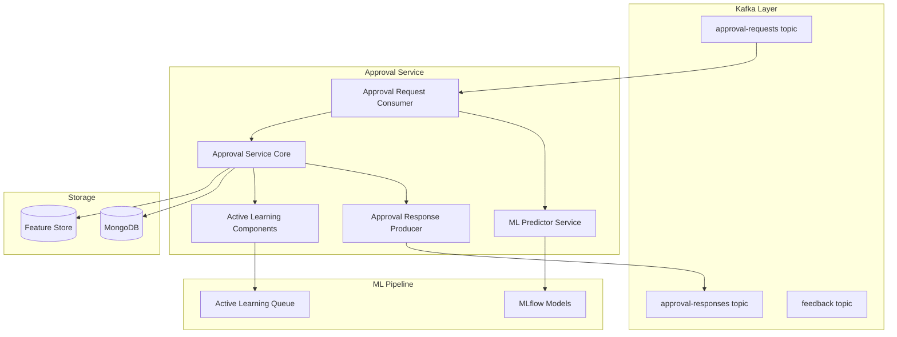
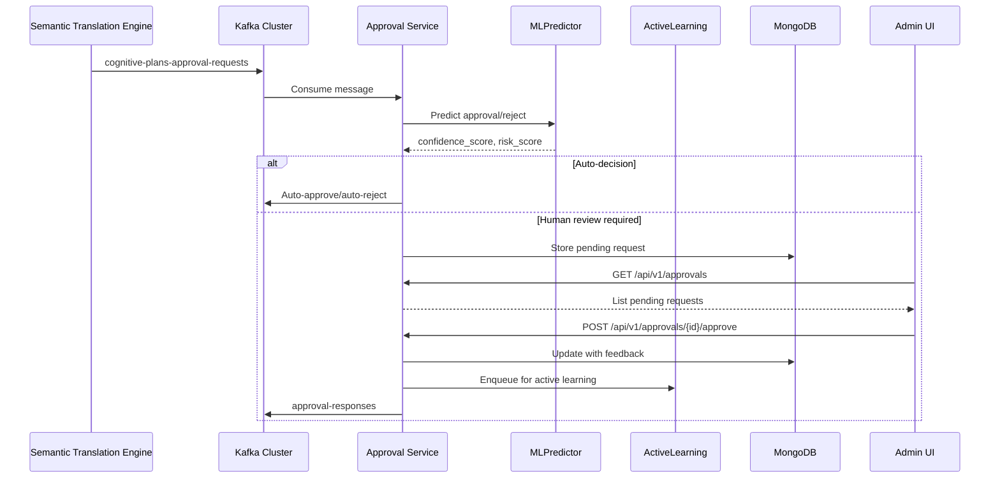

# Approval Service

Serviço de aprovação humana para decisões de IA com alto risco ou potencial destrutivo. Fornece API REST para administradores e processamento assíncrono via Kafka, integrado com predição ML e Active Learning.

## Descrição

O Approval Service é o gateway humano para decisões críticas do Neural Hive-Mind. Ele intercepta Cognitive Plans que requerem intervenção humana, permite aprovação/rejeição com feedback detalhado, e alimenta o ciclo de aprendizado do sistema através do Active Learning.

## Arquitetura

### Componentes Principais



### Fluxo de Dados



### Estrutura de Diretórios

```
services/approval-service/
├── src/
│   ├── main.py                      # Entry point FastAPI
│   ├── api/
│   │   └── routers/
│   │       ├── approvals.py         # CRUD de aprovações
│   │       ├── active_learning.py   # Active Learning API
│   │       ├── health.py            # Health checks
│   │       └── ml_management.py     # Gerenciamento de modelos ML
│   ├── services/
│   │   ├── approval_service.py      # Core business logic
│   │   ├── ml_predictor_service.py  # MLPredictor wrapper
│   │   └── online_learning_service.py # Online learning integration
│   ├── consumers/
│   │   ├── approval_request_consumer.py   # Kafka input
│   │   └── feedback_consumer.py           # Kafka feedback
│   ├── producers/
│   │   └── approval_response_producer.py  # Kafka output
│   ├── clients/
│   │   ├── mongodb_client.py       # MongoDB connection
│   │   ├── cognitive_ledger_client.py # Cognitive ledger
│   │   └── feature_store_client.py # Feature store
│   ├── models/
│   │   └── approval.py             # Pydantic models
│   ├── schedulers/
│   │   └── retraining_scheduler.py # Retraining jobs
│   └── database/
│       └── migrations/
│           └── m001_active_learning_schema.py
├── tests/
├── Dockerfile
└── requirements.txt
```

## Configuração

### Variáveis de Ambiente

| Variável | Descrição | Default |
|----------|-----------|---------|
| `SERVICE_NAME` | Nome do serviço | `approval-service` |
| `ENVIRONMENT` | Ambiente (dev/staging/prod) | `development` |
| `KAFKA_BOOTSTRAP_SERVERS` | Kafka brokers | `localhost:9092` |
| `KAFKA_APPROVAL_REQUESTS_TOPIC` | Tópico de entrada | `cognitive-plans-approval-requests` |
| `KAFKA_APPROVAL_RESPONSES_TOPIC` | Tópico de saída | `approval-responses` |
| `MONGODB_URI` | Connection string MongoDB | `mongodb://mongodb:27017` |
| `MONGODB_DATABASE` | Nome do database | `neural_hive` |
| `ENABLE_ML_PREDICTION` | Habilita predição ML | `true` |
| `ML_AUTO_APPROVE_THRESHOLD` | Threshold auto-approve | `0.85` |
| `ML_AUTO_REJECT_THRESHOLD` | Threshold auto-reject | `0.30` |
| `ENABLE_ACTIVE_LEARNING` | Habilita Active Learning | `true` |
| `ACTIVE_LEARNING_MIN_INFORMATION_VALUE` | Valor mínimo de informação | `0.5` |
| `ACTIVE_LEARNING_ENQUEUE_RATE` | Taxa de enfileiramento | `0.2` |
| `ENABLE_FEEDBACK_COLLECTION` | Habilita coleta de feedback | `true` |

### Configuração MLflow

O serviço carrega modelos do MLflow para predição automática:

```python
ml_model:
  model_name: "approval-predictor"
  stage: "production"
  fallback_to_heuristics: true
```

## API

### Endpoints

#### Health & Status

```
GET /health
GET /ready
```

#### Approvals (CRUD)

```
GET    /api/v1/approvals                    # Listar aprovações pendentes
GET    /api/v1/approvals/{request_id}       # Detalhes de uma aprovação
POST   /api/v1/approvals/{request_id}/approve  # Aprovar plano
POST   /api/v1/approvals/{request_id}/reject   # Rejeitar plano
PATCH  /api/v1/approvals/{request_id}       # Atualizar metadata
```

**Body para approve/reject:**

```json
{
  "feedback": "Comentário opcional",
  "reasoning_factors": [
    {
      "factor_name": "workflow_efficiency",
      "score": 0.85,
      "description": "Workflow bem estruturado"
    }
  ],
  "mitigations": [],
  "reviewer": "admin@example.com"
}
```

#### Active Learning

```
GET  /api/v1/active-learning/metrics          # Métricas de balanceamento
GET  /api/v1/active-learning/queue             # Fila de casos prioritários
POST /api/v1/active-learning/{queue_id}/claim  # Reivindicar caso
POST /api/v1/active-learning/{queue_id}/feedback # Submeter feedback
POST /api/v1/active-learning/{queue_id}/release # Liberar caso
```

**Resposta de métricas:**

```json
{
  "total_samples": 1500,
  "class_distribution": {
    "approve": 1395,
    "reject": 105
  },
  "balance_score": 0.07,
  "semantic_feature_coverage": 0.095,
  "recommendations": [
    "Coletar mais samples da classe reject",
    "Coletar mais feedback com reasoning_factors semânticos"
  ]
}
```

#### ML Management

```
GET    /api/v1/ml/model/info              # Informações do modelo atual
POST   /api/v1/ml/model/reload            # Recarregar modelo do MLflow
GET    /api/v1/ml/training/status         # Status de retreino agendado
POST   /api/v1/ml/training/trigger        # Disparar retreino manual
```

## Integrações

### Kafka

**Tópicos Consumidos:**

- `cognitive-plans-approval-requests` (input): Cognitive Plans requerendo aprovação

**Tópicos Produzidos:**

- `approval-responses` (output): Respostas de aprovação/rejeição
- `specialist-feedback` (feedback): Feedback para especialistas (opcional)

### MongoDB

**Coleções:**

- `plan_approvals`: Histórico de aprovações
- `active_learning_queue`: Fila de casos para Active Learning
- `specialist_feedback`: Feedback coletado (compartilhado)

### Feature Store

Opcional - armazena features para retreino de modelos ML.

## Deploy

### Docker

```bash
docker build -t approval-service:latest .
docker run -p 8080:8080 \
  -e KAFKA_BOOTSTRAP_SERVERS=kafka:9092 \
  -e MONGODB_URI=mongodb://mongodb:27017 \
  approval-service:latest
```

### Kubernetes/Helm

```yaml
image:
  repository: approval-service
  tag: latest
  pullPolicy: Always

resources:
  requests:
    memory: "256Mi"
    cpu: "250m"
  limits:
    memory: "512Mi"
    cpu: "500m"

env:
  - name: ENVIRONMENT
    value: "production"
  - name: ENABLE_ML_PREDICTION
    value: "true"
```

## Desenvolvimento

### Como Executar Localmente

```bash
# Instalar dependências
pip install -r requirements.txt

# Configurar variáveis de ambiente
export KAFKA_BOOTSTRAP_SERVERS=localhost:9092
export MONGODB_URI=mongodb://localhost:27017

# Executar serviço
uvicorn src.main:app --reload --host 0.0.0.0 --port 8080
```

### Testes

```bash
# Unit tests
pytest tests/ -v

# Testes de integração (requer Docker Compose)
docker-compose up -d kafka mongodb
pytest tests/integration/ -v

# Cobertura
pytest --cov=src tests/
```

## Troubleshooting

### Problemas Comuns

**1. Consumer não processa mensagens**

```bash
# Verificar logs do consumer
kubectl logs -f deployment/approval-service -c approval-service

# Verificar tópicos Kafka
kafka-console-consumer --bootstrap-server localhost:9092 \
  --topic cognitive-plans-approval-requests --from-beginning
```

**2. ML Prediction sempre retorna 0.5**

- Verificar se modelo está carregado: `GET /api/v1/ml/model/info`
- Verificar conexão MLflow
- Modelo pode estar em modo degradado (fallback para heurísticas)

**3. Active Learning queue vazia**

- Verificar `ENABLE_ACTIVE_LEARNING=true`
- Verificar `ACTIVE_LEARNING_ENQUEUE_RATE`
- Samples podem estar abaixo de `MIN_INFORMATION_VALUE`

**4. MongoDB connection timeouts**

```bash
# Verificar conectividade
mongosh --host mongodb --eval "db.adminCommand('ping')"

# Aumentar timeout em settings
MONGODB_TIMEOUT_MS=10000
```

## Métricas e Monitoramento

### Prometheus Metrics

- `approval_requests_total`: Total de solicitações de aprovação
- `approval_decisions_total`: Decisões por tipo (approve/reject/escalate)
- `ml_predictions_total`: Predições ML por resultado
- `active_learning_queue_size`: Tamanho da fila Active Learning
- `approval_processing_duration_seconds`: Duração do processamento

### Health Checks

- `/health`: Verificação básica do serviço
- `/ready`: Verificação de dependências (Kafka, MongoDB, MLflow)

## Referências

- [Semantic Translation Engine](../semantic-translation-engine/README.md)
- [Consensus Engine](../consensus-engine/README.md)
- [neural_hive_ml](../../libraries/python/neural_hive_ml/README.md)
- [Active Learning Documentation](./docs/ACTIVE_LEARNING_DEPLOY.md)
