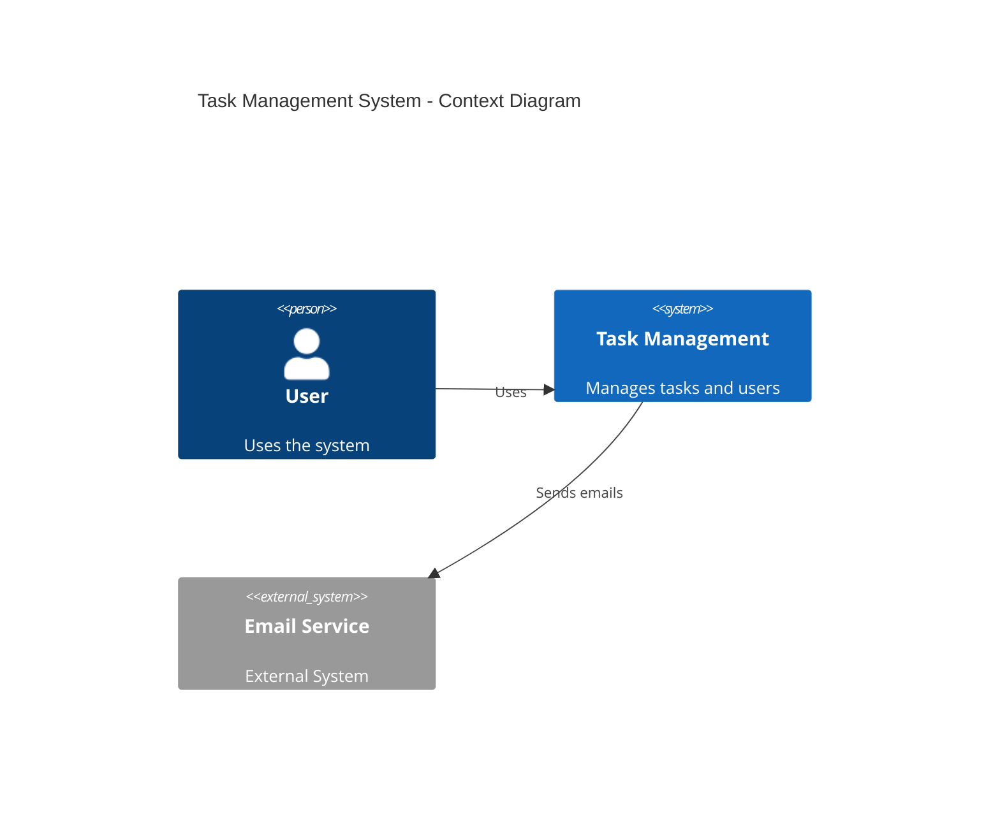

# Diagram Generation

## Visão Geral

O módulo `ArchitectureDiagramGenerator` gera diagramas de arquitetura C4 (Context, Container, Component) usando Mermaid.

## Propósito

Facilitar a documentação visual de arquitetura de software através de:

1. Geração automática de diagramas C4
2. Renderização para SVG usando mermaid-cli
3. Integração com bounded contexts e tech stack

## Uso

```python
from src.generators.architecture_diagram_generator import ArchitectureDiagramGenerator

# Inicializar
generator = ArchitectureDiagramGenerator(output_dir="./diagrams")

# Gerar diagrama Context
context_diagram = await generator.generate_context_diagram(
    project_name="MyApp",
    system_description="Aplicação de gestão de tarefas",
    actors=["User", "Admin"],
    external_systems=["EmailAPI", "PaymentGateway"],
    render=True  # Renderiza para SVG
)

# Gerar diagrama Container
container_diagram = await generator.generate_container_diagram(
    project_name="MyApp",
    bounded_contexts=bounded_contexts,  # do BoundedContextsIdentifier
    tech_stack=tech_recommendation,  # do TechStackRecommender
    render=True
)

# Gerar todos os diagramas
all_diagrams = await generator.generate_all_diagrams(
    project_name="MyApp",
    system_description="...",
    bounded_contexts=bounded_contexts,
    tech_stack=tech_stack,
    actors=["User"],
    external_systems=[],
    render=True
)
```

## API

### `ArchitectureDiagramGenerator`

#### Métodos

- `async generate_context_diagram(...) -> Diagram`
  Gera diagrama C4 Context

- `async generate_container_diagram(...) -> Diagram`
  Gera diagrama C4 Container

- `async generate_component_diagram(...) -> Diagram`
  Gera diagrama C4 Component

- `async generate_all_diagrams(...) -> List[Diagram]`
  Gera todos os diagramas

### `MermaidRenderer`

Renderiza código Mermaid para SVG/PNG.

- `async render_to_svg(mermaid_code: str, output_dir: Optional[str]) -> str`
  Renderiza para SVG

- `async render_to_png(mermaid_code: str, output_dir: Optional[str]) -> str`
  Renderiza para PNG

## REST API

```bash
POST /api/v1/architecture/diagrams/generate
Content-Type: application/json

{
  "description": "Sistema de autenticação com OAuth2",
  "diagram_type": "c4_context"
}
```

## Tipos de Diagrama

### C4 Context
Mostra o sistema no contexto do mundo externo:
- Usuários/atores
- Sistema principal
- Sistemas externos

### C4 Container
Mostra a estrutura interna do sistema:
- Aplicações/web services
- Bancos de dados
- Filas/mensageria
- Relacionamentos entre componentes

### C4 Component
Mostra a estrutura interna de um container:
- Componentes de software
- Camadas (controller, service, repository)
- Relacionamentos

## Dependências

- **mermaid-cli**: Para renderização de Mermaid para SVG/PNG
  ```bash
  npm install -g @mermaid-js/mermaid-cli
  ```

## Exemplo de Saída


