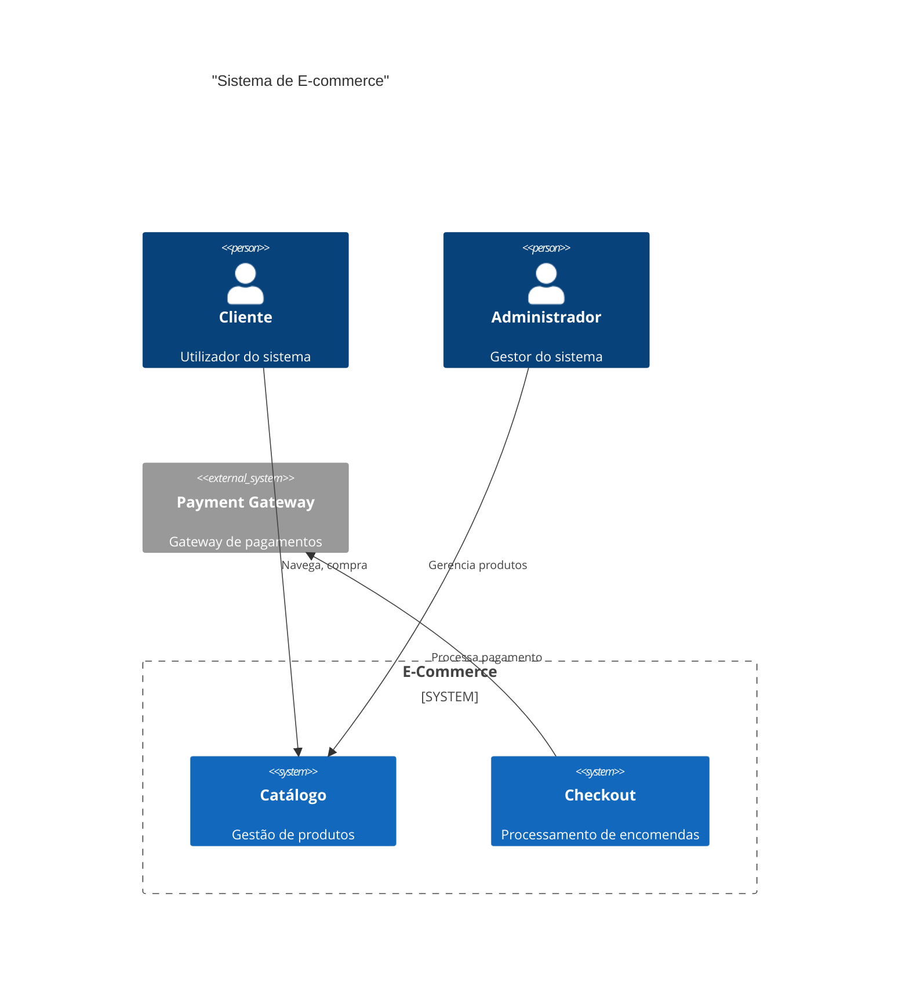
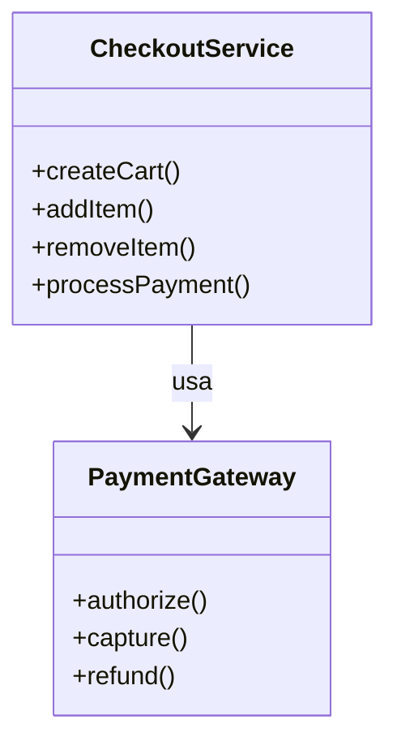

# Diagram Generation - Documentação de Uso

## Visão Geral

O módulo **ArchitectureDiagramGenerator** gera diagramas de arquitetura em formatos C4 e Mermaid.

## Uso via Python

### Gerar Diagrama de Contexto

```python
from src.generators.architecture_diagram_generator import ArchitectureDiagramGenerator

# Inicializar gerador
generator = ArchitectureDiagramGenerator(
    output_dir="./diagrams",
    mmdc_command="mmdc"
)

# Gerar diagrama C4 Context
diagram = await generator.generate_context_diagram(
    project_name="E-Commerce Platform",
    system_description="Plataforma de vendas online com gestão de produtos e pagamentos",
    actors=["Customer", "Admin"],
    external_systems=["Payment Gateway", "Shipping Service"],
    render=True
)

print(f"Diagram ID: {diagram.diagram_id}")
print(f"Type: {diagram.type.value}")
print(f"Mermaid Code:\n{diagram.mermaid_code}")
print(f"SVG URL: {diagram.svg_url}")
```

### Gerar Diagrama de Sequência

```python
# Gerar diagrama de sequência
steps = [
    "Customer->>API: POST /orders",
    "API->>OrderService: createOrder()",
    "OrderService->>Inventory: checkStock()",
    "Inventory-->>OrderService: Stock confirmed",
    "OrderService->>Payment: processPayment()",
    "Payment-->>Customer: Payment successful"
]

diagram = await generator.generate_sequence(
    title="Checkout Flow",
    steps=steps,
    artifacts=["Order", "Payment", "Inventory"],
    render=True
)
```

### Gerar a Partir de Descrição

```python
# Gerar diagrama a partir de linguagem natural
description = """
O sistema permite que utilizadores façam login.
Depois de autenticados, podem navegar pelo catálogo de produtos.
Ao selecionar um produto, este é adicionado ao carrinho.
Finalmente, o utilizador pode fazer checkout e pagar.
"""

diagram = await generator.generate_from_description(
    description=description,
    render=True
)
```

## Tipos de Diagrama

| Tipo | Descrição | Método |
|------|-----------|--------|
| Context | Visão geral do sistema | `generate_context_diagram()` |
| Container | Containers e suas relações | `generate_container_diagram()` |
| Component | Componentes detalhados | `generate_component_diagram()` |
| Sequence | Fluxo sequencial | `generate_sequence()` |

## API REST

### Gerar Diagrama

```bash
POST /api/v1/architecture/diagrams/generate
Content-Type: application/json

{
  "diagram_type": "context",
  "project_name": "E-Commerce",
  "system_description": "Plataforma de vendas online",
  "actors": ["Customer", "Admin"],
  "external_systems": ["Payment Gateway"]
}
```

## Formatos Suportados

### C4 Model

```python
from src.generators.c4_diagram import C4DiagramGenerator

generator = C4DiagramGenerator()
diagram = generator.generate_context(
    project_name="MyApp",
    system_description="Sistema de gestão",
    actors=["User"],
    external_systems=["ExternalAPI"]
)
```

### Mermaid

```python
from src.generators.mermaid_renderer import MermaidRenderer

renderer = MermaidRenderer()
svg = await renderer.render_to_svg(mermaid_code, output_dir="./diagrams")
```

## Renderização

Para SVG:
```bash
pip install mermaid-cli
mmdc -i diagram.mmd -o diagram.svg
```

Para PNG:
```python
await renderer.render_to_png(mermaid_code, output_dir="./diagrams")
```

## Exemplos

### Diagrama de Contexto



### Diagrama de Componente



## Exemplo de Resposta JSON

### Resposta do Endpoint POST /diagrams/generate

```json
{
  "diagram_id": "ecommerce-platform-context",
  "type": "c4_context",
  "title": "E-Commerce Platform - Context Diagram",
  "mermaid_code": "C4Context\n    title \"E-Commerce Platform\"\n    \n    Person(customer, \"Customer\", \"User who buys products\")\n    Person(admin, \"Admin\", \"System administrator\")\n    \n    System_Boundary(c1, \"E-Commerce\") {\n        System(catalog, \"Catalog\", \"Product management\")\n        System(checkout, \"Checkout\", \"Order processing\")\n    }\n    \n    System_Ext(payment, \"Payment Gateway\", \"External payment processor\")\n    System_Ext(shipping, \"Shipping Service\", \"Delivery management\")\n    \n    Rel(customer, catalog, \"Views, searches\")\n    Rel(customer, checkout, \"Places orders\")\n    Rel(admin, catalog, \"Manages\")\n    Rel(checkout, payment, \"Processes payment\")\n    Rel(checkout, shipping, \"Requests delivery\")",
  "svg_url": "/diagrams/ecommerce-platform-context.svg"
}
```

### Resposta do Endpoint GET /{architecture_id}/diagrams

```json
{
  "architecture_id": "arch-12345678",
  "total_diagrams": 3,
  "diagrams": [
    {
      "diagram_id": "ecommerce-context",
      "type": "c4_context",
      "title": "E-Commerce Platform - Context",
      "mermaid_code": "C4Context\n    ...",
      "svg_url": "/diagrams/ecommerce-context.svg"
    },
    {
      "diagram_id": "ecommerce-container",
      "type": "c4_container",
      "title": "E-Commerce Platform - Containers",
      "mermaid_code": "C4Container\n    ...",
      "svg_url": "/diagrams/ecommerce-container.svg"
    },
    {
      "diagram_id": "checkout-sequence",
      "type": "sequence",
      "title": "Checkout Flow",
      "mermaid_code": "sequenceDiagram\n    ...",
      "svg_url": "/diagrams/checkout-sequence.svg"
    }
  ]
}
```
