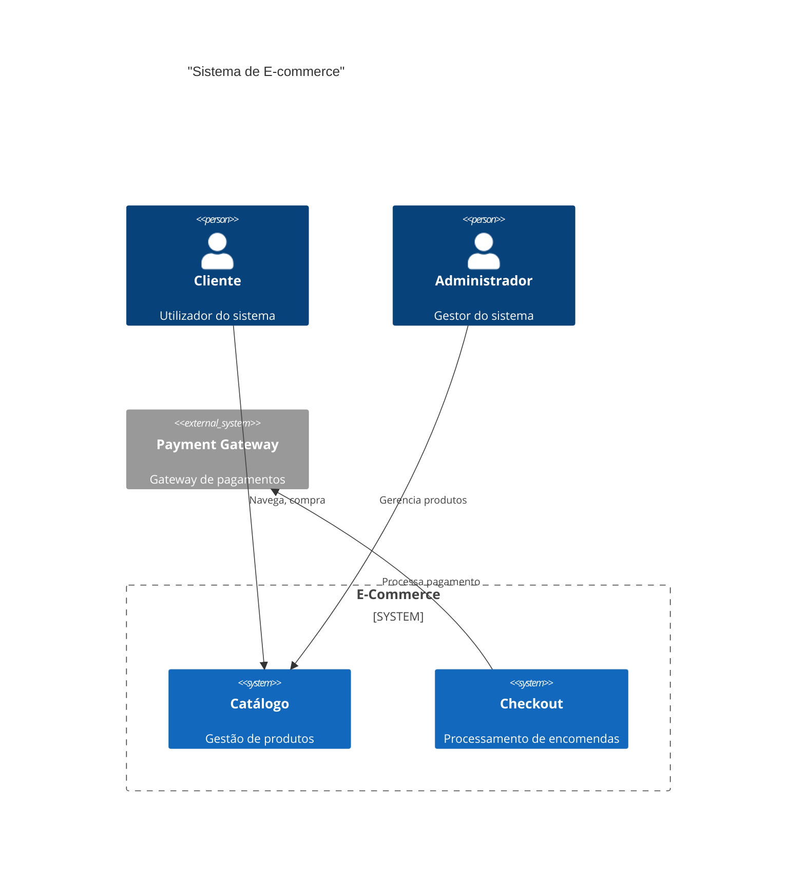
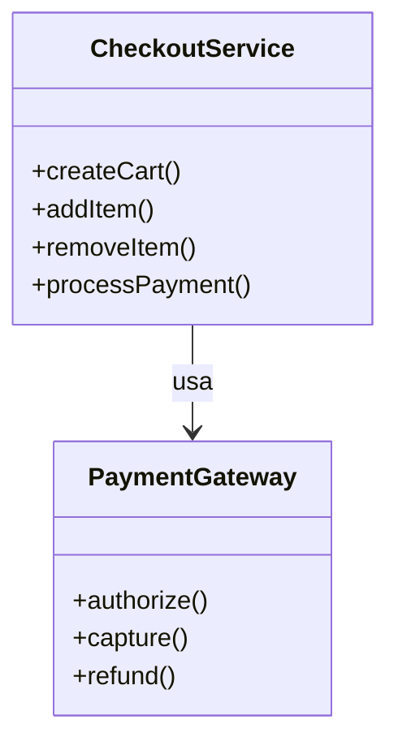

# Diagram Generation - Documentação de Uso

## Visão Geral

O módulo **ArchitectureDiagramGenerator** gera diagramas de arquitetura em formatos C4 e Mermaid.

## Tipos de Diagrama

| Tipo | Descrição | Método |
|------|-----------|--------|
| Context | Visão geral do sistema | `generate_context_diagram()` |
| Container | Containers e suas relações | `generate_container_diagram()` |
| Component | Componentes detalhados | `generate_component_diagram()` |
| Sequence | Fluxo sequencial | `generate_sequence()` |

## API REST

### Gerar Diagrama

```bash
POST /api/v1/architecture/diagrams/generate
Content-Type: application/json

{
  "diagram_type": "context",
  "project_name": "E-Commerce",
  "system_description": "Plataforma de vendas online",
  "actors": ["Customer", "Admin"],
  "external_systems": ["Payment Gateway"]
}
```

## Formatos Suportados

### C4 Model

```python
from src.generators.c4_diagram import C4DiagramGenerator

generator = C4DiagramGenerator()
diagram = generator.generate_context(
    project_name="MyApp",
    system_description="Sistema de gestão",
    actors=["User"],
    external_systems=["ExternalAPI"]
)
```

### Mermaid

```python
from src.generators.mermaid_renderer import MermaidRenderer

renderer = MermaidRenderer()
svg = await renderer.render_to_svg(mermaid_code, output_dir="./diagrams")
```

## Renderização

Para SVG:
```bash
pip install mermaid-cli
mmdc -i diagram.mmd -o diagram.svg
```

Para PNG:
```python
await renderer.render_to_png(mermaid_code, output_dir="./diagrams")
```

## Exemplos

### Diagrama de Contexto



### Diagrama de Componente


