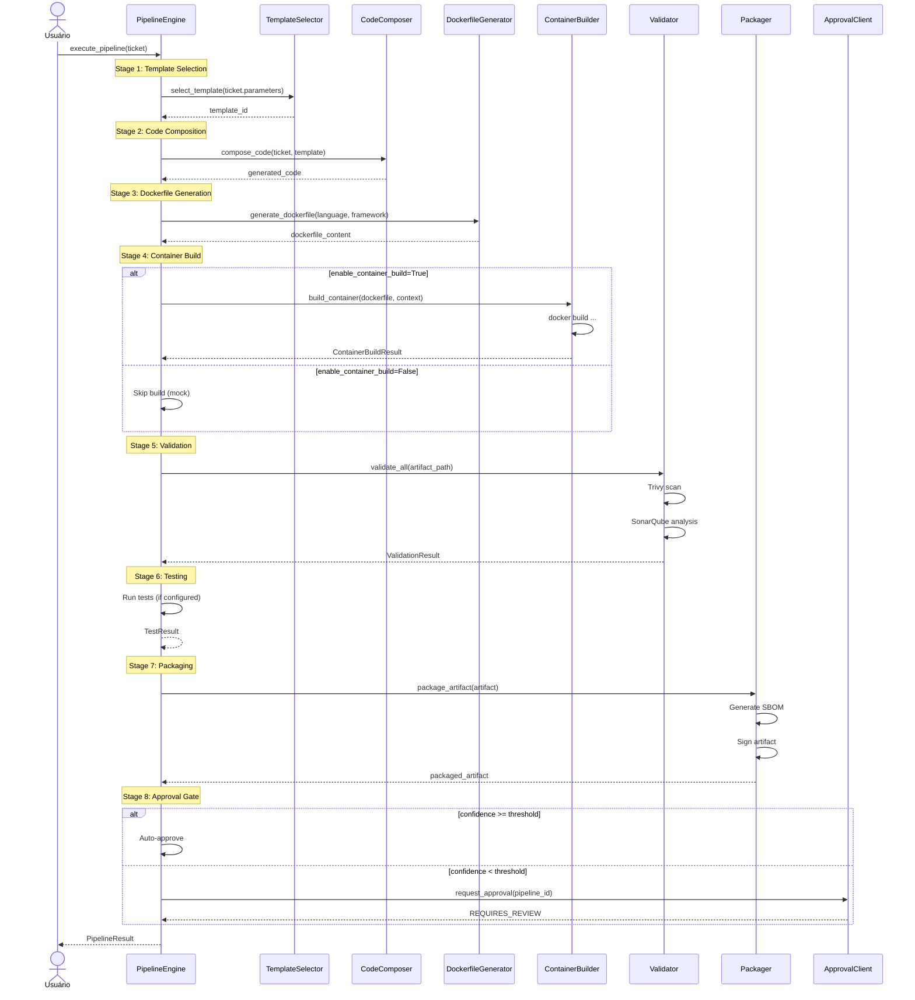
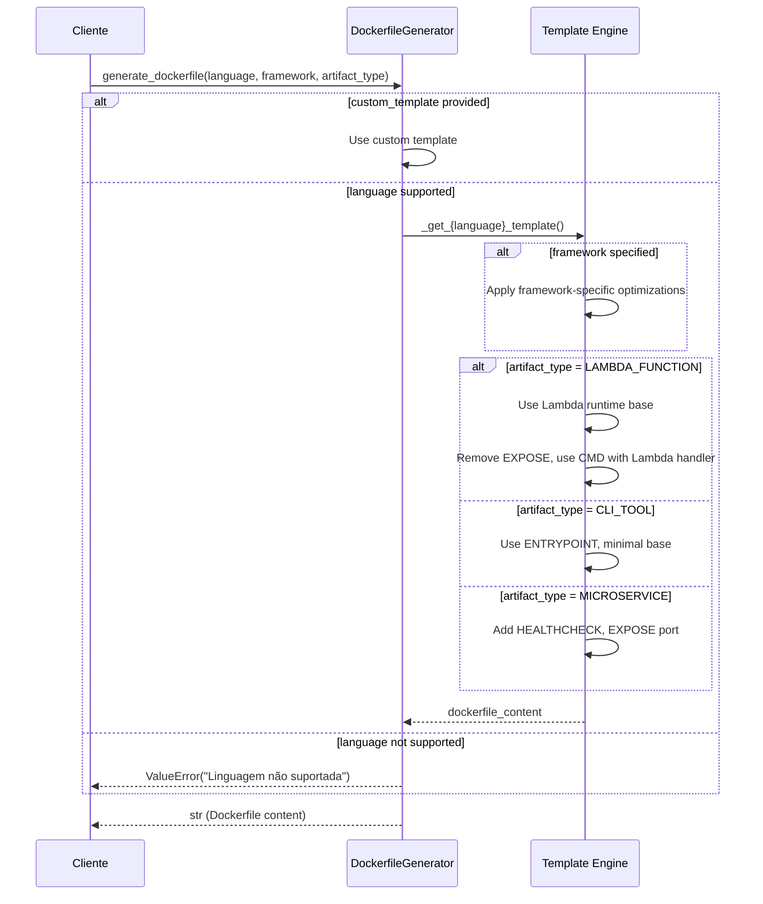
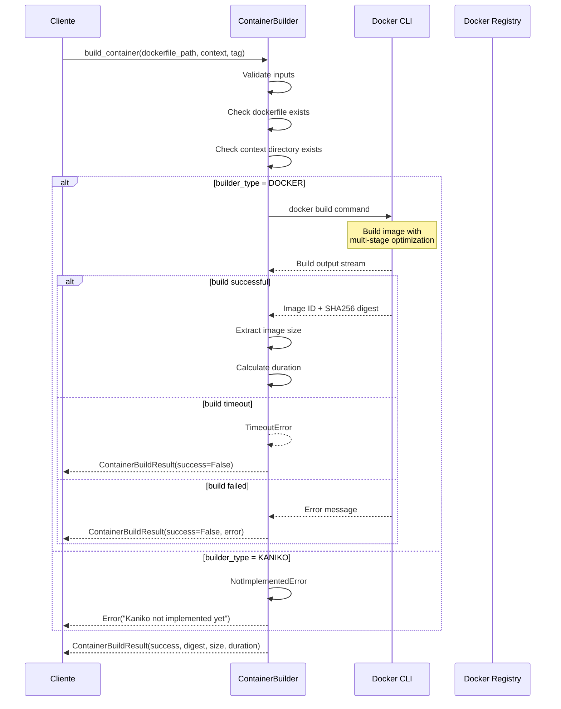
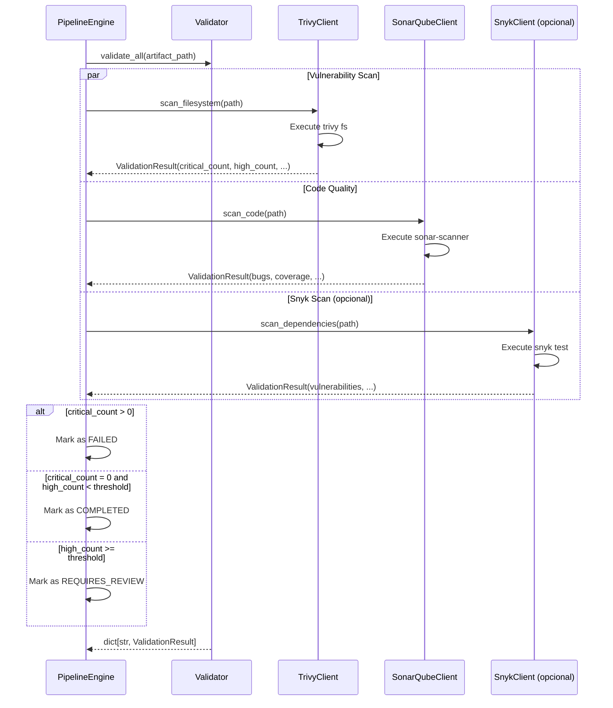
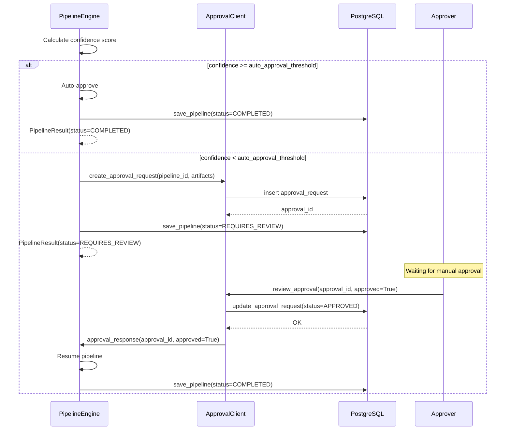
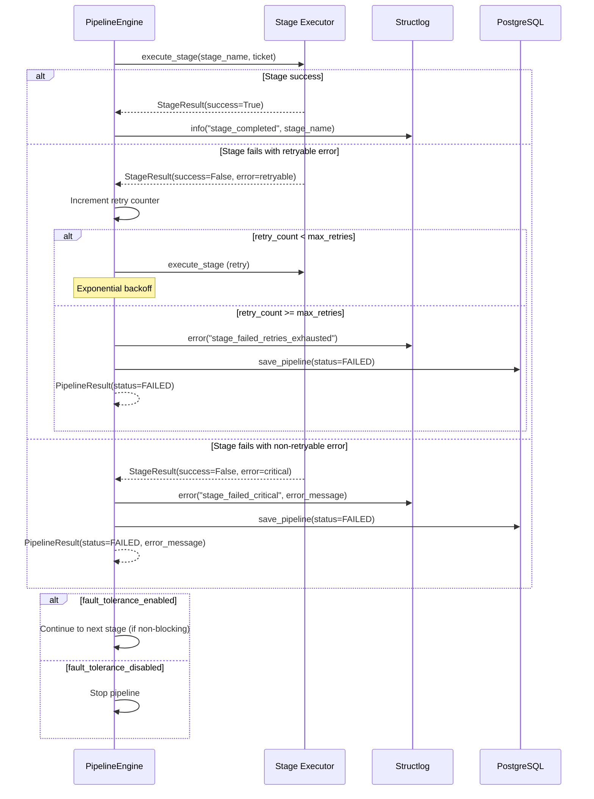
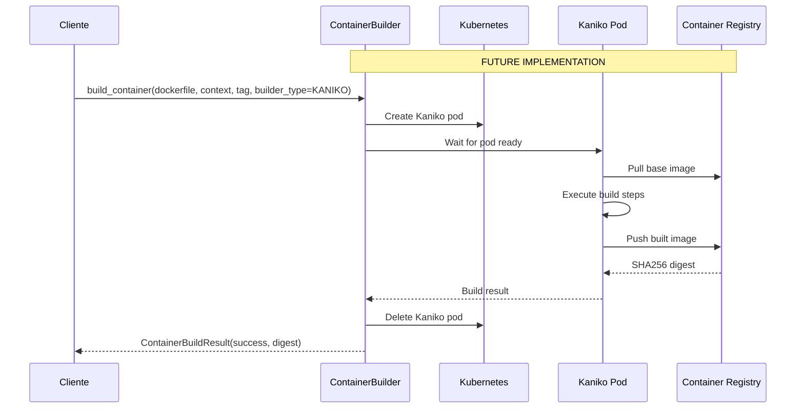
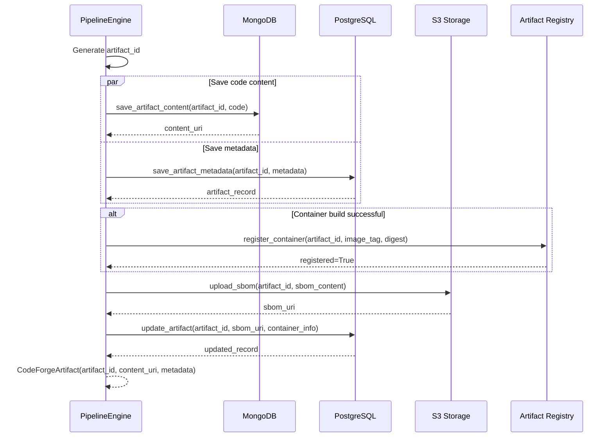
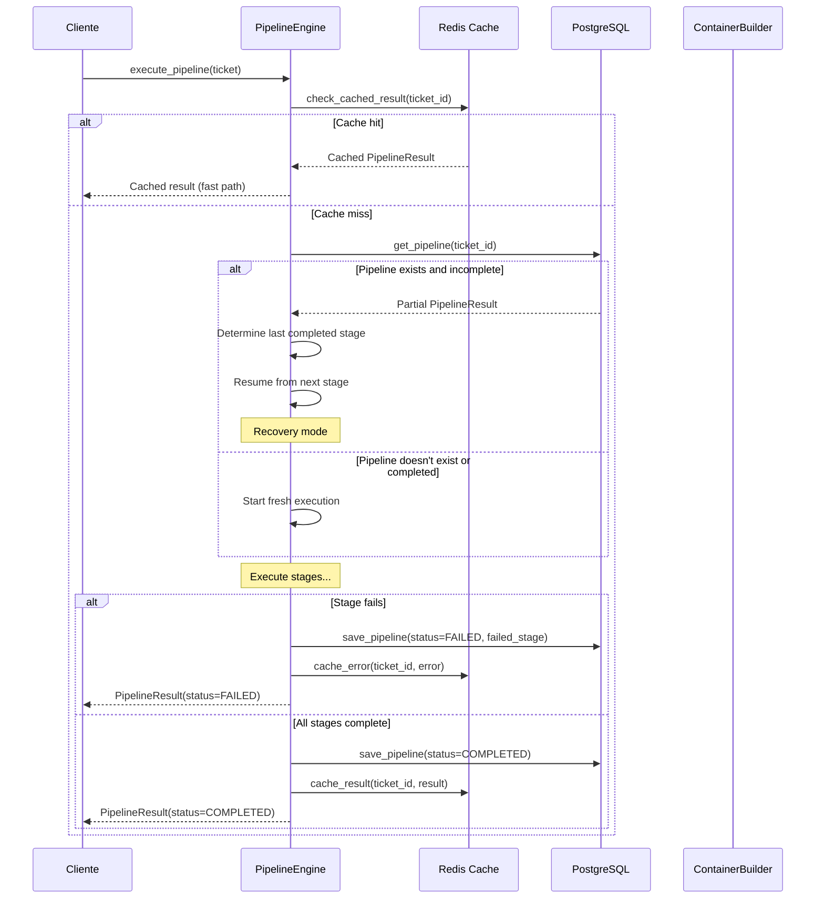
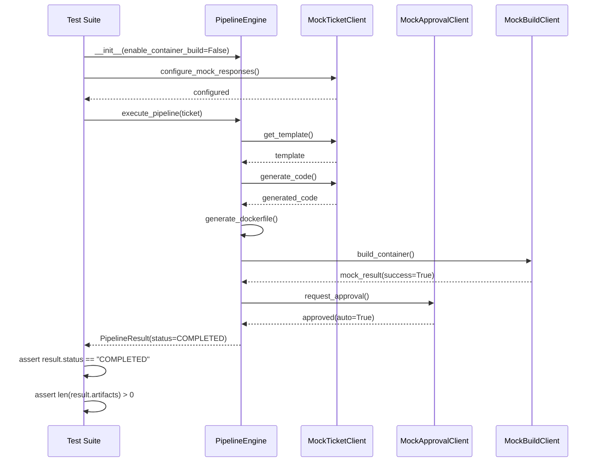

# Diagramas de Sequência - CodeForge

## Visão Geral

Este documento contém diagramas de sequência Mermaid que ilustram os principais fluxos do CodeForge.

## Índice

1. [Fluxo Principal do Pipeline](#fluxo-principal-do-pipeline)
2. [Geração de Dockerfile](#geração-de-dockerfile)
3. [Build de Container](#build-de-container)
4. [Validação de Segurança](#validação-de-segurança)
5. [Fluxo de Aprovação](#fluxo-de-aprovação)
6. [Tratamento de Erros](#tratamento-de-erros)
7. [Build com Kaniko](#build-com-kaniko)
8. [Persistência de Artefatos](#persistência-de-artefatos)

---

## Fluxo Principal do Pipeline

---

## Geração de Dockerfile

---

## Build de Container

---

## Validação de Segurança

---

## Fluxo de Aprovação

---

## Tratamento de Erros

---

## Build com Kaniko (Futuro)

---

## Persistência de Artefatos

---

## Fluxo de Recuperação (Fault Tolerance)

---

## Fluxo de Testes E2E

---

## Legenda de Componentes

| Abreviação | Componente |
|------------|------------|
| `PE` | PipelineEngine |
| `DG` | DockerfileGenerator |
| `CB` | ContainerBuilder |
| `V` | Validator |
| `P` | Packager |
| `AC` | ApprovalClient |
| `TS` | TemplateSelector |
| `CC` | CodeComposer |
| `DB` | PostgreSQL (metadados) |
| `Mongo` | MongoDB (código) |
| `S3` | S3 Storage (SBOMs) |
| `AR` | Artifact Registry |

## Convenções Visuais

- **Seta sólida (`->`)**: Chamada síncrona
- **Seta tracejada (`-->`)**: Retorno de valor
- **Retângulo tracejado**: Atividade assíncrona/processamento
- **Nota (`Note over`)**: Comentário ou contexto adicional
- **Alt/Opt**: Branch condicional

---

## Referências

- [Architecture](architecture.md)
- [API Reference](api-reference.md)
- [Examples](examples.md)
- [Troubleshooting](troubleshooting.md)
