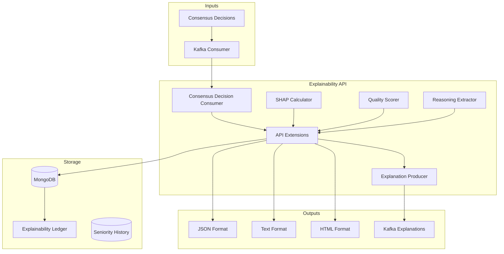
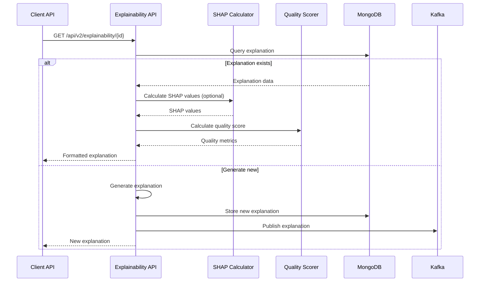

# Explainability API

API RESTful de explicabilidade para decisões, planos e opiniões do Neural Hive-Mind. Fornece explicações interpretáveis com SHAP values, quality scoring e suporte a múltiplos formatos (JSON, texto, HTML).

## Descrição

A Explainability API é o gateway de explicabilidade do sistema. Ela consulta o ledger de explicabilidade no MongoDB, gera explicações sob demanda com SHAP values, calcula quality scores e fornece endpoints para consulta em múltiplos formatos.

## Arquitetura

### Componentes



### Fluxo de Explicação



### Estrutura de Diretórios

```
services/explainability-api/
├── src/
│   ├── main.py                          # FastAPI entry point
│   ├── services/
│   │   ├── api_extensions.py            # Core explainability service
│   │   ├── shap_calculator.py           # SHAP value calculator
│   │   ├── quality_scorer.py            # Explanation quality metrics
│   │   ├── reasoning_extractor.py       # Extract reasoning from text
│   │   ├── hierarchical_explainer.py    # Hierarchical explanations
│   │   ├── temporal_tracker.py          # Track seniority over time
│   │   └── counterfactual_analyzer.py   # Counterfactual analysis
│   ├── consumers/
│   │   └── consensus_decision_consumer.py   # Kafka consumer
│   ├── producers/
│   │   └── explanation_producer.py      # Kafka producer
│   ├── repositories/
│   │   └── seniority_history_repo.py    # Seniority history queries
│   ├── models/
│   │   └── seniority.py                 # Seniority models
│   ├── api/
│   │   └── routes/
│   │       ├── v3/
│   │       │   └── hierarchical.py      # V3 hierarchical endpoints
│   │       └── __init__.py
│   ├── database/
│   │   └── migrations/
│   │       └── m004_seniority_history.py
│   └── metrics/
│       └── v3_metrics.py                # V3 Prometheus metrics
├── tests/
├── Dockerfile
└── requirements.txt
```

## Configuração

### Variáveis de Ambiente

| Variável | Descrição | Default |
|----------|-----------|---------|
| `KAFKA_BOOTSTRAP_SERVERS` | Brokers Kafka | `localhost:9092` |
| `MONGODB_URI` | Connection string MongoDB | `mongodb://mongodb:27017` |
| `CONSUMER_GROUP_ID` | Kafka consumer group | `explainability-api-group` |
| `ENABLE_KAFKA_CONSUMER` | Habilita consumer Kafka | `true` |
| `ENABLE_V3_API` | Habilita API V3 hierárquica | `false` |

## API

### Endpoints

#### Health & Status

```
GET /health                     # Health check básico
GET /ready                      # Readiness check
GET /metrics                    # Métricas Prometheus
```

#### V1 Legacy (Compatibilidade)

```
GET /api/v1/explainability/{token}    # Busca por token (legado)
GET /api/v1/explainability/stats      # Estatísticas gerais
```

#### V2 Extended

```
GET /api/v2/explainability/{decision_id}                      # Busca extendida
POST /api/v2/explainability/generate                         # Gerar sob demanda
GET /api/v2/explainability/{decision_id}/format/{format}     # Formato específico
```

**Formatos suportados:** `json`, `text`, `html`

#### V3 Hierarchical (quando habilitado)

```
GET /api/v3/explainability/{decision_id}                    # Explicação hierárquica
GET /api/v3/explainability/{decision_id}/seniority          # Histórico de senioridade
GET /api/v3/explainability/{decision_id}/breakdown          # Breakdown por especialista
```

### Exemplo de Resposta

```json
{
  "decision_id": "decision-123",
  "explainability_token": "tok-abc",
  "method": "hierarchical_shap",
  "generated_at": "2026-03-30T12:00:00Z",
  "final_decision": "approve",
  "confidence_score": 0.85,
  "specialist_votes": [
    {
      "specialist_type": "business",
      "vote": "approve",
      "confidence": 0.90,
      "seniority_level": "senior",
      "reasoning_factors": [
        {
          "factor_name": "workflow_efficiency",
          "weight": 0.40,
          "score": 0.88,
          "shap_value": 0.035
        }
      ]
    }
  ],
  "shap_values": {
    "business_confidence": 0.045,
    "technical_confidence": 0.038,
    "architecture_confidence": 0.042
  },
  "quality_score": {
    "completeness": 0.92,
    "clarity": 0.85,
    "specificity": 0.78,
    "overall": 0.85
  },
  "reasoning_summary": "Decisão baseada em forte alinhamento de negócios..."
}
```

## Integrações

### Kafka

**Tópicos Consumidos:**

- `consensus.decision.created`: Decisões de consenso para gerar explicações

**Tópicos Produzidos:**

- `consensus.explanations`: Explicações geradas publicadas

### MongoDB

**Coleções:**

- `explainability_ledger`: Ledger principal de explicações
- `seniority_history`: Histórico de senioridade de especialistas (V3)

## Deploy

### Docker

```bash
docker build -t explainability-api:latest .
docker run -p 8000:8000 \
  -e KAFKA_BOOTSTRAP_SERVERS=kafka:9092 \
  -e MONGODB_URI=mongodb://mongodb:27017 \
  explainability-api:latest
```

### Kubernetes

```yaml
apiVersion: apps/v1
kind: Deployment
metadata:
  name: explainability-api
spec:
  replicas: 2
  selector:
    matchLabels:
      app: explainability-api
  template:
    metadata:
      labels:
        app: explainability-api
    spec:
      containers:
      - name: api
        image: explainability-api:latest
        ports:
        - containerPort: 8000
        env:
        - name: ENABLE_V3_API
          value: "true"
```

## Desenvolvimento

### Como Executar Localmente

```bash
pip install -r requirements.txt
uvicorn src.main:app --reload --port 8000
```

### Testes

```bash
pytest tests/ -v
```

## Troubleshooting

**1. Consumer Kafka não inicia**

```bash
# Verificar ENABLE_KAFKA_CONSUMER
export ENABLE_KAFKA_CONSUMER=true

# Verificar tópicos
kafka-topics --bootstrap-server localhost:9092 --list
```

**2. SHAP values demoram**

- Reduzir `n_background_samples` no ShapCalculator
- Verificar se modelo ML está disponível

## Métricas Prometheus

- `explainability_queries_total`: Queries por tipo e status
- `explainability_query_duration_seconds`: Duração das queries
- `explanations_generated_total`: Explicações geradas por formato
- `v3_explanations_total`: Explicações V3 hierárquicas

## Referências

- [Consensus Engine](../consensus-engine/README.md)
- [neural_hive_specialists](../../libraries/python/neural_hive_specialists/README.md)
