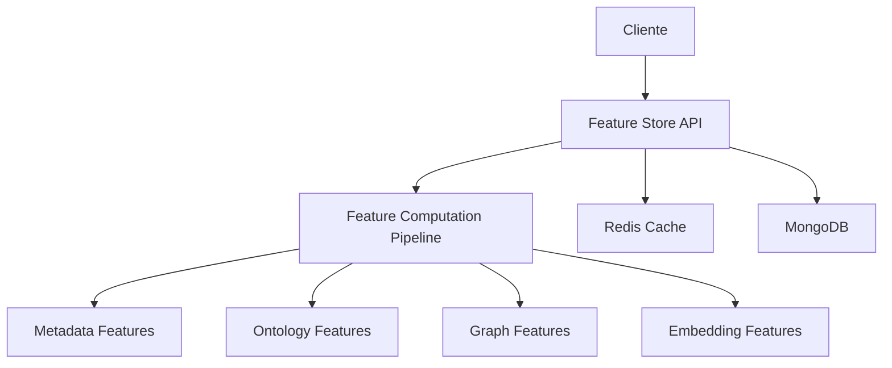

# Feature Store Service

## Descricao
Servico de armazenamento e computacao de features para modelos ML do Neural-Hive-Mind. Fornece API REST para gerenciamento de features com cache Redis e persistencia em MongoDB, computando 26 features a partir de planos cognitivos.

## Arquitetura


## Funcionalidades
- Computacao de 26 features organizadas em 4 categorias
- Cache Redis para performance (TTL configuravel)
- Persistencia em MongoDB com indices otimizados
- Computation assincrona com timeout
- Batch processing para multiplas solicitacoes
- Monitorizacao de metricas de uso

### Features Computadas (26 total)

**Metadata Features (6):**
- `num_tasks` - Numero de tarefas no plano
- `priority_score` - Score de prioridade normalizado (0-1)
- `total_duration_ms` - Soma das duracoes estimadas
- `avg_duration_ms` - Duracao media por tarefa
- `risk_score` - Score de risco do plano
- `complexity_score` - Score baseado em tipos de tarefas

**Ontology Features (6):**
- `domain_risk_weight` - Peso de risco do dominio
- `avg_task_complexity_factor` - Fator medio de complexidade
- `num_patterns_detected` - Padroes arquiteturais
- `num_anti_patterns_detected` - Anti-padroes
- `avg_pattern_quality` - Qualidade media dos padroes
- `total_anti_pattern_penalty` - Penalidade total

**Graph Features (11):**
- `num_nodes` - Numero de nos (tarefas)
- `num_edges` - Numero de arestas (dependencias)
- `density` - Densidade do grafo
- `avg_in_degree` - Grau medio de entrada
- `max_in_degree` - Grau maximo de entrada
- `critical_path_length` - Caminho critico
- `max_parallelism` - Paralelismo maximo
- `num_levels` - Niveis do DAG
- `avg_coupling` - Acoplamento medio
- `num_bottlenecks` - Gargalos identificados
- `graph_complexity_score` - Score de complexidade

**Embedding Features (3):**
- `mean_norm` - Norma media dos embeddings
- `std_norm` - Desvio padrao da norma
- `avg_diversity` - Diversidade media (similaridade cosseno)

## API

### Endpoints

| Metodo | Endpoint | Descricao |
|--------|----------|-----------|
| GET | `/api/v1/features/{plan_id}` | Busca features de um plano |
| POST | `/api/v1/features/{plan_id}` | Salva ou computa features |
| DELETE | `/api/v1/features/{plan_id}` | Deleta features |
| GET | `/api/v1/features` | Lista features com paginacao |
| POST | `/api/v1/features/batch` | Computa features em batch |
| GET | `/api/v1/features/metrics/summary` | Metricas do servico |
| GET | `/api/v1/features/by-plan-ids` | Busca por multiplas IDs |
| GET | `/health` | Health check |

### Exemplos

**Buscar features:**
```bash
GET /api/v1/features/plan-123?use_cache=true
```

**Computar features:**
```bash
POST /api/v1/features/plan-123
{
  "plan_id": "plan-123",
  "cognitive_plan": {...},
  "force_recompute": false
}
```

**Batch computation:**
```bash
POST /api/v1/features/batch
[
  {"plan_id": "plan-1", "cognitive_plan": {...}},
  {"plan_id": "plan-2", "cognitive_plan": {...}}
]
```

## Configuracao

| Variavel | Default | Descricao |
|----------|---------|-----------|
| `ENVIRONMENT` | dev | Ambiente de execucao |
| `MONGODB_URI` | mongodb://localhost:27017 | URI de conexao MongoDB |
| `MONGODB_DATABASE` | neural_hive | Nome do database |
| `MONGODB_FEATURES_COLLECTION` | feature_store | Colecao de features |
| `REDIS_URL` | redis://localhost:6379/0 | URL de conexao Redis |
| `REDIS_CACHE_TTL_SECONDS` | 3600 | TTL do cache em segundos |
| `ENABLE_ASYNC_COMPUTATION` | true | Habilita computacao assincrona |
| `COMPUTATION_TIMEOUT_SECONDS` | 30 | Timeout para computacao |
| `MAX_PARALLEL_COMPUTATIONS` | 10 | Maximo de computacoes paralelas |
| `RATE_LIMIT_REQUESTS_PER_MINUTE` | 200 | Limite de requests por minuto |

## Integracoes

- **MongoDB:** `feature_store` collection com indices em `plan_id`, `created_at`, `status`
- **Redis:** Cache de features com key pattern `feature:{plan_id}`
- **Semantic Translation Engine:** Fonte de Cognitive Plans
- **ML Services:** Consumidor de features para treinamento/inferencia

## Deploy

### Docker
```bash
docker build -t feature-store:latest .
docker run -p 8080:8080 \
  -e MONGODB_URI=mongodb://mongodb:27017 \
  -e REDIS_URL=redis://redis:6379/0 \
  feature-store:latest
```

### Docker Compose
```yaml
services:
  feature-store:
    build: .
    ports:
      - "8080:8080"
    environment:
      - MONGODB_URI=mongodb://mongodb:27017
      - REDIS_URL=redis://redis:6379/0
    depends_on:
      - mongodb
      - redis
```

### Kubernetes
```bash
helm install feature-store ./helm/feature-store \
  --namespace neural-hive \
  --set mongodb.uri=mongodb://mongodb-service:27017 \
  --set redis.url=redis://redis-service:6379/0
```

## Desenvolvimento

```bash
# Instalar dependencias
pip install -r requirements.txt

# Executar servico
python src/main.py

# Executar testes
pytest tests/ -v

# Com cobertura
pytest tests/ --cov=src --cov-report=html
```

## Troubleshooting

| Problema | Solução |
|----------|---------|
| Timeout na computacao | Aumente `COMPUTATION_TIMEOUT_SECONDS` |
| Cache hit rate baixo | Verifique se `REDIS_CACHE_TTL_SECONDS` esta adequado |
| Features nao computadas | Verifique se o Cognitive Plan possui todos os campos necessarios |
| Erro de conexao MongoDB | Confirme `MONGODB_URI` e disponibilidade do servidor |
| Erro de conexao Redis | Confirme `REDIS_URL` e disponibilidade do servidor |
