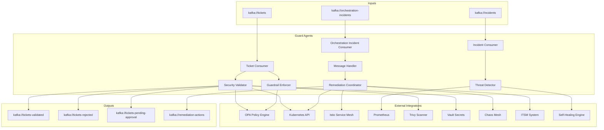
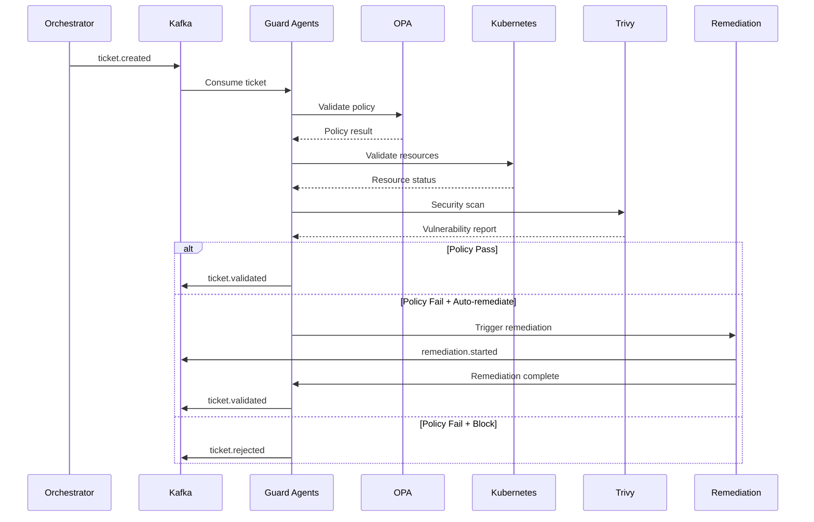

# Guard Agents

Sistema de detecção de ameaças, validação de segurança e remediação automática do Neural Hive-Mind. Responsável por aplicar políticas de segurança, detectar anomalias e coordenar respostas a incidentes.

## Descrição

Os Guard Agents são a primeira linha de defesa do Neural Hive-Mind. Eles monitoram tickets de execução, validam políticas via OPA, detectam ameaças de segurança, scan de vulnerabilidades e coordenam remediação automática ou manual via integração com sistemas externos (Chaos Mesh, Trivy, Vault, ITSM).

## Arquitetura

### Componentes Principais



### Fluxo de Validação de Ticket



### Estrutura de Diretórios

```
services/guard-agents/
├── src/
│   ├── main.py                          # FastAPI entry point
│   ├── api/
│   │   ├── health.py                    # Health endpoints
│   │   ├── validation.py                # Validation API
│   │   ├── incidents.py                 # Incident management API
│   │   └── enforcement.py               # Policy enforcement API
│   ├── services/
│   │   ├── security_validator.py        # Core validation logic
│   │   ├── guardrail_enforcer.py        # Guardrail enforcement
│   │   ├── threat_detector.py           # Threat detection
│   │   ├── incident_classifier.py       # Incident classification
│   │   ├── remediation_coordinator.py   # Remediation orchestration
│   │   ├── policy_enforcer.py           # OPA policy enforcement
│   │   └── message_handler.py           # Kafka message handler
│   ├── consumers/
│   │   ├── ticket_consumer.py           # Ticket validation consumer
│   │   └── kafka_consumer.py            # Generic Kafka consumer
│   ├── producers/
│   │   ├── validation_producer.py       # Publish validation results
│   │   └── remediation_producer.py      # Publish remediation actions
│   ├── clients/
│   │   ├── opa_client.py                # Open Policy Agent
│   │   ├── kubernetes_client.py         # Kubernetes API
│   │   ├── istio_client.py              # Istio API
│   │   ├── prometheus_client.py         # Prometheus metrics
│   │   ├── trivy_client.py              # Trivy scanner
│   │   ├── vault_client.py              # HashiCorp Vault
│   │   ├── chaosmesh_client.py          # Chaos Mesh
│   │   ├── itsm_client.py               # ITSM integration
│   │   ├── self_healing_client.py       # Self-Healing Engine
│   │   ├── script_executor.py           # Script execution
│   │   ├── mongodb_client.py            # MongoDB
│   │   ├── redis_client.py              # Redis
│   │   └── service_registry_client.py   # Service Registry
│   ├── models/
│   │   ├── security_validation.py       # Validation models
│   │   ├── security_incident.py         # Incident models
│   │   └── remediation_action.py        # Remediation models
│   ├── observability/
│   │   ├── metrics.py                   # Prometheus metrics
│   │   └── tracing.py                   # OpenTelemetry tracing
│   └── config/
│       └── settings.py                  # Configuration
├── tests/
├── Dockerfile
└── requirements.txt
```

## Configuração

### Variáveis de Ambiente

| Variável | Descrição | Default |
|----------|-----------|---------|
| `SERVICE_NAME` | Nome do serviço | `guard-agents` |
| `ENVIRONMENT` | Ambiente | `development` |
| `KAFKA_BOOTSTRAP_SERVERS` | Brokers Kafka | `localhost:9092` |
| `KAFKA_CONSUMER_GROUP` | Consumer group ID | `guard-agents-group` |
| `KAFKA_TICKETS_TOPIC` | Tópico de tickets | `tickets` |
| `KAFKA_TICKETS_VALIDATED_TOPIC` | Tópicos de saída | `tickets-validated` |
| `KAFKA_TICKETS_REJECTED_TOPIC` | Tickets rejeitados | `tickets-rejected` |
| `KAFKA_TICKETS_PENDING_APPROVAL_TOPIC` | Tickets pendentes | `tickets-pending-approval` |
| `KAFKA_INCIDENTS_TOPIC` | Incidentes | `security-incidents` |
| `KAFKA_REMEDIATION_TOPIC` | Remediação | `remediation-actions` |
| `MONGODB_URI` | MongoDB connection | `mongodb://mongodb:27017` |
| `REDIS_HOST` | Redis host | `redis` |
| `REDIS_PORT` | Redis port | `6379` |
| `OPA_ENFORCEMENT_ENABLED` | Habilita OPA | `true` |
| `OPA_URL` | URL do OPA | `http://opa:8181` |
| `OPA_TIMEOUT_SECONDS` | Timeout OPA | `5` |
| `VAULT_ENABLED` | Habilita Vault | `false` |
| `VAULT_ADDR` | Vault address | `http://vault:8200` |
| `TRIVY_ENABLED` | Habilita Trivy | `false` |
| `TRIVY_URL` | Trivy server URL | `http://trivy:8080` |
| `ISTIO_ENFORCEMENT_ENABLED` | Habilita Istio | `false` |
| `CHAOSMESH_ENABLED` | Habilita Chaos Mesh | `false` |
| `ITSM_ENABLED` | Habilita ITSM | `false` |
| `ANOMALY_DETECTOR_ENABLED` | Habilita ML anomaly detection | `true` |
| `GUARDRAILS_MODE` | Modo de guardrails | `enforce` |

## API

### Endpoints REST

#### Health & Status

```
GET /health                     # Health check básico
GET /ready                     # Readiness check
GET /metrics                   # Métricas Prometheus
```

#### Validation

```
POST /api/v1/validation/validate    # Validar ticket manualmente
GET  /api/v1/validation/policies    # Listar políticas OPA
POST /api/v1/validation/test-policy # Testar política OPA
```

**Body validate:**

```json
{
  "ticket_id": "ticket-123",
  "plan_id": "plan-abc",
  "action": "query_database",
  "parameters": {
    "collection": "users",
    "query": {}
  }
}
```

#### Incidents

```
GET    /api/v1/incidents                    # Listar incidentes
GET    /api/v1/incidents/{id}               # Detalhes do incidente
POST   /api/v1/incidents                    # Criar incidente
POST   /api/v1/incidents/{id}/resolve       # Resolver incidente
POST   /api/v1/incidents/{id}/escalate      # Escalar incidente
```

#### Enforcement

```
GET  /api/v1/enforcement/guardrails        # Listar guardrails ativos
POST /api/v1/enforcement/enable             # Habilitar guardrail
POST /api/v1/enforcement/disable            # Desabilitar guardrail
GET  /api/v1/enforcement/audit              # Audit log de enforcement
```

## Integrações

### Kafka

**Tópicos Consumidos:**

- `tickets`: Tickets de execução para validação
- `security-incidents`: Incidentes de segurança
- `orchestration-incidents`: Incidentes de orquestração

**Tópicos Produzidos:**

- `tickets-validated`: Tickets validados com sucesso
- `tickets-rejected`: Tickets rejeitados por política
- `tickets-pending-approval`: Tickets requer aprovação manual
- `remediation-actions`: Ações de remediação

### OPA (Open Policy Agent)

Políticas de exemplo:

```rego
package neuralhive.guardrails

# Bloquear queries sem collection especificada
deny[reason] {
    not input.parameters.collection
    reason := "collection parameter is required for queries"
}

# Bloquear queries em coleções sensíveis
deny[reason] {
    sensitive_collections := ["users", "credentials", "api_keys"]
    input.parameters.collection == sensitive_collections[_]
    not input.context.admin
    reason := sprintf("access to %s requires admin role", [input.parameters.collection])
}

# Limitar tamanho de resultados
deny[reason] {
    input.parameters.limit > 1000
    reason := "result limit exceeds maximum (1000)"
}
```

### Kubernetes

Validação de recursos:

```python
# Validar se namespace existe
namespace_exists = await k8s_client.check_namespace(namespace)

# Validar se pod tem permissões RBAC
rbac_allowed = await k8s_client.check_pod_security_context(pod_spec)

# Validar quotas de recursos
within_quotas = await k8s_client.check_resource_quotas(resources)
```

### Trivy

Scan de vulnerabilidades:

```python
vulnerabilities = await trivy_client.scan_image(image_url)

high_critical = [
    v for v in vulnerabilities
    if v['Severity'] in ['HIGH', 'CRITICAL']
]

if high_critical:
    reject_ticket(vulnerabilities=high_critical)
```

### Chaos Mesh

Testes de resiliência:

```python
# Injetar falha para teste
await chaosmesh_client.inject_pod_failure(
    namespace=namespace,
    pod_name=pod_name,
    duration_seconds=60
)
```

### ITSM

Criação de tickets:

```python
# Criar ticket no ServiceNow / JIRA
ticket_id = await itsm_client.create_ticket({
    'title': f'Security Incident: {incident_type}',
    'severity': severity,
    'description': incident_details
})
```

## Deploy

### Docker

```bash
docker build -t guard-agents:latest .
docker run -p 8080:8080 \
  -e KAFKA_BOOTSTRAP_SERVERS=kafka:9092 \
  -e OPA_ENFORCEMENT_ENABLED=true \
  -e OPA_URL=http://opa:8181 \
  guard-agents:latest
```

### Kubernetes/Helm

```yaml
replicaCount: 2

image:
  repository: guard-agents
  tag: latest

resources:
  requests:
    memory: "512Mi"
    cpu: "250m"
  limits:
    memory: "1Gi"
    cpu: "500m"

env:
  - name: OPA_ENFORCEMENT_ENABLED
    value: "true"
  - name: TRIVY_ENABLED
    value: "true"
  - name: VAULT_ENABLED
    value: "true"
```

## Desenvolvimento

### Como Executar Localmente

```bash
# Instalar dependências
pip install -r requirements.txt

# Configurar variáveis de ambiente
export KAFKA_BOOTSTRAP_SERVERS=localhost:9092
export OPA_ENFORCEMENT_ENABLED=true
export OPA_URL=http://localhost:8181

# Executar serviço
uvicorn src.main:app --reload --host 0.0.0.0 --port 8080
```

### Testes

```bash
# Unit tests
pytest tests/ -v

# Testes de integração
docker-compose up -d kafka opa
pytest tests/integration/ -v

# Testes de políticas OPA
pytest tests/opa_policies/ -v
```

## Troubleshooting

### Problemas Comuns

**1. Tickets sempre rejeitados**

```bash
# Verificar políticas OPA carregadas
curl http://opa:8181/v1/policies

# Testar política manualmente
curl -X POST http://opa:8181/v1/data/neuralhive/guardrails \
  -d '{"input": {...}}'

# Verificar logs do Guard
kubectl logs -f deployment/guard-agents | grep "policy_validation"
```

**2. Trivy scan falhando**

```bash
# Verificar conectividade Trivy
curl http://trivy:8080/health

# Verificar se imagem é acessível
docker pull <image_to_scan>
```

**3. Anomaly detector não inicia**

```bash
# Verificar se MLflow está acessível
curl http://mlflow:5000/health

# Verificar se modelo existe
curl http://mlflow:5000/api/2.0/mlflow/registered-models/list
```

**4. Remediation actions não executam**

```bash
# Verificar permissões RBAC do pod
kubectl auth can-i create pods --as=system:service:neuralhive:guard-agents

# Verificar logs do remediation coordinator
kubectl logs -f deployment/guard-agents | grep "remediation"
```

## Modelos de Detecção

### Anomaly Detection

O Guard Agents usa ML para detectar anomalias em padrões de tickets:

- **Isolation Forest**: Detecta outliers em parâmetros de tickets
- **One-Class SVM**: Identifica desvios de comportamento normal
- **Threshold Dinâmico**: Ajusta limites baseado em histórico

### Classificação de Incidentes

Incidentes são classificados em:

- **CRITICAL**: Requer ação imediata (ex: data breach)
- **HIGH**: Alta prioridade (ex: elevação de privilégios suspeita)
- **MEDIUM**: Investigação necessária
- **LOW**: Informacional

## Referências

- [Approval Service](../approval-service/README.md)
- [Service Registry](../service-registry/README.md)
- [Self-Healing Engine](../self-healing-engine/README.md)
- [OPA Documentation](https://www.openpolicyagent.org/docs/latest/)
- [Trivy Documentation](https://aquasecurity.github.io/trivy/)
