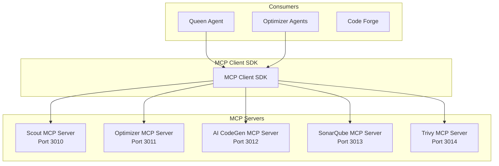

# MCP Servers

Coleção de servidores MCP (Model Context Protocol) do Neural Hive-Mind. Fornece ferramentas especializadas para exploração de código, otimização, geração de código, análise de segurança e qualidade.

## Descrição

O diretório `mcp-servers` contém múltiplos servidores MCP que implementam o protocolo Model Context Protocol, permitindo que agentes de IA acessem ferramentas especializadas de forma padronizada.

## Arquitetura



## Servidores Disponíveis

### 1. Scout MCP Server

Servidor de exploração de código e descoberta de arquivos.

**Porta:** 3010

**Ferramentas:**

- `list_files`: Listar arquivos em um diretório
- `read_file`: Ler conteúdo de arquivo
- `analyze_structure`: Analisar estrutura de diretórios
- `search_code`: Buscar padrões no código
- `get_file_info`: Obter metadados de arquivo

**Stack:** Python, FastAPI, aiofiles

**Repositório:** `mcp-servers/scout-mcp-server/`

### 2. Optimizer MCP Server

Servidor de otimização de código e refatoração.

**Porta:** 3011

**Ferramentas:**

- `optimize_code`: Otimizar código
- `refactor`: Refatorar código
- `suggest_improvements`: Sugerir melhorias
- `analyze_complexity`: Analisar complexidade ciclomática
- `detect_smells`: Detectar code smells

**Stack:** Python, FastAPI, radon, pylint

**Repositório:** `mcp-servers/optimizer-mcp-server/`

### 3. AI CodeGen MCP Server

Servidor de geração de código assistida por IA.

**Porta:** 3012

**Ferramentas:**

- `generate_code`: Gerar código a partir de descrição
- `complete_code': Autocompletar código
- `generate_tests`: Gerar testes unitários
- `generate_docs`: Gerar documentação
- `translate_code`: Traduzir código entre linguagens

**Stack:** Python, FastAPI, Anthropic SDK

**Repositório:** `mcp-servers/ai-codegen-mcp-server/`

### 4. SonarQube MCP Server

Servidor de análise de qualidade de código SonarQube.

**Porta:** 3013

**Ferramentas:**

- `analyze_project`: Analisar projeto no SonarQube
- `get_issues`: Obter issues de qualidade
- `get_metrics`: Obter métricas de código
- `get_hotspots`: Obter hotspots de segurança
- `get_rules`: Listar regras de qualidade

**Stack:** Python, FastAPI, sonarqube-api

**Repositório:** `mcp-servers/sonarqube-mcp-server/`

### 5. Trivy MCP Server

Servidor de scan de vulnerabilidades Trivy.

**Porta:** 3014

**Ferramentas:**

- `scan_image`: Scan de imagem de container
- `scan_filesystem`: Scan de sistema de arquivos
- `scan_repository`: Scan de repositório Git
- `get_vulnerabilities`: Obter vulnerabilidades encontradas
- `generate_report`: Gerar relatório de segurança

**Stack:** Python, FastAPI, trivy-api

**Repositório:** `mcp-servers/trivy-mcp-server/`

## MCP Client SDK

SDK para conectar agentes aos servidores MCP.

**Instalação:**

```bash
pip install mcp-client-sdk
```

**Uso Básico:**

```python
import asyncio
from mcp_client_sdk import MCPClient

async def main():
    client = MCPClient(server_url="http://localhost:3010")

    # Listar ferramentas
    tools = await client.list_tools()
    print(f"Ferramentas: {[t['name'] for t in tools]}")

    # Executar ferramenta
    result = await client.execute_tool(
        tool_name="list_files",
        params={"path": "/src", "pattern": "*.py"}
    )
    print(f"Arquivos: {result}")

asyncio.run(main())
```

**Execução em Lote:**

```python
results = await client.execute_batch([
    {"tool_name": "list_files", "params": {"path": "/src"}},
    {"tool_name": "analyze_structure", "params": {"path": "/src"}},
])
```

## Configuração

### Variáveis de Ambiente Comuns

| Variável | Descrição | Default |
|----------|-----------|---------|
| `SERVICE_NAME` | Nome do serviço | `{server}-mcp-server` |
| `ENVIRONMENT` | Ambiente | `development` |
| `CORS_ORIGINS` | Origens CORS permitidas | `*` |
| `LOG_LEVEL` | Nível de log | `INFO` |

### Scout MCP Server

| Variável | Descrição | Default |
|----------|-----------|---------|
| `SCOUT_BASE_PATH` | Caminho base para exploração | `/app` |
| `SCOUT_MAX_DEPTH` | Profundidade máxima de scan | `10` |
| `SCOUT_EXCLUDE_PATTERNS` | Padrões de exclusão | `.git,node_modules` |

### Optimizer MCP Server

| Variável | Descrição | Default |
|----------|-----------|---------|
| `OPTIMIZER_MAX_COMPLEXITY` | Complexidade máxima permitida | `15` |
| `OPTIMIZER_ENABLE_AUTO_FIX` | Habilita correção automática | `false` |

### AI CodeGen MCP Server

| Variável | Descrição | Default |
|----------|-----------|---------|
| `ANTHROPIC_API_KEY` | API Key Anthropic | - |
| `CODEGEN_MODEL` | Modelo Claude | `claude-3-opus` |
| `CODEGEN_MAX_TOKENS` | Tokens máximos | `4096` |

### SonarQube MCP Server

| Variável | Descrição | Default |
|----------|-----------|---------|
| `SONARQUBE_URL` | URL do SonarQube | `http://sonarqube:9000` |
| `SONARQUBE_TOKEN` | Token de autenticação | - |

### Trivy MCP Server

| Variável | Descrição | Default |
|----------|-----------|---------|
| `TRIVY_SERVER_URL` | URL do servidor Trivy | `http://trivy:8080` |
| `TRIVY_TIMEOUT_SECONDS` | Timeout de scan | `300` |

## Deploy

### Docker Compose

```yaml
version: '3.8'
services:
  scout-mcp:
    build: ./scout-mcp-server
    ports:
      - "3010:3010"
    volumes:
      - /path/to/code:/app:ro

  optimizer-mcp:
    build: ./optimizer-mcp-server
    ports:
      - "3011:3011"

  ai-codegen-mcp:
    build: ./ai-codegen-mcp-server
    ports:
      - "3012:3012"
    environment:
      ANTHROPIC_API_KEY: ${ANTHROPIC_API_KEY}

  sonarqube-mcp:
    build: ./sonarqube-mcp-server
    ports:
      - "3013:3013"
    environment:
      SONARQUBE_URL: http://sonarqube:9000
      SONARQUBE_TOKEN: ${SONARQUBE_TOKEN}

  trivy-mcp:
    build: ./trivy-mcp-server
    ports:
      - "3014:3014"
    environment:
      TRIVY_SERVER_URL: http://trivy:8080
```

## Desenvolvimento

### Como Executar Localmente

```bash
# Scout MCP Server
cd scout-mcp-server
pip install -r requirements.txt
uvicorn src.main:app --port 3010

# Optimizer MCP Server
cd optimizer-mcp-server
pip install -r requirements.txt
uvicorn src.main:app --port 3011

# AI CodeGen MCP Server
cd ai-codegen-mcp-server
pip install -r requirements.txt
uvicorn src.main:app --port 3012
```

### Testes

```bash
# Todos os servidores
pytest mcp-servers/tests/ -v

# Servidor específico
pytest scout-mcp-server/tests/ -v
```

## API MCP

### Protocolo de Comunicação

Os servidores MCP implementam o protocolo REST:

**Listar Ferramentas:**

```
GET /tools
```

**Executar Ferramenta:**

```
POST /tools/execute
Content-Type: application/json

{
  "tool_name": "list_files",
  "parameters": {
    "path": "/src",
    "pattern": "*.py"
  }
}
```

**Health Check:**

```
GET /health
```

## Integração com Queen Agent

O Queen Agent usa o MCP Tool Orchestrator para coordenar chamadas aos servidores MCP:

```python
# Queen Agent chama Scout MCP
result = await mcp_orchestrator.execute_tool(
    server="scout",
    tool_name="list_files",
    params={"path": "/src", "pattern": "*.py"}
)

# Queen Agent chama Optimizer MCP
result = await mcp_orchestrator.execute_tool(
    server="optimizer",
    tool_name="optimize_code",
    params={"code": "...", "language": "python"}
)
```

## Troubleshooting

**1. Servidor não responde**

```bash
# Verificar health
curl http://localhost:3010/health

# Verificar logs
docker logs scout-mcp-server
```

**2. Ferramenta retorna erro**

```bash
# Verificar ferramentas disponíveis
curl http://localhost:3010/tools

# Testar execução
curl -X POST http://localhost:3010/tools/execute \
  -d '{"tool_name": "list_files", "parameters": {"path": "/"}}'
```

**3. Anthropic API key inválida**

```bash
# Verificar variável de ambiente
echo $ANTHROPIC_API_KEY

# Testar API key
curl https://api.anthropic.com/v1/messages \
  -H "x-api-key: $ANTHROPIC_API_KEY"
```

## Referências

- [Queen Agent](../queen-agent/README.md)
- [Optimizer Agents](../optimizer-agents/README.md)
- [Code Forge](../code-forge/README.md)
- [MCP Protocol Specification](https://modelcontextprotocol.io/)
