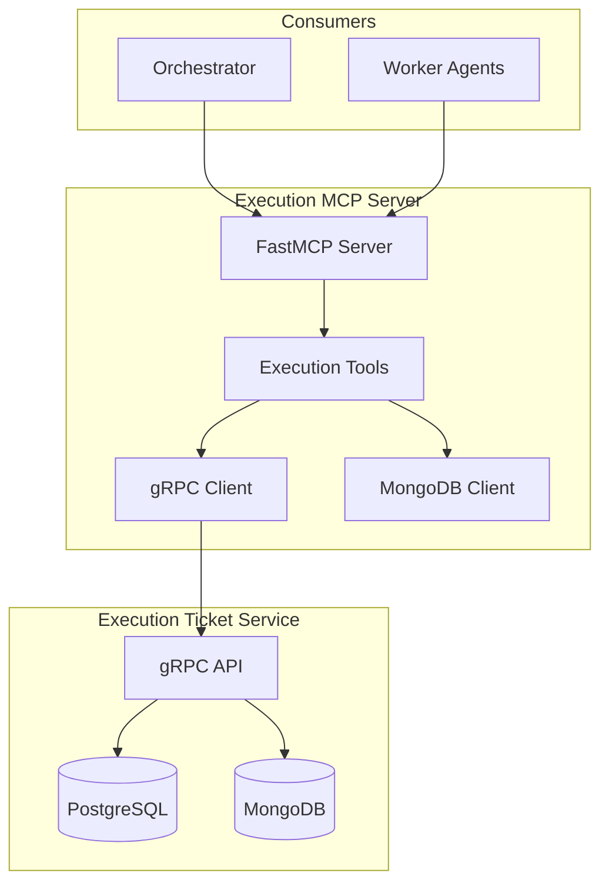

# Execution MCP Server

Servidor MCP (Model Context Protocol) para gerenciamento de Execution Tickets do Neural Hive-Mind.

## Descrição

O Execution MCP Server fornece ferramentas MCP para criar, consultar e gerenciar Execution Tickets, que são usados para orquestrar tarefas assíncronas entre o Orchestrator e Worker Agents.

## Porta

- **3015** - Porta padrão do servidor

## Ferramentas MCP

### 1. create_ticket

Cria um novo Execution Ticket.

**Parâmetros:**
- `plan_id` (str, obrigatório): ID do plano cognitivo
- `task_type` (str, obrigatório): Tipo da tarefa (BUILD, DEPLOY, TEST, VALIDATE, EXECUTE, COMPENSATE, QUERY, TRANSFORM)
- `description` (str, obrigatório): Descrição da tarefa
- `priority` (str, opcional): Prioridade (LOW, NORMAL, HIGH, CRITICAL) - padrão: NORMAL
- `risk_band` (str, opcional): Banda de risco (low, medium, high, critical) - padrão: medium
- `timeout_ms` (int, opcional): Timeout em milissegundos - padrão: 30000
- `max_retries` (int, opcional): Máximo de retries - padrão: 3
- `intent_id` (str, opcional): ID da intenção original
- `decision_id` (str, opcional): ID da decisão consolidada
- `correlation_id` (str, opcional): ID de correlação
- `security_level` (str, opcional): Nível de segurança (PUBLIC, INTERNAL, CONFIDENTIAL, RESTRICTED) - padrão: INTERNAL
- `dependencies` (list[str], opcional): Lista de ticket_ids dependentes
- `parameters` (dict, opcional): Parâmetros da tarefa

**Retorna:**
```json
{
  "ticket_id": "ticket-abc123",
  "status": "PENDING",
  "created_at": "2026-04-03T18:00:00Z"
}
```

### 2. update_status

Atualiza o status de um Execution Ticket.

**Parâmetros:**
- `ticket_id` (str, obrigatório): ID do ticket
- `status` (str, obrigatório): Novo status (PENDING, RUNNING, COMPLETED, FAILED, COMPENSATING, COMPENSATED)
- `error_message` (str, opcional): Mensagem de erro (para status FAILED)

**Retorna:**
```json
{
  "ticket_id": "ticket-abc123",
  "status": "RUNNING",
  "previous_status": "PENDING"
}
```

### 3. query_ticket

Consulta Execution Tickets por ID ou filtros.

**Parâmetros:**
- `ticket_id` (str, opcional): ID específico do ticket (retorna um único ticket)
- `status` (str, opcional): Filtrar por status
- `plan_id` (str, opcional): Filtrar por plan_id

**Retorna:**
- Se `ticket_id` fornecido: objeto do ticket ou `null`
- Se filtro fornecido: array de tickets

### 4. generate_token

Gera token JWT para autenticação de um Execution Ticket.

**Parâmetros:**
- `ticket_id` (str, obrigatório): ID do ticket
- `ttl_seconds` (int, opcional): Time-to-live em segundos - padrão: 3600
- `custom_claims` (dict, opcional): Claims customizados para incluir no token

**Retorna:**
```json
{
  "token": "eyJhbGciOiJIUzI1NiIsInR5cCI6IkpXVCJ9...",
  "expires_at": "2026-04-03T19:00:00Z",
  "ticket_id": "ticket-abc123",
  "ttl_seconds": 3600
}
```

### 5. dispatch_webhook

Dispara webhook de notificação.

**Parâmetros:**
- `ticket_id` (str, obrigatório): ID do ticket
- `event_type` (str, obrigatório): Tipo de evento (ticket_created, status_changed, ticket_completed, ticket_failed, compensation_started)
- `payload` (dict, obrigatório): Payload do evento
- `url` (str, obrigatório): URL do webhook
- `headers` (dict, opcional): Headers HTTP customizados
- `max_retries` (int, opcional): Máximo de retries - padrão: 3

**Retorna:**
```json
{
  "webhook_id": "webhook-xyz789",
  "status": "delivered",
  "status_code": 200,
  "url": "https://example.com/webhook"
}
```

## Configuração

### Variáveis de Ambiente

| Variável | Descrição | Default |
|----------|-----------|---------|
| `EXECUTION_MCP_PORT` | Porta do servidor | 3015 |
| `EXECUTION_MCP_LOG_LEVEL` | Nível de log | INFO |
| `EXECUTION_MCP_EXECUTION_TICKET_HOST` | Host do Execution Ticket Service | execution-ticket-service |
| `EXECUTION_MCP_EXECUTION_TICKET_PORT` | Porta do Execution Ticket Service | 8008 |
| `EXECUTION_MCP_TICKET_TIMEOUT` | Timeout para operações (segundos) | 30 |
| `EXECUTION_MCP_JWT_SECRET` | Segredo para JWT | change-me-in-production |
| `EXECUTION_MCP_JWT_ALGORITHM` | Algoritmo JWT | HS256 |
| `EXECUTION_MCP_DEFAULT_TOKEN_TTL` | TTL padrão de tokens (segundos) | 3600 |
| `EXECUTION_MCP_WEBHOOK_TIMEOUT` | Timeout de webhooks (segundos) | 10 |
| `EXECUTION_MCP_WEBHOOK_MAX_RETRIES` | Máximo de retries de webhook | 3 |
| `EXECUTION_MCP_MONGODB_URI` | Connection string MongoDB | mongodb://mongodb:27017 |
| `EXECUTION_MCP_MONGODB_DATABASE` | Database MongoDB | execution_tickets |
| `EXECUTION_MCP_REDIS_URI` | Connection string Redis | redis://redis:6379 |

## Desenvolvimento

### Instalação

```bash
cd services/mcp-servers/execution-mcp-server
pip install -r requirements.txt
```

### Executar Localmente

```bash
# Modo stdio (para MCP)
python -m execution_mcp_server.main

# Ou diretamente
python src/execution_mcp_server/main.py
```

### Testes

```bash
# Todos os testes
pytest tests/ -v

# Com coverage
pytest tests/ --cov=src --cov-report=html

# Testes específicos
pytest tests/test_execution_tools_tdd.py -v
```

## Integração com Execution-Ticket-Service

O Execution MCP Server integra-se com o Execution-Ticket-Service via:

1. **gRPC**: Para criar, consultar e atualizar tickets
2. **MongoDB**: Para persistência de tickets e audit trail
3. **Webhooks**: Para notificar Worker Agents sobre mudanças de status

### Cliente gRPC

```python
from execution_mcp_server.clients import get_grpc_client

client = await get_grpc_client()
await client.connect()

# Criar ticket
ticket = await client.create_ticket(
    plan_id="plan-123",
    task_id="task-456",
    task_type="EXECUTE",
    description="Executar tarefa X",
    priority="HIGH"
)

# Consultar ticket
ticket = await client.get_ticket(ticket["ticket_id"])

# Atualizar status
updated = await client.update_status(
    ticket_id=ticket["ticket_id"],
    status="RUNNING"
)

# Gerar token
token = await client.generate_token(ticket["ticket_id"])
```

## Deploy

### Docker

```bash
# Build
docker build -f execution-mcp-server/Dockerfile -t execution-mcp-server:latest .

# Run
docker run -p 3015:3015 \
  -e EXECUTION_MCP_JWT_SECRET=your-secret-key \
  -e EXECUTION_MCP_MONGODB_URI=mongodb://mongodb:27017 \
  execution-mcp-server:latest
```

### Kubernetes (via Helm)

```yaml
# values.yaml
executionMcpServer:
  enabled: true
  image:
    repository: execution-mcp-server
    tag: latest
  env:
    jwtSecret: your-secret-key
    mongodbUri: mongodb://mongodb:27017
```

```bash
helm install execution-mcp-server ./charts/execution-mcp-server -f values.yaml
```

## Arquitetura



## Troubleshooting

### Servidor não inicia

```bash
# Verificar porta livre
lsof -i :3015

# Verificar logs
LOG_LEVEL=DEBUG python -m execution_mcp_server.main
```

### Erro de conexão com MongoDB

```bash
# Testar conexão
mongosh mongodb://mongodb:27017

# Verificar URI
echo $EXECUTION_MCP_MONGODB_URI
```

### Erro de conexão gRPC

```bash
# Testar porta do Execution Ticket Service
nc -zv execution-ticket-service 8008

# Verificar health check
curl http://execution-ticket-service:8008/health
```

## Licença

MIT

## Autores

Neural Hive-Mind Team
