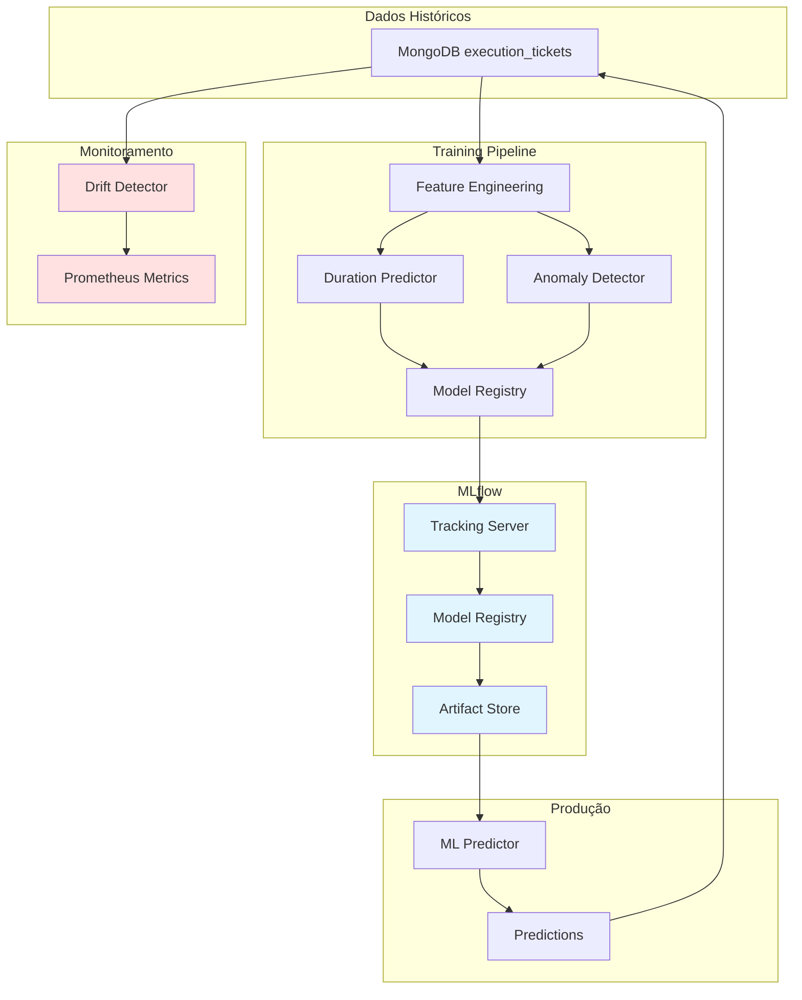
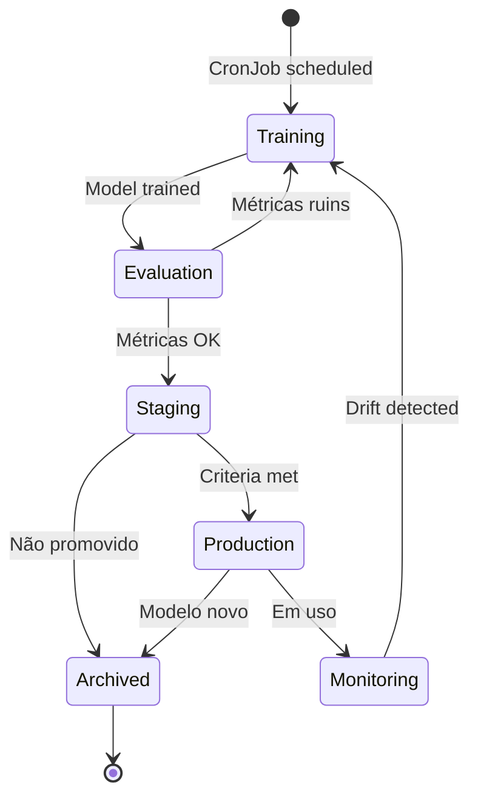
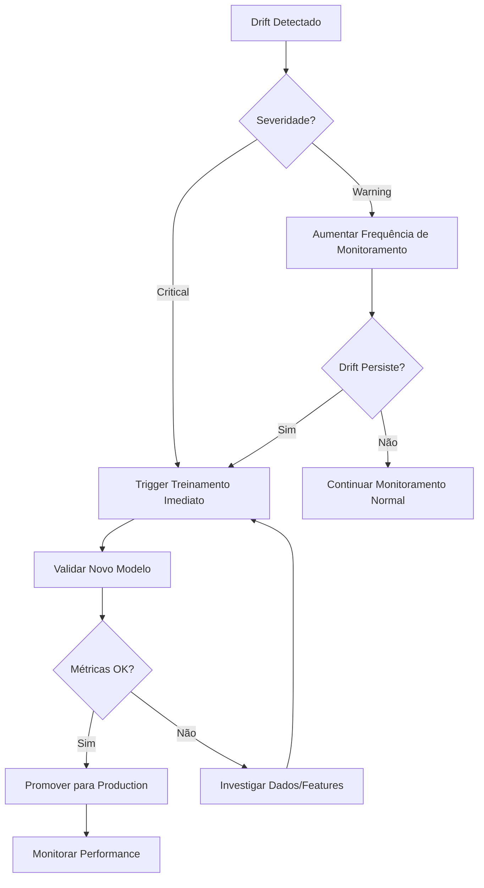

# Guia de Operações de Machine Learning

Guia completo para operação e manutenção dos modelos de Machine Learning do Orchestrator Dynamic.

## Índice

- [Overview](#overview)
- [Modelos ML](#modelos-ml)
- [Treinamento de Modelos](#treinamento-de-modelos)
- [Promoção de Modelos](#promoção-de-modelos)
- [Detecção de Drift](#detecção-de-drift)
- [Troubleshooting](#troubleshooting)
- [Configuração](#configuração)
- [Monitoramento](#monitoramento)
- [Best Practices](#best-practices)
- [FAQ](#faq)

---

## Overview

O Orchestrator Dynamic utiliza modelos de Machine Learning para predição inteligente de duração de tarefas e detecção de anomalias em execuções. Os modelos são treinados automaticamente com dados históricos e promovidos para produção quando atingem critérios de qualidade.

### Arquitetura ML



### Fluxo de Vida do Modelo



---

## Modelos ML

### Duration Predictor

**Objetivo**: Prever duração de execução de tickets baseado em características históricas.

**Algoritmo**: Random Forest Regressor

**Features utilizadas**:
- `task_type_encoded`: Tipo da tarefa (BUILD, TEST, DEPLOY, etc.)
- `risk_band_encoded`: Banda de risco (low, medium, high, critical)
- `qos_encoded`: QoS (delivery_guarantee, consistency_level)
- `retry_count`: Número de tentativas
- `param_count`: Quantidade de parâmetros
- `capability_count`: Número de capabilities requeridas
- `estimated_duration_ms`: Duração estimada inicial

**Métricas de avaliação**:
- **MAE (Mean Absolute Error)**: Erro médio absoluto em ms
- **MAE %**: Erro percentual (MAE / duração média)
- **RMSE**: Root Mean Squared Error
- **R²**: Coeficiente de determinação (0-1)

**Critério de promoção**: MAE % < 15%

### Anomaly Detector

**Objetivo**: Detectar execuções anômalas que podem indicar problemas.

**Algoritmo**: Isolation Forest

**Features utilizadas**:
- Mesmas do Duration Predictor
- `duration_deviation`: Desvio entre predito e real
- `retry_pattern`: Padrão de retries

**Métricas de avaliação**:
- **Precision**: Proporção de anomalias corretas
- **Recall**: Proporção de anomalias detectadas
- **F1 Score**: Média harmônica de precision e recall

**Critério de promoção**: Precision > 0.75

---

## Treinamento de Modelos

### Treinamento Automático

Os modelos são treinados automaticamente via CronJob Kubernetes:

**Schedule**: Diário às 02:00 UTC (configurável)

**Arquivo**: `services/orchestrator-dynamic/src/ml/training_job.py`

**CronJob Kubernetes**: `helm-charts/orchestrator-dynamic/templates/ml-training-cronjob.yaml`

```yaml
apiVersion: batch/v1
kind: CronJob
metadata:
  name: orchestrator-ml-training
spec:
  schedule: "0 2 * * *"  # Diariamente às 02:00 UTC
  jobTemplate:
    spec:
      template:
        spec:
          containers:
          - name: training
            image: orchestrator-dynamic:latest
            command: ["python", "-m", "src.ml.training_job"]
```

**Verificar execuções**:

```bash
# Listar jobs de treinamento
kubectl get jobs -n orchestrator -l job=ml-training

# Ver logs do último job
kubectl logs -n orchestrator job/orchestrator-ml-training-<timestamp>

# Ver status de execuções recentes
kubectl get cronjobs -n orchestrator orchestrator-ml-training
```

### Treinamento Manual

Para treinar modelos manualmente (útil após mudanças significativas):

**Via API**:

```bash
# Trigger treinamento via API
curl -X POST http://orchestrator-dynamic:8000/api/v1/ml/train \
  -H "Content-Type: application/json" \
  -d '{
    "window_days": 30,
    "backfill_errors": true
  }'

# Resposta
{
  "job_id": "abc-123-def",
  "status": "queued",
  "message": "Treinamento iniciado"
}

# Consultar status
curl http://orchestrator-dynamic:8000/api/v1/ml/train/abc-123-def
```

**Via kubectl exec**:

```bash
# Executar treinamento diretamente no pod
kubectl exec -n orchestrator deployment/orchestrator-dynamic -- \
  python -m src.ml.training_job

# Com backfill de erros históricos
kubectl exec -n orchestrator deployment/orchestrator-dynamic -- \
  python -c "
from src.ml.training_job import main
import sys
sys.exit(main())
"
```

### Parâmetros de Treinamento

| Parâmetro | Descrição | Default | Recomendado |
|-----------|-----------|---------|-------------|
| `window_days` | Janela de dados históricos | 30 | 30-60 dias |
| `backfill_errors` | Calcular erros históricos | false | true (mensal) |
| `min_samples` | Mínimo de amostras para treinar | 100 | 100-500 |

### Backfill de Erros

Calcula erros de predição para tickets históricos que não têm predições:

```bash
# Executar backfill
curl -X POST http://orchestrator-dynamic:8000/api/v1/ml/train \
  -d '{"backfill_errors": true}'
```

**Quando executar**:
- Primeira implantação dos modelos
- Após correções no feature engineering
- Mensalmente para análise retrospectiva

---

## Promoção de Modelos

### Critérios de Promoção

Os modelos são promovidos automaticamente quando atendem critérios de qualidade:

**Duration Predictor**:
- MAE % < 15%
- R² > 0.6 (desejável)

**Anomaly Detector**:
- Precision > 0.75
- Recall > 0.5 (desejável)

### Promoção Manual

Para promover modelos manualmente:

```bash
# Listar modelos disponíveis
curl http://orchestrator-dynamic:8000/api/v1/ml/models

# Ver detalhes de um modelo específico
curl http://orchestrator-dynamic:8000/api/v1/ml/models/duration-predictor

# Promover versão específica para Production
curl -X POST http://orchestrator-dynamic:8000/api/v1/ml/models/duration-predictor/promote \
  -H "Content-Type: application/json" \
  -d '{
    "version": "3",
    "stage": "Production"
  }'
```

### Rollback de Modelo

Para reverter para versão anterior:

```bash
# Identificar versão anterior em produção
mlflow models list --name duration-predictor

# Promover versão anterior
curl -X POST http://orchestrator-dynamic:8000/api/v1/ml/models/duration-predictor/promote \
  -d '{
    "version": "2",
    "stage": "Production"
  }'
```

### Stages do MLflow

- **None**: Modelo recém-treinado, não validado
- **Staging**: Modelo validado, aguardando promoção
- **Production**: Modelo em uso ativo
- **Archived**: Modelo antigo, substituído

---

## Detecção de Drift

### Tipos de Drift

#### 1. Feature Drift

**Definição**: Mudanças na distribuição das features de entrada.

**Métrica**: PSI (Population Stability Index)

**Thresholds**:
- PSI < 0.1: Sem drift
- 0.1 ≤ PSI < 0.25: Drift moderado (warning)
- PSI ≥ 0.25: Drift severo (critical)

**Ações**:
- **Warning**: Monitorar de perto
- **Critical**: Retreinar modelo imediatamente

#### 2. Prediction Drift

**Definição**: Degradação da acurácia das predições.

**Métrica**: Ratio MAE atual / MAE baseline

**Thresholds**:
- Ratio < 1.2: Sem drift
- 1.2 ≤ Ratio < 1.5: Drift moderado (warning)
- Ratio ≥ 1.5: Drift severo (critical)

**Ações**:
- **Warning**: Investigar padrões
- **Critical**: Retreinar modelo urgentemente

#### 3. Target Drift

**Definição**: Mudanças na distribuição da variável alvo (duração).

**Métrica**: K-S Test (Kolmogorov-Smirnov)

**Thresholds**:
- p-value > 0.05: Sem drift
- 0.01 ≤ p-value ≤ 0.05: Drift moderado (warning)
- p-value < 0.01: Drift severo (critical)

**Ações**:
- **Warning**: Analisar mudanças no sistema
- **Critical**: Retreinar modelo

### Monitoramento de Drift

**CronJob de Drift Detection**:

```yaml
apiVersion: batch/v1
kind: CronJob
metadata:
  name: orchestrator-ml-drift-check
spec:
  schedule: "0 */6 * * *"  # A cada 6 horas
```

**Verificar drift via API**:

```bash
# Executar drift check
curl http://orchestrator-dynamic:8000/api/v1/ml/drift

# Resposta exemplo
{
  "overall_status": "warning",
  "window_days": 7,
  "feature_drift": {
    "risk_band_encoded": 0.28,
    "retry_count": 0.15
  },
  "prediction_drift": {
    "current_mae": 7500,
    "baseline_mae": 5000,
    "drift_ratio": 1.5
  },
  "target_drift": {
    "ks_statistic": 0.12,
    "p_value": 0.03
  },
  "recommendations": [
    "Retrain model due to high feature drift",
    "Investigate recent system changes"
  ]
}
```

### Resposta a Drift



---

## Troubleshooting

### Problema: Treinamento Falhando

**Sintomas**:
- Job de treinamento com status Failed
- Logs indicam erro ao acessar MongoDB ou MLflow

**Diagnóstico**:

```bash
# Verificar logs do job
kubectl logs job/orchestrator-ml-training-<timestamp> -n orchestrator

# Erros comuns e soluções:
```

**Erro: "Insufficient training data"**

```
Samples: 45, Required: 100
```

**Solução**:
1. Ajustar `ml_min_training_samples` em ConfigMap
2. Aguardar acúmulo de mais dados históricos

```bash
kubectl edit configmap orchestrator-config -n orchestrator
# Alterar: ml_min_training_samples: "50"
```

**Erro: "Connection to MLflow failed"**

```
ConnectionError: http://mlflow:5000
```

**Solução**:
1. Verificar se MLflow está rodando

```bash
kubectl get pods -n mlflow
kubectl logs deployment/mlflow -n mlflow
```

2. Verificar conectividade

```bash
kubectl exec -n orchestrator deployment/orchestrator-dynamic -- \
  curl http://mlflow:5000/health
```

**Erro: "MongoDB query timeout"**

**Solução**:
1. Verificar índices no MongoDB

```javascript
// Conectar ao MongoDB
use orchestrator;

// Verificar índices
db.execution_tickets.getIndexes();

// Criar índice se necessário
db.execution_tickets.createIndex({
  "created_at": -1,
  "status": 1
});
```

### Problema: Modelos Não São Promovidos

**Sintomas**:
- Treinamento completa com sucesso
- Modelos não aparecem em Production

**Diagnóstico**:

```bash
# Ver métricas do último treinamento
curl http://orchestrator-dynamic:8000/api/v1/ml/models/duration-predictor
```

**Causa: Métricas abaixo do threshold**

```json
{
  "metrics": {
    "mae_percentage": 18.5  // > 15% threshold
  }
}
```

**Solução**:
1. Analisar qualidade dos dados
2. Ajustar feature engineering
3. Aumentar window_days
4. Considerar ajustar threshold (temporariamente)

### Problema: Predições com Alta Latência

**Sintomas**:
- `ml_prediction_duration_seconds` > 1s no Grafana
- Tickets demorando para serem criados

**Diagnóstico**:

```bash
# Verificar métricas de predição
curl http://orchestrator-dynamic:8000/api/v1/ml/predictions/stats
```

**Causas**:
1. Modelo não cacheado (primeiro acesso)
2. Modelo muito grande
3. Feature extraction complexa

**Solução**:

```bash
# 1. Forçar pré-carregamento de modelos
kubectl exec -n orchestrator deployment/orchestrator-dynamic -- \
  python -c "
from src.ml.ml_predictor import MLPredictor
from src.config import get_settings
predictor = MLPredictor(get_settings())
predictor.load_models()
"

# 2. Aumentar cache TTL
kubectl edit configmap orchestrator-config -n orchestrator
# ml_model_cache_ttl_seconds: "7200"  # 2 horas
```

### Problema: Drift Contínuo

**Sintomas**:
- Alertas de drift frequentes
- Drift não resolve após retreinamento

**Diagnóstico**:

```bash
# Ver histórico de drift
kubectl logs -n orchestrator cronjob/orchestrator-ml-drift-check --tail=100
```

**Causas**:
1. Mudança fundamental no sistema (nova versão, arquitetura)
2. Sazonalidade não capturada
3. Outliers frequentes

**Solução**:
1. Analisar mudanças recentes no sistema
2. Ajustar feature engineering
3. Considerar modelo ensemble
4. Implementar features de tempo (dia da semana, hora)

### Problema: Anomalias Não Detectadas

**Sintomas**:
- Falhas conhecidas não marcadas como anomalias
- Precision/Recall baixos

**Diagnóstico**:

```bash
# Ver estatísticas de anomalias
curl http://orchestrator-dynamic:8000/api/v1/ml/predictions/stats | jq '.anomaly_rate'
```

**Solução**:
1. Ajustar `contamination` (% esperado de anomalias)

```bash
kubectl edit configmap orchestrator-config
# ml_anomaly_contamination: "0.1"  # 10%
```

2. Retreinar com mais exemplos de anomalias

---

## Configuração

### Variáveis de Ambiente

```yaml
# ConfigMap orchestrator-config
apiVersion: v1
kind: ConfigMap
metadata:
  name: orchestrator-config
  namespace: orchestrator
data:
  # ML Predictions
  ML_PREDICTIONS_ENABLED: "true"
  MLFLOW_TRACKING_URI: "http://mlflow:5000"
  MLFLOW_EXPERIMENT_NAME: "orchestrator-predictions"

  # Training
  ML_TRAINING_WINDOW_DAYS: "30"
  ML_TRAINING_INTERVAL_HOURS: "24"
  ML_MIN_TRAINING_SAMPLES: "100"

  # Model Criteria
  ML_DURATION_ERROR_THRESHOLD: "0.15"  # MAE % < 15%
  ML_ANOMALY_CONTAMINATION: "0.05"     # 5% anomalias esperadas

  # Cache
  ML_MODEL_CACHE_TTL_SECONDS: "3600"    # 1 hora
  ML_FEATURE_CACHE_TTL_SECONDS: "1800"  # 30 min

  # Drift Detection
  ML_DRIFT_DETECTION_ENABLED: "true"
  ML_DRIFT_CHECK_WINDOW_DAYS: "7"
  ML_DRIFT_PSI_THRESHOLD: "0.25"
  ML_DRIFT_MAE_RATIO_THRESHOLD: "1.5"
  ML_DRIFT_KS_PVALUE_THRESHOLD: "0.05"

  # Backfill
  ML_BACKFILL_ERRORS: "false"
```

### Configuração de CronJobs

```yaml
# Training CronJob
spec:
  schedule: "0 2 * * *"                    # Diário às 02:00
  concurrencyPolicy: Forbid                 # Não executar concorrentemente
  successfulJobsHistoryLimit: 3
  failedJobsHistoryLimit: 3

# Drift Detection CronJob
spec:
  schedule: "0 */6 * * *"                  # A cada 6 horas
  concurrencyPolicy: Allow
  successfulJobsHistoryLimit: 5
  failedJobsHistoryLimit: 5
```

---

## Monitoramento

### Métricas Prometheus

#### Training Metrics

```promql
# Taxa de sucesso de treinamento (últimas 24h)
rate(orchestration_ml_training_jobs_total{status="success"}[24h])
/ rate(orchestration_ml_training_jobs_total[24h])

# Duração média de treinamento
rate(orchestration_ml_training_duration_seconds_sum[1h])
/ rate(orchestration_ml_training_duration_seconds_count[1h])

# Número de amostras usadas
orchestration_ml_training_samples_used{model_name="duration-predictor"}
```

#### Prediction Metrics

```promql
# Taxa de predições bem-sucedidas
rate(orchestration_ml_predictions_total{status="success"}[5m])

# Latência P95 de predições
histogram_quantile(0.95,
  rate(orchestration_ml_prediction_duration_seconds_bucket[5m])
)

# MAE % atual (production)
orchestration_ml_model_accuracy{
  model_name="duration-predictor",
  metric_type="mae_pct_production"
}
```

#### Drift Metrics

```promql
# Status geral de drift (0=ok, 1=warning, 2=critical)
orchestration_ml_drift_status{model_name="duration-predictor"}

# PSI máximo entre features
max(orchestration_ml_drift_score{drift_type="feature"})

# MAE ratio (predição drift)
orchestration_ml_drift_score{
  drift_type="prediction",
  feature="mae_ratio"
}
```

### Dashboards Grafana

**Dashboard: ML Model Performance**

Importar: `monitoring/dashboards/orchestrator-ml-predictions.json`

Painéis:
- Model Accuracy Over Time
- Prediction Latency
- Anomaly Detection Rate
- Training Job Status

**Dashboard: ML Drift Monitoring**

Importar: `monitoring/dashboards/orchestrator-ml-drift.json`

Painéis:
- Overall Drift Status
- Feature Drift PSI Scores
- Prediction Drift Ratio
- Target Distribution Shift

### Alertas

```yaml
# Arquivo: monitoring/alerts/orchestrator-ml-alerts.yaml

groups:
- name: ml_predictions
  interval: 30s
  rules:

  # Training failures
  - alert: MLTrainingJobFailed
    expr: |
      increase(orchestration_ml_training_jobs_total{status="failure"}[1h]) > 0
    for: 5m
    labels:
      severity: critical
    annotations:
      summary: "ML training job falhou"
      description: "Training job falhou {{ $value }} vezes na última hora"

  # Drift crítico
  - alert: MLCriticalDriftDetected
    expr: |
      orchestration_ml_drift_status{} == 2
    for: 15m
    labels:
      severity: critical
    annotations:
      summary: "Drift crítico detectado em {{ $labels.model_name }}"
      description: "Tipo: {{ $labels.drift_type }}, retreinamento urgente recomendado"

  # Prediction errors altos
  - alert: MLHighPredictionErrors
    expr: |
      orchestration_ml_model_accuracy{metric_type="mae_pct_production"} > 20
    for: 30m
    labels:
      severity: warning
    annotations:
      summary: "Erro de predição alto: {{ $value }}%"
      description: "MAE % acima de 20%, considerar retreinamento"

  # Model load errors
  - alert: MLModelLoadErrors
    expr: |
      increase(orchestration_ml_model_load_errors_total[5m]) > 3
    labels:
      severity: warning
    annotations:
      summary: "Erros ao carregar modelo ML"
      description: "{{ $value }} erros nos últimos 5 minutos"
```

### Runbooks

**Runbook: Responder a Drift Crítico**

1. Verificar tipo de drift no alerta
2. Consultar relatório de drift via API
3. Trigger treinamento manual imediato
4. Monitorar métricas do novo modelo
5. Promover se métricas OK
6. Documentar causa raiz

**Runbook: Training Job Falhou**

1. Consultar logs do job
2. Identificar erro específico (ver Troubleshooting)
3. Corrigir causa
4. Trigger treinamento manual
5. Verificar sucesso
6. Atualizar documentação se necessário

---

## Best Practices

### 1. Frequência de Treinamento

**Recomendações**:
- **Produção estável**: Treinar diariamente às 02:00
- **Mudanças frequentes**: Treinar a cada 12 horas
- **Desenvolvimento**: Treinar manualmente conforme necessário

### 2. Janela de Dados

**Recomendações**:
- **Mínimo**: 7 dias (168 horas de dados)
- **Padrão**: 30 dias (captura sazonalidade semanal)
- **Máximo**: 90 dias (evita dados muito antigos)

### 3. Promoção de Modelos

**Recomendações**:
- Sempre validar métricas antes de promover
- Manter pelo menos 3 versões em Staging
- Nunca deletar modelo em Production sem substituto
- Documentar motivo de rollback

### 4. Monitoramento de Drift

**Recomendações**:
- Executar drift check a cada 6 horas
- Responder a drift critical em até 2 horas
- Manter baseline atualizada mensalmente
- Documentar padrões de drift recorrentes

### 5. Feature Engineering

**Recomendações**:
- Testar novas features em Staging primeiro
- Documentar features e transformações
- Versionar código de feature engineering
- Monitorar importância de features

### 6. Dados de Treinamento

**Recomendações**:
- Mínimo 100 amostras (idealmente 500+)
- Incluir dados de diferentes bandas de risco
- Filtrar outliers extremos (> 3 sigma)
- Balancear classes para anomaly detector

### 7. Cache de Modelos

**Recomendações**:
- TTL de 1-2 horas para modelos
- Pré-carregar modelos no startup
- Limpar cache após promoção
- Monitorar cache hit rate

### 8. Backups

**Recomendações**:
- MLflow mantém histórico automático
- Exportar modelos Production mensalmente
- Documentar critérios de promoção
- Manter logs de treinamento por 90 dias

---

## FAQ

### Quando devo retreinar os modelos?

**Automático**: Diariamente às 02:00 (CronJob)

**Manual**:
- Após drift crítico detectado
- Após mudanças significativas no sistema
- Se MAE % > 20% por mais de 1 hora
- Após adicionar novas features

### Como interpretar MAE %?

- **< 10%**: Excelente
- **10-15%**: Bom (dentro do threshold)
- **15-20%**: Aceitável (monitorar)
- **> 20%**: Ruim (retreinar)

### Qual a diferença entre Staging e Production?

- **Staging**: Modelos validados mas não em uso ativo
- **Production**: Modelo servindo predições em tempo real

Apenas um modelo pode estar em Production por vez.

### Como saber se drift é sazonal ou problema real?

1. Verificar histórico de drift (último mês)
2. Correlacionar com mudanças no sistema
3. Analisar dias da semana / horários
4. Se recorrente em padrão: sazonal
5. Se aleatório ou após mudança: problema real

### Posso ter múltiplos modelos em Production?

Não. MLflow permite apenas um modelo por stage. Ao promover novo modelo, o anterior é automaticamente arquivado.

### Como adicionar novas features?

1. Editar `src/ml/feature_engineering.py`
2. Adicionar feature em `extract_ticket_features()`
3. Testar localmente
4. Fazer deploy
5. Trigger treinamento manual
6. Validar métricas
7. Promover se OK

### Modelo está com latência alta, o que fazer?

1. Verificar se modelo está cacheado
2. Aumentar cache TTL
3. Simplificar features (remover correlacionadas)
4. Usar modelo mais leve (menos árvores)
5. Considerar quantização do modelo

### Como reverter para versão anterior?

```bash
# Listar versões
curl http://orchestrator-dynamic:8000/api/v1/ml/models/duration-predictor

# Promover versão anterior
curl -X POST .../models/duration-predictor/promote \
  -d '{"version": "2", "stage": "Production"}'
```

### Preciso de acesso ao MLflow UI?

**Útil para**:
- Visualizar experimentos e métricas
- Comparar versões de modelos
- Análise de hiperparâmetros
- Debug de treinamento

**Acesso**:
```bash
kubectl port-forward -n mlflow svc/mlflow 5000:5000
# Abrir http://localhost:5000
```

### Como testar modelos localmente?

```python
# Script de teste local
from src.ml.ml_predictor import MLPredictor
from src.config import get_settings

config = get_settings()
predictor = MLPredictor(config)

# Predizer duração
ticket = {
    'task_type': 'BUILD',
    'risk_band': 'high',
    'qos': {'delivery_guarantee': 'exactly_once'},
    # ...
}

prediction = predictor.predict_duration(ticket)
print(f"Duração prevista: {prediction}ms")
```

---

## Referências

- [MLflow Documentation](https://www.mlflow.org/docs/latest/index.html)
- [Scikit-learn Random Forest](https://scikit-learn.org/stable/modules/ensemble.html#forest)
- [Isolation Forest](https://scikit-learn.org/stable/modules/generated/sklearn.ensemble.IsolationForest.html)
- [Drift Detection Best Practices](https://www.evidentlyai.com/blog/ml-monitoring-drift-detection)
- [PSI Interpretation](https://www.lexjansen.com/wuss/2017/47_Final_Paper_PDF.pdf)

---

**Última atualização**: 2025-11-16

**Responsável**: ML Ops Team

**Contato**: #ml-ops-orchestrator
