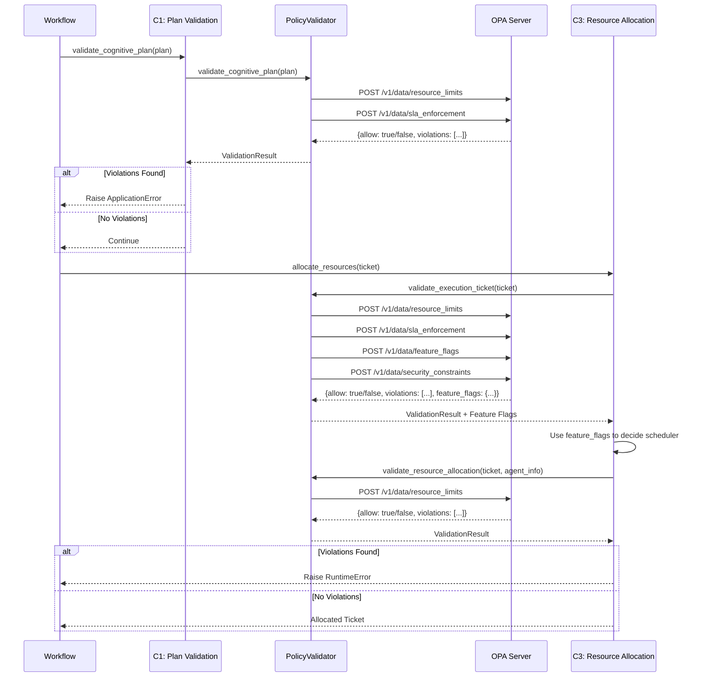

# OPA Integration Guide

Guia completo de uso e operação da integração com o Open Policy Agent (OPA) no Orchestrator Dynamic.

## Visão Geral da Integração OPA
- OPA é usado como **motor de decisão** para enforcement em C1 (validação de plano) e C3 (alocação de recursos).
- O `PolicyValidator` orquestra chamadas em batch para múltiplas políticas Rego e agrega violações, warnings e feature flags.
- O fluxo padrão: Intent → C1 (OPA) → C2 → C3 (OPA) → Execution.



## Políticas Rego Disponíveis
- `resource_limits`: timeout, max retries, capabilities permitidas, limite de tickets concorrentes.
- `sla_enforcement`: deadline, QoS, priority alinhada ao `risk_band`, timeout insuficiente.
- `feature_flags`: intelligent scheduler, burst capacity, predictive allocation, auto-scaling, experimental features.
- `security_constraints`: cross-tenant access, autenticação SPIFFE/JWT, autorização por role, PII, rate limits.

## Padrões de Uso
- Para adicionar uma nova política Rego, crie o arquivo em `policies/rego/orchestrator/` e registre o path em `OrchestratorSettings`.
- Feature flags são configuradas via `feature_flags.rego` e consumidas em `ticket_generation.allocate_resources`.
- Teste políticas localmente com OPA CLI: `opa eval -d feature_flags.rego -i input.json "data.neuralhive.orchestrator.feature_flags.result"`.
- Para debugar violações, habilite logs `structlog` e use o OPA Playground com o `input` serializado.

## Configuração
- Variáveis de ambiente:
  - `OPA_HOST`, `OPA_PORT`, `OPA_TIMEOUT_SECONDS`, `OPA_RETRY_ATTEMPTS`
  - `OPA_FAIL_OPEN` (fail-open vs fail-closed)
  - `OPA_CACHE_TTL_SECONDS`
  - `OPA_CIRCUIT_BREAKER_ENABLED`, `OPA_CIRCUIT_BREAKER_FAILURE_THRESHOLD`, `OPA_CIRCUIT_BREAKER_RESET_TIMEOUT`
- Paths de políticas:
  - `OPA_POLICY_RESOURCE_LIMITS`, `OPA_POLICY_SLA_ENFORCEMENT`, `OPA_POLICY_FEATURE_FLAGS`, `OPA_POLICY_SECURITY_CONSTRAINTS`
- Segurança:
  - `SPIFFE_ENABLED`, `SPIFFE_TRUST_DOMAIN`
  - `OPA_ALLOWED_TENANTS`, `OPA_TENANT_RATE_LIMITS`, `OPA_DEFAULT_TENANT_RATE_LIMIT`, `OPA_GLOBAL_RATE_LIMIT`

## Validação JWT com SPIFFE

### Configuração JWKS

O OPA é configurado para buscar automaticamente o JWKS do SPIRE Server para verificação de assinaturas JWT:

```yaml
# helm-charts/orchestrator-dynamic/values.yaml
opa:
  config:
    services:
      spire-jwks:
        url: https://spire-server.spire-system.svc.cluster.local:8081
    bundles:
      spire-jwks:
        service: spire-jwks
        resource: /keys
        polling:
          min_delay_seconds: 60
          max_delay_seconds: 120
```

### Processo de Verificação JWT

1. **Cliente obtém JWT-SVID** do SPIRE Agent via Workload API
2. **Cliente envia JWT** no header `Authorization: Bearer <jwt>`
3. **Orchestrator extrai JWT** e passa para OPA via `input.context.jwt_token`
4. **OPA valida JWT**:
   - Busca chave pública do JWKS bundle
   - Verifica assinatura usando `io.jwt.decode_verify()`
   - Valida issuer, audience, expiração
   - Verifica claims obrigatórios (`tenant_id`, `roles`)
5. **OPA retorna decisão** (allow/deny) com violações detalhadas

### Claims Obrigatórios

Todos os JWTs devem conter:
- `sub`: SPIFFE ID do workload
- `iss`: Issuer (SPIRE Server)
- `aud`: Audience (serviço destino)
- `exp`: Timestamp de expiração
- `iat`: Timestamp de emissão
- `tenant_id`: ID do tenant (multi-tenancy)
- `roles`: Array de roles (RBAC)

### Métricas de Segurança JWT

```python
# Métricas recomendadas para monitoramento
jwt_validation_failures_total = Counter(
    'opa_jwt_validation_failures_total',
    'Total de falhas de validação JWT',
    ['failure_reason']  # signature_invalid, expired, missing_claims, invalid_issuer
)
```

### Alertas Recomendados

```yaml
# monitoring/alerts/opa-security-alerts.yaml
- alert: OPAJWTValidationFailureRate
  expr: rate(opa_jwt_validation_failures_total[5m]) > 0.1
  for: 5m
  labels:
    severity: critical
  annotations:
    summary: "Alta taxa de falhas de validação JWT"
    description: "{{ $value }} falhas/s de validação JWT no OPA"

- alert: OPAJWKSBundleLoadFailure
  expr: opa_bundle_last_successful_activation_timestamp_nanoseconds{bundle="spire-jwks"} < (time() - 300) * 1e9
  for: 5m
  labels:
    severity: warning
  annotations:
    summary: "Bundle JWKS não atualizado há mais de 5 minutos"
```

## Troubleshooting
- **OPA indisponível**: verifique `/health`, logs do container e métrica `orchestration_opa_evaluation_errors_total`.
- **Políticas não encontradas**: confirme paths carregados em `/v1/policies`.
- **Violações inesperadas**: copie o `input` para o OPA Playground e revise o Rego.
- **Performance**: monitore `orchestration_opa_cache_hits_total` e `orchestration_opa_validation_duration_seconds`.
- **JWT Signature Verification Failed**: verifique se OPA consegue acessar SPIRE JWKS endpoint.
- **JWT Missing Required Claims**: verifique se JWT contém `tenant_id` e `roles`.

## Métricas Prometheus
- `orchestration_opa_validations_total{policy_name, result}` - total de validações (allowed/denied/error).
- `orchestration_opa_validation_duration_seconds{policy_name}` - latência de validação.
- `orchestration_opa_policy_rejections_total{policy_name, rule, severity}` - rejeições por regra.
- `orchestration_opa_policy_warnings_total{policy_name, rule}` - avisos não bloqueantes.
- `orchestration_opa_evaluation_errors_total{error_type}` - erros de avaliação (connection, timeout, policy_not_found, evaluation_error).
- `orchestration_opa_cache_hits_total` - cache hits em decisões OPA.
- `orchestration_opa_circuit_breaker_state{circuit_name}` - estado do circuit breaker (0=closed, 1=half_open, 2=open).
- `orchestration_security_violations_total{tenant_id, violation_type, severity}` - violações críticas de segurança.

## Exemplos de Uso
- **Validar plano cognitivo (C1)**: `policy_validator.validate_cognitive_plan(plan)` aplica `resource_limits` + `sla_enforcement`.
- **Validar ticket de execução (C3)**: `policy_validator.validate_execution_ticket(ticket)` aplica `resource_limits`, `sla_enforcement`, `feature_flags`, `security_constraints`.
- **Validar alocação de recursos (C3 pós-scheduler)**: `policy_validator.validate_resource_allocation(ticket, agent_info)` reforça `resource_limits`.
- **Extrair feature flags**: decisões são retornadas em `result.policy_decisions['feature_flags']` para guiar o `IntelligentScheduler`.
