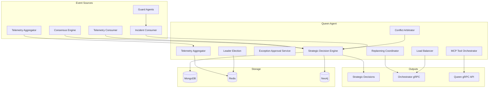
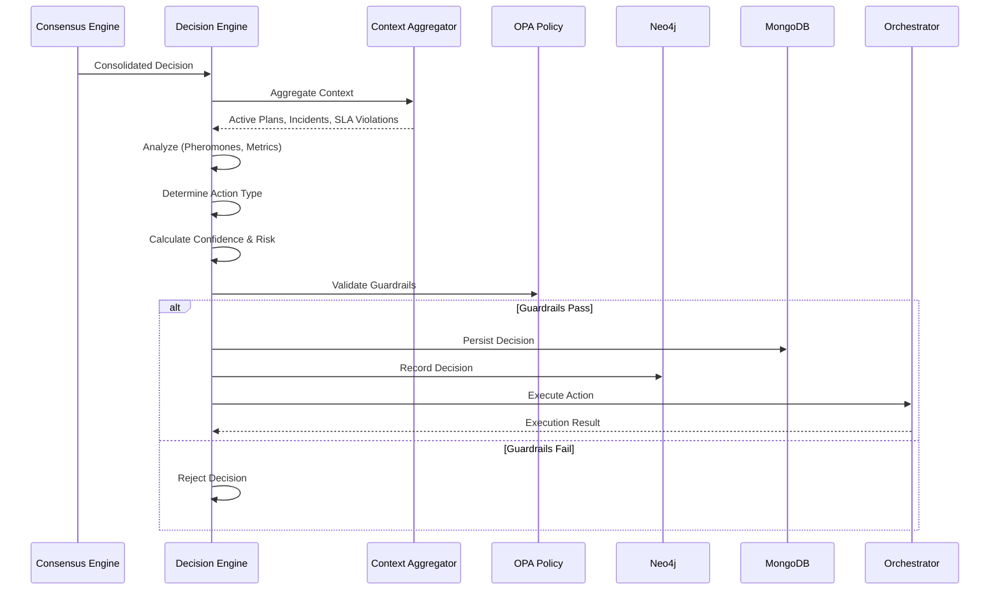

# Queen Agent

Coordenador estratégico do Neural Hive-Mind. Responsável pela tomada de decisões estratégicas, resolução de conflitos, orquestração de replanejamento e gestão de alta disponibilidade.

## Descrição

O Queen Agent é o cérebro estratégico do sistema Neural Hive-Mind. Ele agrega eventos de múltiplas fontes (consenso, telemetria, incidentes), aplica heurísticas de enxame (feromônios), análise Bayesiana e otimização multi-objetivo para tomar decisões que afetam toda a colmeia.

## Arquitetura

### Componentes Principais



### Fluxo de Decisão Estratégica



### Estrutura de Diretórios

```
services/queen-agent/
├── src/
│   ├── main.py                      # FastAPI entry point
│   ├── api/
│   │   ├── health.py                # Health endpoints
│   │   ├── decisions.py             # Strategic decisions API
│   │   ├── exceptions.py            # Exception approval API
│   │   ├── status.py                # Status/telemetry API
│   │   ├── mcp.py                   # MCP tool orchestration
│   │   ├── election.py              # Leader election API
│   │   └── workers.py               # Worker management API
│   ├── services/
│   │   ├── strategic_decision_engine.py    # Core decision logic
│   │   ├── conflict_arbitrator.py         # Conflict resolution
│   │   ├── replanning_coordinator.py      # Replanning orchestration
│   │   ├── exception_approval_service.py  # Exception handling
│   │   ├── telemetry_aggregator.py        # Telemetry aggregation
│   │   ├── mcp_tool_orchestrator.py       # MCP tool orchestration
│   │   ├── leader_election.py             # HA leader election
│   │   └── load_balancer.py               # Load balancing
│   ├── consumers/
│   │   ├── consensus_consumer.py          # Consume consensus events
│   │   ├── telemetry_consumer.py          # Consume telemetry
│   │   └── incident_consumer.py           # Consume incidents
│   ├── producers/
│   │   └── strategic_decision_producer.py  # Publish decisions
│   ├── clients/
│   │   ├── mongodb_client.py              # MongoDB connection
│   │   ├── redis_client.py                # Redis connection
│   │   ├── neo4j_client.py                # Neo4j connection
│   │   ├── prometheus_client.py           # Prometheus metrics
│   │   ├── orchestrator_client.py         # Orchestrator gRPC
│   │   ├── service_registry_client.py     # Service discovery
│   │   ├── pheromone_client.py            # Pheromone trails
│   │   ├── opa_client.py                  # Policy validation
│   │   └── mcp_client.py                  # MCP server client
│   ├── grpc_server/
│   │   └── queen_servicer.py              # gRPC servicer
│   ├── models/
│   │   ├── strategic_decision.py          # Decision models
│   │   ├── conflict.py                    # Conflict models
│   │   └── qos_adjustment.py              # QoS models
│   ├── proto/
│   │   ├── queen_agent_pb2.py             # gRPC definitions
│   │   └── orchestrator_strategic_pb2.py  # Orchestrator gRPC
│   └── config/
│       └── settings.py                    # Configuration
├── tests/
├── Dockerfile
└── requirements.txt
```

## Configuração

### Variáveis de Ambiente

| Variável | Descrição | Default |
|----------|-----------|---------|
| `SERVICE_NAME` | Nome do serviço | `queen-agent` |
| `ENVIRONMENT` | Ambiente | `development` |
| `FASTAPI_HOST` | Host HTTP | `0.0.0.0` |
| `FASTAPI_PORT` | Porta HTTP | `8006` |
| `GRPC_PORT` | Porta gRPC | `50051` |
| `KAFKA_BOOTSTRAP_SERVERS` | Brokers Kafka | `localhost:9092` |
| `MONGODB_URI` | Connection string | `mongodb://mongodb:27017` |
| `REDIS_URL` | Connection string Redis | `redis://redis:6379` |
| `NEO4J_URI` | URI Neo4j | `bolt://neo4j:7687` |
| `OPA_ENABLED` | Habilita OPA | `true` |
| `OPA_URL` | URL do OPA | `http://opa:8181` |
| `OPA_FAIL_OPEN` | Fail-open policy | `false` |
| `MCP_ENABLED` | Habilita MCP | `true` |
| `MCP_SCOUT_URL` | Scout MCP Server | `http://scout-mcp:3010` |
| `MCP_OPTIMIZER_URL` | Optimizer MCP Server | `http://optimizer-mcp:3011` |
| `ELECTION_ENABLED` | Habilita leader election | `true` |
| `ELECTION_LEASE_TTL_SECONDS` | TTL do lease | `30` |
| `LOAD_BALANCER_STRATEGY` | Estratégia de LB | `round_robin` |
| `SPIFFE_ENABLED` | Habilita mTLS SPIFFE | `false` |

## API

### REST Endpoints (FastAPI)

#### Health & Status

```
GET /health                    # Health check básico
GET /status                    # Status detalhado do Queen
GET /metrics                   # Métricas Prometheus
```

#### Strategic Decisions

```
GET    /api/v1/decisions                    # Listar decisões
GET    /api/v1/decisions/{decision_id}      # Detalhes da decisão
POST   /api/v1/decisions                    # Criar decisão manual
PATCH  /api/v1/decisions/{decision_id}      # Atualizar decisão
```

#### Exception Approvals

```
GET    /api/v1/exceptions                   # Listar exceções
POST   /api/v1/exceptions/{id}/approve      # Aprovar exceção
POST   /api/v1/exceptions/{id}/reject       # Rejeitar exceção
```

#### MCP Orchestration

```
POST   /api/v1/mcp/tools/execute            # Executar ferramenta MCP
GET    /api/v1/mcp/tools                    # Listar ferramentas
GET    /api/v1/mcp/servers                  # Status dos servidores MCP
```

#### Leader Election

```
GET    /api/v1/election/status              # Status da eleição
POST   /api/v1/election/step-down           # Abandonar liderança
```

#### Worker Management

```
GET    /api/v1/workers                      # Listar workers conhecidos
POST   /api/v1/workers/{id}/register        # Registrar worker
DELETE /api/v1/workers/{id}                 # Remover worker
```

### gRPC Services

#### Queen Agent Service

```protobuf
service QueenAgent {
    rpc GetStrategicDecision(StrategicDecisionRequest)
        returns (StrategicDecisionResponse);

    rpc SubmitException(ExceptionRequest)
        returns (ExceptionResponse);

    rpc GetStatus(StatusRequest)
        returns (StatusResponse);

    rpc ExecuteMCPTool(MCPToolRequest)
        returns (MCPToolResponse);
}
```

## Integrações

### Kafka

**Tópicos Consumidos:**

- `consensus.decision.consolidated`: Decisões consolidadas do Consensus Engine
- `telemetry.aggregated`: Telemetria agregada de serviços
- `incidents.critical`: Incidentes críticos do Guard Agents

**Tópicos Produzidos:**

- `strategic.decisions`: Decisões estratégicas do Queen
- `qos.adjustments`: Ajustes de QoS para workflows

### gRPC

**Cliente (Orchestrator):**

- `TriggerReplanning()`: Dispara replanejamento de workflow
- `AdjustPriorities()`: Ajusta prioridades de tickets
- `PauseWorkflow()`: Pausa execução de workflow
- `ResumeWorkflow()`: Retoma execução de workflow
- `RebalanceResources()`: Realoca recursos entre workflows

**Servidor (Queen):**

- `GetStrategicDecision()`: Consulta decisão estratégica
- `SubmitException()`: Submete exceção para aprovação
- `ExecuteMCPTool()`: Executa ferramenta via MCP

### Banco de Dados

**MongoDB:**

- `strategic_decisions`: Histórico de decisões estratégicas
- `exception_approvals`: Aprovações de exceção
- `mcp_executions`: Execuções de ferramentas MCP

**Neo4j:**

- `:StrategicDecision`: Nós de decisões estratégicas
- `:CognitivePlan`: Planos cognitivos ativos
- Relacionamentos: `INFLUENCES`, `TRIGGERS`, `RESOLVES`

**Redis:**

- Cache de feromônios
- Leader election locks
- Load balancer state

### OPA (Open Policy Agent)

Validação de guardrails éticos para decisões estratégicas:

```rego
package neuralhive.queen.ethical_guardrails

default allow = false

allow {
    not input.decision.risk_assessment.risk_score > 0.9
    not input.decision.decision.action == "destroy_data"
    count(input.decision.context.critical_incidents) == 0
}
```

## Deploy

### Docker

```bash
docker build -t queen-agent:latest .
docker run -p 8006:8006 -p 50051:50051 \
  -e KAFKA_BOOTSTRAP_SERVERS=kafka:9092 \
  -e MONGODB_URI=mongodb://mongodb:27017 \
  queen-agent:latest
```

### Kubernetes/Helm

```yaml
replicaCount: 3  # HA deployment

image:
  repository: queen-agent
  tag: latest

service:
  type: ClusterIP
  ports:
    http: 8006
    grpc: 50051

resources:
  requests:
    memory: "512Mi"
    cpu: "500m"
  limits:
    memory: "1Gi"
    cpu: "1000m"

env:
  - name: ELECTION_ENABLED
    value: "true"
  - name: OPA_ENABLED
    value: "true"
```

## Desenvolvimento

### Como Executar Localmente

```bash
# Instalar dependências
pip install -r requirements.txt

# Configurar variáveis de ambiente
export KAFKA_BOOTSTRAP_SERVERS=localhost:9092
export MONGODB_URI=mongodb://localhost:27017
export REDIS_URL=redis://localhost:6379
export NEO4J_URI=bolt://localhost:7687

# Executar serviço (HTTP + gRPC)
uvicorn src.main:app --host 0.0.0.0 --port 8006
```

### Testes

```bash
# Unit tests
pytest tests/ -v

# Testes de integração
docker-compose up -d kafka mongodb redis neo4j
pytest tests/integration/ -v

# Testes gRPC
pytest tests/grpc/ -v
```

## Troubleshooting

### Problemas Comuns

**1. Leader Election falhando**

```bash
# Verificar conectividade Redis
redis-cli -h redis ping

# Verificar locks no Redis
redis-cli -h redis KEYS "queen:election:*"

# Forçar step-down do líder atual
curl -X POST http://queen-agent:8006/api/v1/election/step-down
```

**2. Decisões sempre rejeitadas pelo OPA**

```bash
# Verificar logs OPA
kubectl logs -f deployment/opa -n neuralhive

# Testar política OPA manualmente
curl -X POST http://opa:8181/v1/data/neuralhive/queen/ethical_guardrails \
  -d '{"input": {...}}'
```

**3. MCP Tools retornando erro**

```bash
# Verificar status dos servidores MCP
curl http://queen-agent:8006/api/v1/mcp/servers

# Verificar conectividade direta
curl http://scout-mcp:3010/health
curl http://optimizer-mcp:3011/health
```

**4. gRPC server não inicia**

```bash
# Verificar se porta está em uso
netstat -tlnp | grep 50051

# Verificar configuração SPIFFE/mTLS
# Em produção, certificados SPIFFE são obrigatórios
export SPIFFE_ENABLED=true
export SPIFFE_SOCKET_PATH=/var/run/spiffe/sockets/agent.sock
```

## Algoritmos e Heurísticas

### Swarm Heuristics (Feromônios)

O Queen usa trilhas de feromônios para aprender com decisões anteriores:

```
Pheromone Strength = (SUCCESS - FAILURE) / (SUCCESS + FAILURE)

Decision Confidence = (Context_Completeness * 0.3) +
                      (Pheromone_Strength * 0.3) +
                      (Historical_Success_Rate * 0.4)
```

### Bayesian Analysis

Combina probabilidades de múltiplas fontes:

```
Posterior_Risk = P(Risk|Context) * P(Context) / P(Context)
```

### Multi-Objective Optimization

Otimiza para múltiplos objetivos conflitantes:

- Minimizar risco
- Maximizar valor de negócio
- Minimizar custo
- Maximizar compliance (SLA)

## Referências

- [Orchestrator Dynamic](../orchestrator-dynamic/README.md)
- [Consensus Engine](../consensus-engine/README.md)
- [Guard Agents](../guard-agents/README.md)
- [Service Registry](../service-registry/README.md)
- [OPA Documentation](https://www.openpolicyagent.org/)
