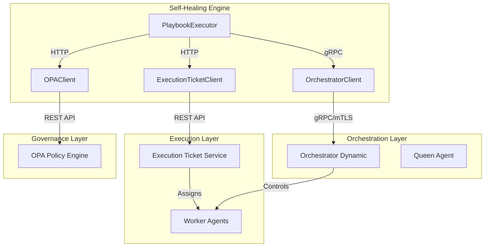
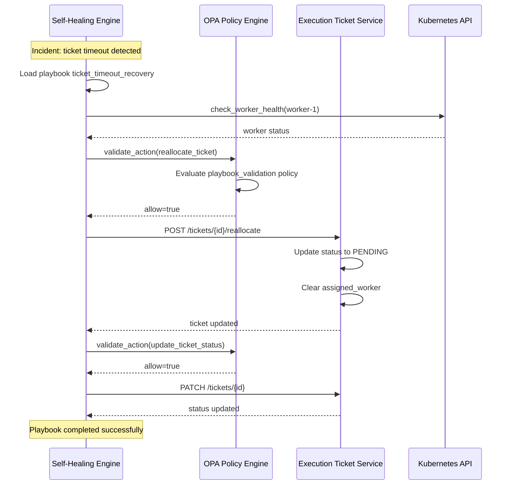
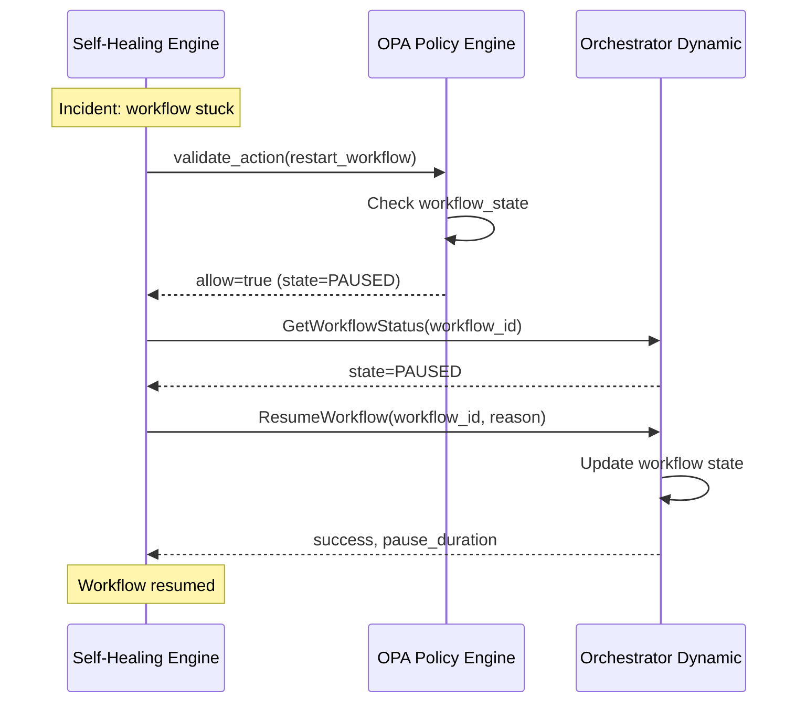

# Self-Healing Engine Integration Guide

This guide documents the integration between the Self-Healing Engine and other Neural Hive-Mind services for automated remediation workflows.

## Architecture Overview



## Integration Components

### 1. Execution Ticket Service Client

**Location**: `src/clients/execution_ticket_client.py`

The `SelfHealingTicketClient` provides ticket reallocation and status update capabilities.

#### Key Methods

| Method | Description |
|--------|-------------|
| `reallocate_ticket(ticket_id, reason, metadata)` | Reallocate a single ticket for re-execution |
| `reallocate_multiple_tickets(ticket_ids, reason, metadata)` | Batch reallocation with controlled parallelism |
| `update_ticket_status(ticket_id, status, result, metadata)` | Update ticket status |
| `get_ticket(ticket_id)` | Retrieve ticket details |

#### Configuration

```python
# In settings.py
execution_ticket_service_url: str = "http://execution-ticket-service.neural-hive-orchestration:8000"
execution_ticket_service_timeout: int = 30
execution_ticket_circuit_breaker_threshold: int = 5
execution_ticket_circuit_breaker_reset_seconds: int = 60
```

#### Environment Variables

```yaml
EXECUTION_TICKET_SERVICE_URL: "http://execution-ticket-service.neural-hive-orchestration:8000"
EXECUTION_TICKET_SERVICE_TIMEOUT: "30"
```

### 2. Orchestrator gRPC Client

**Location**: `src/clients/orchestrator_client.py`

The `OrchestratorClient` provides workflow control operations via gRPC with mTLS support.

#### Key Methods

| Method | Description |
|--------|-------------|
| `pause_workflow(workflow_id, reason, duration_seconds)` | Pause a running workflow |
| `resume_workflow(workflow_id, reason)` | Resume a paused workflow |
| `get_workflow_status(workflow_id, include_tickets)` | Get detailed workflow status |
| `trigger_replanning(plan_id, reason, trigger_type)` | Trigger workflow replanning |

#### Configuration

```python
# In settings.py
orchestrator_grpc_host: str = "orchestrator-dynamic.neural-hive-orchestration.svc.cluster.local"
orchestrator_grpc_port: int = 50052
orchestrator_grpc_use_tls: bool = True
orchestrator_grpc_timeout_seconds: int = 10
```

#### mTLS Configuration

In production, the client uses SPIFFE/SPIRE for mTLS:

```python
from neural_hive_security import SPIFFEConfig

spiffe_config = SPIFFEConfig(
    trust_domain="neural-hive.local",
    enable_x509=True,
    workload_api_socket="/run/spire/sockets/agent.sock"
)
```

### 3. OPA Policy Validation

**Location**: `policies/rego/self_healing/playbook_validation.rego`

Critical self-healing actions are validated against OPA policies before execution.

#### Validated Actions

- `reallocate_ticket` - Rate limited, requires ticket_id and reason
- `restart_workflow` - Blocked for terminal workflow states
- `update_ticket_status` - Requires ticket_id
- `trigger_replanning` - Requires plan_id or workflow_id

#### Policy Rules

1. **Reallocation Rate Limiting**: Tickets cannot be reallocated within 5 minutes of previous reallocation
2. **Terminal State Protection**: Workflows in COMPLETED, FAILED, or CANCELLED states cannot be restarted
3. **Required Fields**: Actions must provide required identifiers

## Sequence Diagrams

### Ticket Timeout Recovery



### Workflow Restart



## Playbook Actions

### New Actions Added

| Action | Description | Client Used |
|--------|-------------|-------------|
| `reallocate_ticket` | Reallocate ticket(s) for re-execution | ExecutionTicketClient |
| `update_ticket_status` | Update ticket status | ExecutionTicketClient |
| `restart_workflow` | Resume paused workflow | OrchestratorClient |
| `pause_workflow` | Pause running workflow | OrchestratorClient |
| `trigger_replanning` | Trigger plan replanning | OrchestratorClient |
| `get_workflow_status` | Get workflow details | OrchestratorClient |

### Example Playbook

```yaml
name: ticket_timeout_recovery
description: Recover from ticket execution timeout
timeout_seconds: 120
actions:
  - type: check_worker_health
    parameters:
      worker_id: "{{ worker_id }}"

  - type: restart_pod
    condition: "{{ worker_unhealthy }}"
    parameters:
      pod_name: "{{ pod_name }}"
      namespace: "{{ namespace }}"

  - type: reallocate_ticket
    parameters:
      ticket_id: "{{ ticket_id }}"
      reason: timeout_recovery

  - type: update_ticket_status
    parameters:
      ticket_id: "{{ ticket_id }}"
      status: pending
```

## Metrics

### Prometheus Metrics

| Metric | Type | Labels | Description |
|--------|------|--------|-------------|
| `self_healing_ticket_reallocation_total` | Counter | status, reason | Total ticket reallocations |
| `self_healing_ticket_reallocation_duration_seconds` | Histogram | - | Reallocation duration |
| `self_healing_ticket_status_update_total` | Counter | status, new_status | Status updates |
| `self_healing_orchestrator_calls_total` | Counter | operation, status | gRPC calls to Orchestrator |
| `self_healing_orchestrator_call_duration_seconds` | Histogram | operation | gRPC call duration |
| `self_healing_opa_validation_total` | Counter | action, result | OPA policy validations |

### Grafana Dashboard

The integration metrics are available in the `self-healing-integration` dashboard:

- **Ticket Reallocations**: Rate and duration panels
- **Workflow Operations**: Pause/resume/replanning metrics
- **OPA Validations**: Allow/deny rates per action
- **Integration Health**: Circuit breaker state, error rates

## Fail-Safe Behavior

The integration implements fail-safe patterns to ensure self-healing continues even when dependent services are unavailable:

### 1. Execution Ticket Service Unavailable

- Actions that require ETS return `success=True` with a warning
- Playbook continues with remaining actions
- Metrics record the skip

### 2. Orchestrator Unavailable

- Workflow control actions return `success=True` with a warning
- Playbook continues with remaining actions
- Actions are logged for manual follow-up

### 3. OPA Unavailable

- Configurable via `opa_fail_open` setting
- When `opa_fail_open=True` (default): Actions proceed with warning
- When `opa_fail_open=False`: Actions are blocked

## Troubleshooting

### Logs

Key log events to monitor:

```
playbook_executor.reallocate_ticket_failed  # Reallocation failure
playbook_executor.ticket_reallocated        # Successful reallocation
playbook_executor.workflow_resumed          # Workflow resumed
playbook_executor.opa_validation_denied     # Action blocked by OPA
playbook_executor.execution_ticket_client_unavailable  # ETS unavailable
playbook_executor.orchestrator_client_unavailable      # Orchestrator unavailable
```

### Common Issues

1. **Rate Limited Reallocation**
   - Symptom: `opa_validation_denied` with `reallocate_ticket_rate_limited`
   - Cause: Ticket was reallocated within last 5 minutes
   - Resolution: Wait for cooldown or update policy

2. **Terminal State Restart**
   - Symptom: `restart_workflow_failed` with terminal state error
   - Cause: Workflow is COMPLETED/FAILED/CANCELLED
   - Resolution: Create new workflow instead

3. **Circuit Breaker Open**
   - Symptom: Requests fail immediately
   - Cause: Too many consecutive failures
   - Resolution: Wait for reset timeout, check dependent service health

### Traces

OpenTelemetry spans are created for all integration operations:

- `self_healing.reallocate_ticket`
- `self_healing.update_ticket_status`
- `self_healing.orchestrator.pause_workflow`
- `self_healing.orchestrator.resume_workflow`
- `self_healing.orchestrator.get_workflow_status`

Use Jaeger to trace complete remediation flows.

## Configuration Reference

### Environment Variables

| Variable | Description | Default |
|----------|-------------|---------|
| `EXECUTION_TICKET_SERVICE_URL` | ETS base URL | `http://execution-ticket-service:8000` |
| `EXECUTION_TICKET_SERVICE_TIMEOUT` | Request timeout (seconds) | `30` |
| `ORCHESTRATOR_GRPC_HOST` | Orchestrator gRPC host | `orchestrator-dynamic.svc.cluster.local` |
| `ORCHESTRATOR_GRPC_PORT` | Orchestrator gRPC port | `50052` |
| `ORCHESTRATOR_GRPC_USE_TLS` | Enable mTLS | `true` |
| `OPA_HOST` | OPA server host | `opa.svc.cluster.local` |
| `OPA_PORT` | OPA server port | `8181` |
| `OPA_ENABLED` | Enable OPA validation | `true` |
| `OPA_FAIL_OPEN` | Allow actions when OPA unavailable | `true` |
