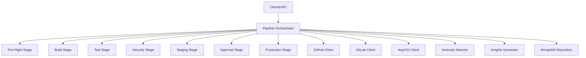

# Software Engineering Pipeline Service

## Descricao
Servico de orquestracao de pipelines CI/CD com geracao automatizada de manifests, deteccao de anomalias e insights de performance. Integra-se com GitHub, GitLab, Jenkins, ArgoCD e Flux CD para automatizar o deployment de infraestrutura e aplicacoes.

## Arquitetura


## Funcionalidades

### Orquestracao de Pipelines
- 7 estagios de pipeline configuraveis: Pre-Flight, Build, Test, Security, Staging, Approval, Production
- Execucao com retry e timeout configuravel
- Auto-rollback baseado em health checks e metricas
- Suporte a ambientes staging e production

### Geracao de Manifests
- Detecao automatica de stack tecnologica
- Geracao de manifests para GitHub Actions, GitLab CI, Jenkins
- Suporte a stacks: Python, Node.js, Go, Java, Ruby, Docker, Kubernetes

### Inteligencia Artificial
- **Anomaly Detector:** Identifica padroes anormais em execucoes de pipeline
- **Flaky Test Detector:** Detecta testes instaveis
- **Insights Generator:** Gera recomendacoes de otimizacao

### Multi-Provider Support
- GitHub Actions (via App ou Personal Access Token)
- GitLab CI
- Jenkins
- ArgoCD (GitOps)
- Flux CD (GitOps)

## API

### Endpoints

| Metodo | Endpoint | Descricao |
|--------|----------|-----------|
| GET | `/health` | Health check |
| GET | `/metrics` | Metricas Prometheus |
| POST | `/api/v1/pipelines/runs` | Cria execucao de pipeline |
| GET | `/api/v1/pipelines/runs` | Lista execucoes |
| GET | `/api/v1/pipelines/runs/{run_id}` | Detalhes da execucao |
| DELETE | `/api/v1/pipelines/runs/{run_id}` | Deleta execucao |
| GET | `/api/v1/pipelines/repositories/{repo_url}/stats` | Estatisticas do repositorio |
| POST | `/api/v1/manifests` | Cria manifesto |
| GET | `/api/v1/manifests/repositories/{repo_url}` | Busca manifesto |
| DELETE | `/api/v1/manifests/{manifest_id}` | Deleta manifesto |
| GET | `/api/v1/anomalies` | Lista anomalias detectadas |
| GET | `/api/v1/insights` | Insights de pipeline |

### Exemplos

**Criar execucao de pipeline:**
```bash
POST /api/v1/pipelines/runs
{
  "manifest_id": "manifest-123",
  "repo_url": "github.com/org/repo",
  "git_sha": "abc123"
}
```

**Buscar manifesto:**
```bash
GET /api/v1/manifests/repositories/github.com/org/repo?branch=main
```

**Estatisticas do repositorio:**
```bash
GET /api/v1/pipelines/repositories/github.com/org/repo/stats?days=30
```

## Configuracao

| Variavel | Default | Descricao |
|----------|---------|-----------|
| `app_name` | software-engineering-pipeline | Nome do servico |
| `api_port` | 8008 | Porta da API |
| `mongodb_url` | mongodb://localhost:27017 | URI MongoDB |
| `mongodb_db_name` | pipeline_db | Nome do database |
| `kafka_bootstrap_servers` | localhost:9092 | Servers Kafka |
| `github_token` | - | Token de acesso GitHub |
| `gitlab_token` | - | Token de acesso GitLab |
| `jenkins_url` | - | URL do Jenkins |
| `argocd_url` | - | URL do ArgoCD |
| `docker_registry` | ghcr.io | Registry Docker |
| `anomaly_detection_enabled` | true | Habilita deteccao de anomalias |
| `anomaly_threshold` | 0.7 | Threshold para anomalias |
| `flaky_test_threshold` | 3 | Falhas para considerar teste flaky |
| `default_timeout_minutes` | 60 | Timeout default de estagio |
| `max_retries` | 3 | Maximo de retries |
| `rollback_on_health_check_failure` | true | Auto-rollback em falha de health |
| `rollback_on_metrics_degradation` | true | Auto-rollback em degradacao |

## Integracoes

### Code Forge
- Recebe solicitacoes de geracao de pipelines
- Consome manifests gerados pelo Code Forge

### CI/CD Providers
- **GitHub Actions:** Push workflows, status checks
- **GitLab CI:** CI/CD configs, pipeline triggers
- **Jenkins:** Jenkinsfile generation, trigger jobs
- **ArgoCD:** Application manifests, sync operations
- **Flux CD:** Kustomization manifests, reconciliation

### Observabilidade
- OpenTelemetry tracing
- Prometheus metrics
- Structured logging (structlog)

## Deploy

### Docker
```bash
docker build -t software-engineering-pipeline:latest .
docker run -p 8008:8008 \
  -e mongodb_url=mongodb://mongodb:27017 \
  -e github_token=ghp_xxx \
  software-engineering-pipeline:latest
```

### Docker Compose
```yaml
services:
  software-engineering-pipeline:
    build: .
    ports:
      - "8008:8008"
    environment:
      - mongodb_url=mongodb://mongodb:27017
      - github_token=${GITHUB_TOKEN}
    depends_on:
      - mongodb
```

### Kubernetes
```bash
helm install software-engineering-pipeline ./helm/software-engineering-pipeline \
  --namespace neural-hive \
  --set config.github.token=${GITHUB_TOKEN} \
  --set config.mongodb.url=mongodb://mongodb-service:27017
```

## Desenvolvimento

```bash
# Instalar dependencias
pip install -r requirements.txt

# Executar servico
python src/main.py

# Executar testes
pytest tests/ -v

# Testes unitarios
pytest tests/unit/ -v

# Com覆盖率
pytest tests/ --cov=src --cov-report=html
```

## Troubleshooting

| Problema | Solução |
|----------|---------|
| Erro de autenticacao GitHub | Verifique `github_token` permissoes |
| Timeout na execucao do pipeline | Aumente `default_timeout_minutes` |
| Anomalias falsas positivas | Ajuste `anomaly_threshold` |
| Falha ao conectar ArgoCD | Verifique `argocd_url` e `argocd_token` |
| Health check falhando | Configure `rollback_on_health_check_failure=false` para debug |
| Insights nao gerados | Verifique se `anomaly_detection_enabled=true` |
