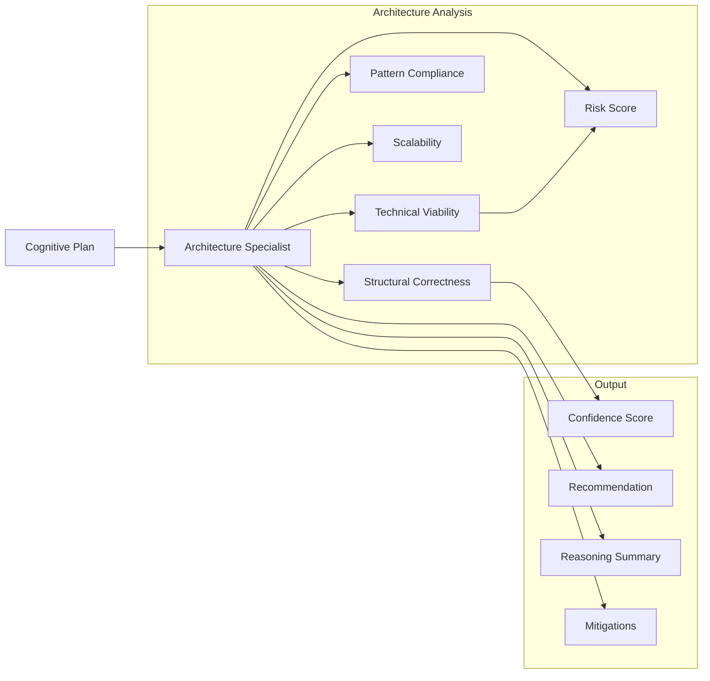
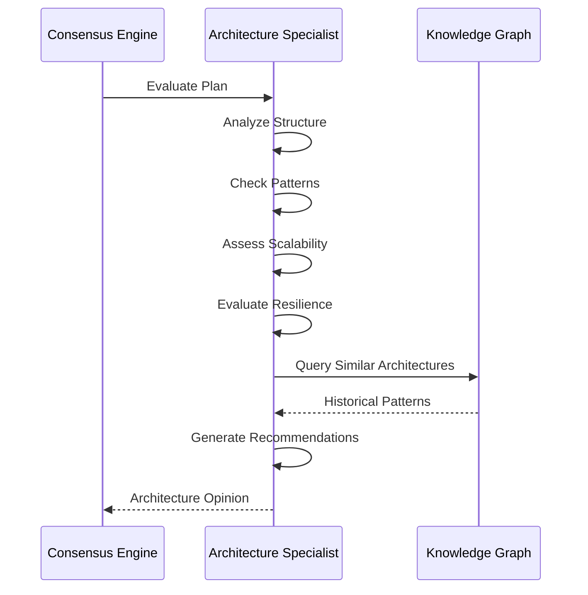

# Architecture Specialist

Especialista em arquitetura de sistemas, design de software e padrões de projeto do Neural Hive-Mind. Avalia Cognitive Plans sob a perspectiva de correção arquitetural, aderência a padrões e viabilidade técnica.

## Descrição

O Architecture Specialista analisa planos cognitivos focando em aspectos de arquitetura: correção estrutural, aderência a padrões de projeto, escalabilidade, resiliência e viabilidade técnica de longo prazo.

## Arquitetura

### Componentes



### Fluxo de Avaliação



### Estrutura de Diretórios

```
services/specialist-architecture/
├── src/
│   ├── main.py                      # Entry point gRPC + HTTP
│   ├── specialist.py                # ArchitectureSpecialist class
│   ├── config.py                    # Configuration
│   ├── http_server.py               # HTTP server (legacy)
│   └── http_server_fastapi.py       # FastAPI HTTP server
├── tests/
├── Dockerfile
└── requirements.txt
```

## Configuração

### Variáveis de Ambiente

| Variável | Descrição | Default |
|----------|-----------|---------|
| `SPECIALIST_TYPE` | Tipo do especialista | `architecture` |
| `ENVIRONMENT` | Ambiente | `development` |
| `GRPC_PORT` | Porta gRPC | `50055` |
| `HTTP_PORT` | Porta HTTP | `8105` |
| `PROMETHEUS_PORT` | Porta métricas | `9095` |
| `SERVICE_REGISTRY_HOST` | Service Registry | `service-registry` |
| `SERVICE_REGISTRY_PORT` | Porta SR | `8007` |
| `MLFLOW_TRACKING_URI` | MLflow URI | `http://mlflow:5000` |
| `MLFLOW_MODEL_NAME` | Nome do modelo | `architecture-specialist` |
| `MLFLOW_MODEL_STAGE` | Stage do modelo | `production` |
| `LOG_LEVEL` | Nível de log | `INFO` |

## API

### gRPC Service

```protobuf
service Specialist {
    rpc EvaluatePlan(CognitivePlan) returns (SpecialistOpinion);
    rpc HealthCheck(HealthRequest) returns (HealthResponse);
    rpc GetSpecialistInfo(InfoRequest) returns (SpecialistInfo);
}
```

### HTTP Endpoints

```
GET /health                 # Health check
GET /metrics                # Métricas Prometheus
GET /info                   # Informações do especialista
POST /evaluate              # Avaliar plano (HTTP alternative)
```

## Avaliação de Planos

### Fatores de Análise

#### 1. Structural Correctness

Correção estrutural da arquitetura:

- **Componentes bem definidos**: Limites claros entre componentes
- **Dependências acíclicas**: Sem ciclos de dependência
- **Camadas separadas**: Separation of concerns
- **Interfaces contratuais**: Contratos bem definidos

#### 2. Pattern Compliance

Aderência a padrões de projeto:

- **GoF Patterns**: Factory, Strategy, Observer, etc.
- **Enterprise Patterns**: Repository, Unit of Work, CQRS
- **Cloud Patterns**: Circuit Breaker, Sidecar, Ambassador
- **DDD Patterns**: Aggregates, Domain Events, Bounded Contexts

#### 3. Scalability

Capacidade de escalonamento:

- **Horizontal scaling**: Stateless design
- **Vertical scaling**: Resource optimization
- **Data partitioning**: Sharding strategies
- **Load balancing**: Distribution capabilities

#### 4. Resilience

Resiliência do sistema:

- **Fault tolerance**: Graceful degradation
- **Recovery mechanisms**: Retry, fallback, cache
- **Health checks**: Proper monitoring
- **Isolation**: Bulkhead pattern

### Reasoning Factors

```json
{
  "reasoning_factors": [
    {
      "factor_name": "structural_correctness",
      "weight": 0.3,
      "score": 0.88,
      "description": "Correção estrutural da arquitetura"
    },
    {
      "factor_name": "pattern_compliance",
      "weight": 0.25,
      "score": 0.82,
      "description": "Aderência a padrões de projeto"
    },
    {
      "factor_name": "scalability",
      "weight": 0.25,
      "score": 0.75,
      "description": "Capacidade de escalonamento"
    },
    {
      "factor_name": "resilience",
      "weight": 0.2,
      "score": 0.80,
      "description": "Resiliência do sistema"
    }
  ]
}
```

## Deploy

### Docker

```bash
docker build -t specialist-architecture:latest .
docker run -p 50055:50055 -p 8105:8105 \
  specialist-architecture:latest
```

### Kubernetes

```yaml
apiVersion: apps/v1
kind: Deployment
metadata:
  name: specialist-architecture
spec:
  replicas: 2
  selector:
    matchLabels:
      app: specialist-architecture
  template:
    metadata:
      labels:
        app: specialist-architecture
    spec:
      containers:
      - name: specialist
        image: specialist-architecture:latest
        ports:
        - containerPort: 50055
```

## Desenvolvimento

### Como Executar Localmente

```bash
pip install -r requirements.txt
python src/main.py
```

### Testes

```bash
pytest tests/ -v
```

## Métricas Prometheus

- `architecture_evaluation_duration_seconds`: Tempo de avaliação
- `architecture_correctness_score`: Score de correção
- `architecture_pattern_score`: Score de padrões
- `architecture_scalability_score`: Score de escalabilidade

## Referências

- [Business Specialist](../specialist-business/README.md)
- [Technical Specialist](../specialist-technical/README.md)
- [Behavior Specialist](../specialist-behavior/README.md)
