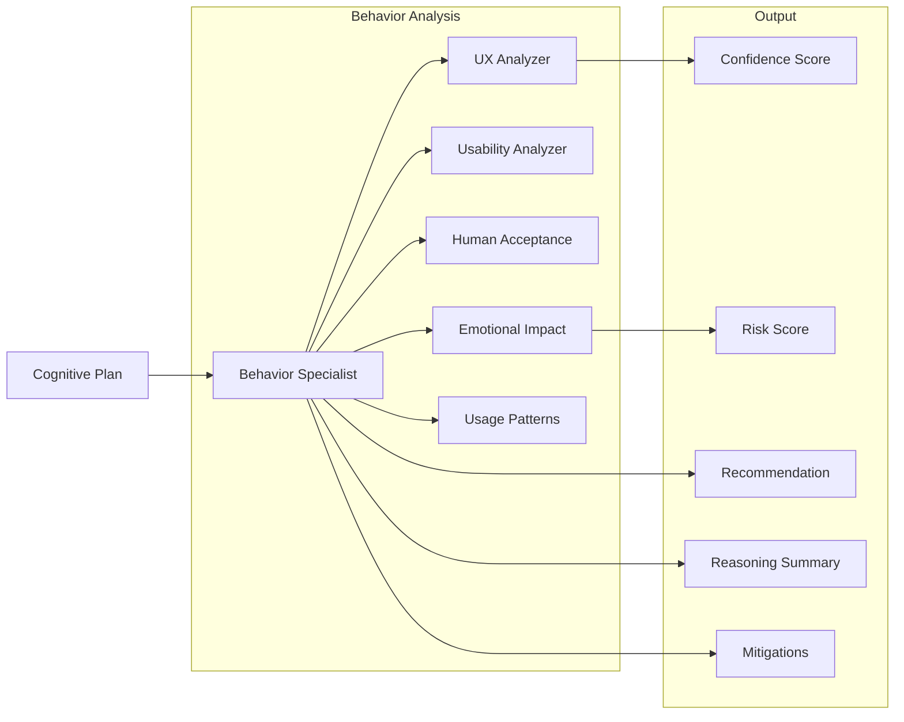
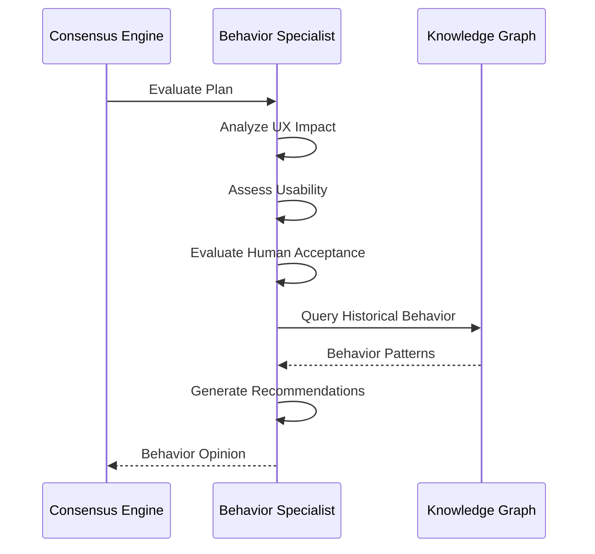

# Behavior Specialist

Especialista em análise comportamental, experiência do usuário e impacto humano do Neural Hive-Mind. Avalia Cognitive Plans sob a perspectiva de usabilidade, aceitação humana e comportamento do usuário final.

## Descrição

O Behavior Specialist analisa planos cognitivos focando em aspectos comportamentais: experiência do usuário (UX), usabilidade da interface, aceitação humana, impacto emocional e padrões de uso. Ele avalia como as ações propostas afetarão os usuários finais.

## Arquitetura

### Componentes



### Fluxo de Avaliação



### Estrutura de Diretórios

```
services/specialist-behavior/
├── src/
│   ├── main.py                      # Entry point gRPC + HTTP
│   ├── specialist.py                # BehaviorSpecialist class
│   ├── config.py                    # Configuration
│   ├── http_server.py               # HTTP server (legacy)
│   └── http_server_fastapi.py       # FastAPI HTTP server
├── tests/
├── Dockerfile
└── requirements.txt
```

## Configuração

### Variáveis de Ambiente

| Variável | Descrição | Default |
|----------|-----------|---------|
| `SPECIALIST_TYPE` | Tipo do especialista | `behavior` |
| `ENVIRONMENT` | Ambiente | `development` |
| `GRPC_PORT` | Porta gRPC | `50056` |
| `HTTP_PORT` | Porta HTTP | `8106` |
| `PROMETHEUS_PORT` | Porta métricas | `9096` |
| `SERVICE_REGISTRY_HOST` | Service Registry | `service-registry` |
| `SERVICE_REGISTRY_PORT` | Porta SR | `8007` |
| `MLFLOW_TRACKING_URI` | MLflow URI | `http://mlflow:5000` |
| `MLFLOW_MODEL_NAME` | Nome do modelo | `behavior-specialist` |
| `MLFLOW_MODEL_STAGE` | Stage do modelo | `production` |
| `LOG_LEVEL` | Nível de log | `INFO` |

## API

### gRPC Service

```protobuf
service Specialist {
    rpc EvaluatePlan(CognitivePlan) returns (SpecialistOpinion);
    rpc HealthCheck(HealthRequest) returns (HealthResponse);
    rpc GetSpecialistInfo(InfoRequest) returns (SpecialistInfo);
}
```

### HTTP Endpoints

```
GET /health                 # Health check
GET /metrics                # Métricas Prometheus
GET /info                   # Informações do especialista
POST /evaluate              # Avaliar plano (HTTP alternative)
```

## Avaliação de Planos

### Fatores de Análise

#### 1. UX Impact

Impacto na experiência do usuário:

- **Interrupções**: Frequência de interrupções
- **Complexidade**: Complexidade das interações
- **Feedback**: Clareza do feedback fornecido
- **Controle**: Sensação de controle do usuário

#### 2. Usability

Usabilidade das ações propostas:

- **Clareza**: Ações são compreensíveis?
- **Consistência**: Interface consistente?
- **Acessibilidade**: Acessível a todos os usuários?
- **Erro recovery**: Recuperação de erros intuitiva?

#### 3. Human Acceptance

Aceitação humana das ações:

- **Privacy**: Respeito à privacidade?
- **Consent**: Consentimento claro?
- **Transparency**: Transparência das ações?
- **Trust**: Construção de confiança?

#### 4. Emotional Impact

Impacto emocional:

- **Stresse**: Nível de estresse induzido
- **Frustração**: Potencial de frustração
- **Satisfação**: Impacto na satisfação
- **Motivação**: Efeito na motivação

### Reasoning Factors

```json
{
  "reasoning_factors": [
    {
      "factor_name": "ux_impact",
      "weight": 0.3,
      "score": 0.85,
      "description": "Impacto na experiência do usuário"
    },
    {
      "factor_name": "usability",
      "weight": 0.25,
      "score": 0.78,
      "description": "Usabilidade das ações propostas"
    },
    {
      "factor_name": "human_acceptance",
      "weight": 0.25,
      "score": 0.82,
      "description": "Aceitação humana esperada"
    },
    {
      "factor_name": "emotional_impact",
      "weight": 0.2,
      "score": 0.75,
      "description": "Impacto emocional no usuário"
    }
  ]
}
```

## Deploy

### Docker

```bash
docker build -t specialist-behavior:latest .
docker run -p 50056:50056 -p 8106:8106 \
  specialist-behavior:latest
```

### Kubernetes

```yaml
apiVersion: apps/v1
kind: Deployment
metadata:
  name: specialist-behavior
spec:
  replicas: 2
  selector:
    matchLabels:
      app: specialist-behavior
  template:
    metadata:
      labels:
        app: specialist-behavior
    spec:
      containers:
      - name: specialist
        image: specialist-behavior:latest
        ports:
        - containerPort: 50056
```

## Desenvolvimento

### Como Executar Localmente

```bash
pip install -r requirements.txt
python src/main.py
```

### Testes

```bash
pytest tests/ -v
```

## Métricas Prometheus

- `behavior_evaluation_duration_seconds`: Tempo de avaliação
- `behavior_ux_score`: Score de UX
- `behavior_usability_score`: Score de usabilidade
- `behavior_acceptance_score`: Score de aceitação

## Referências

- [Business Specialist](../specialist-business/README.md)
- [Evolution Specialist](../specialist-evolution/README.md)
- [Approval Service](../approval-service/README.md)
