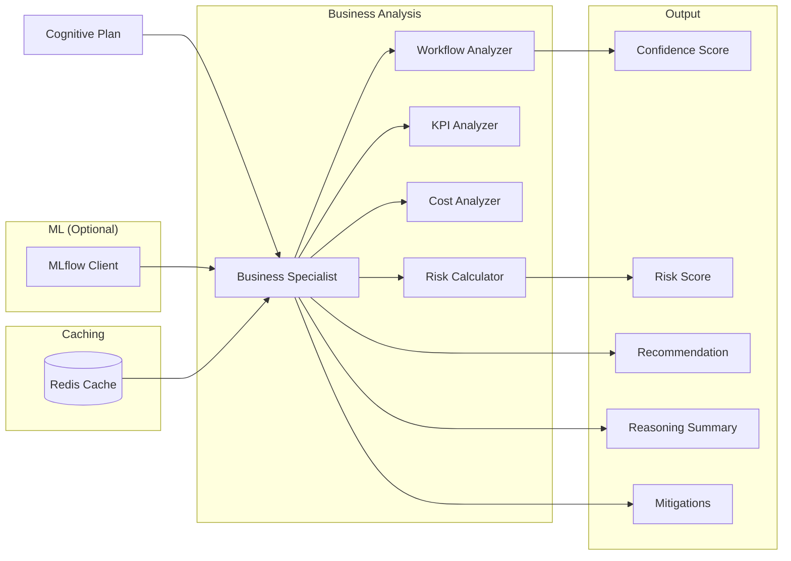
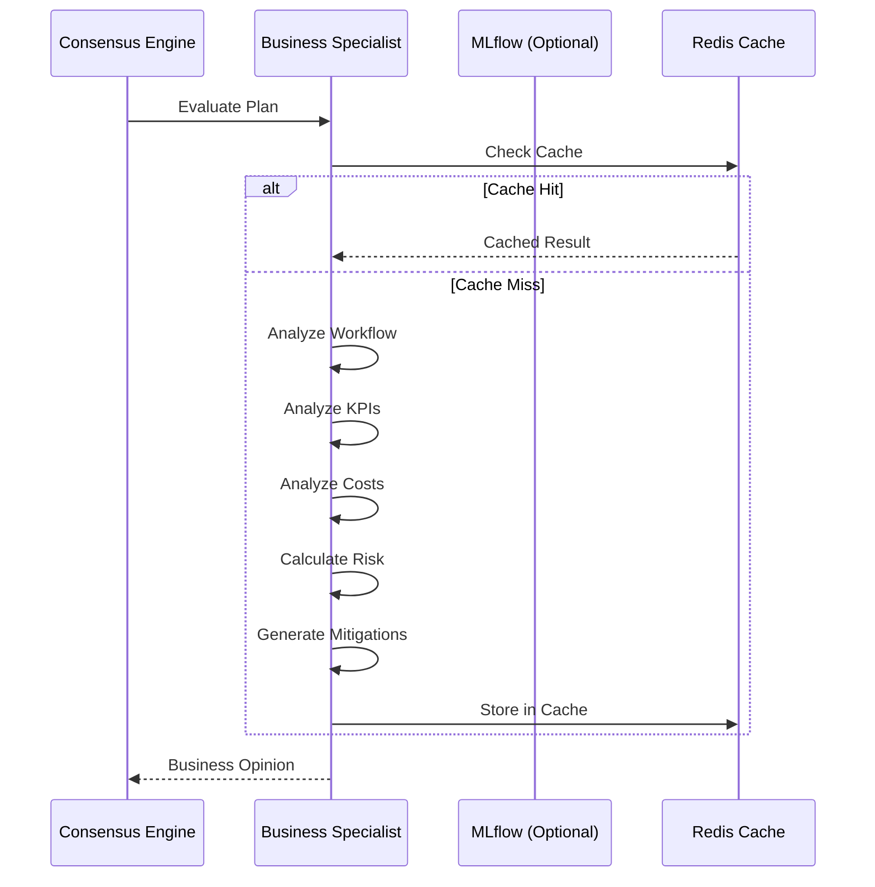

# Business Specialist

Especialista em análise de negócios, workflows, KPIs e custos do Neural Hive-Mind. Avalia Cognitive Plans sob a perspectiva de eficiência operacional, alinhamento com métricas de negócio e custo-efetividade.

## Descrição

O Business Specialist é um agente especializado que analisa planos cognitivos focando em aspectos de negócio: eficiência de workflows, alinhamento com KPIs estratégicos, análise de custos e otimização operacional. Ele fornece scores de confiança e risco com recomendações de mitigação.

## Arquitetura

### Componentes



### Fluxo de Avaliação



### Estrutura de Diretórios

```
services/specialist-business/
├── src/
│   ├── main.py                      # Entry point gRPC + HTTP
│   ├── specialist.py                # BusinessSpecialist class
│   ├── config.py                    # Configuration
│   ├── http_server.py               # HTTP server (legacy)
│   └── http_server_fastapi.py       # FastAPI HTTP server
├── tests/
├── Dockerfile
└── requirements.txt
```

## Configuração

### Variáveis de Ambiente

| Variável | Descrição | Default |
|----------|-----------|---------|
| `SPECIALIST_TYPE` | Tipo do especialista | `business` |
| `ENVIRONMENT` | Ambiente | `development` |
| `GRPC_PORT` | Porta gRPC | `50053` |
| `HTTP_PORT` | Porta HTTP | `8103` |
| `PROMETHEUS_PORT` | Porta métricas | `9093` |
| `REDIS_HOST` | Redis host | `redis` |
| `REDIS_PORT` | Redis port | `6379` |
| `REDIS_CACHE_TTL` | TTL do cache (segundos) | `3600` |
| `SERVICE_REGISTRY_HOST` | Service Registry | `service-registry` |
| `SERVICE_REGISTRY_PORT` | Porta SR | `8007` |
| `MLFLOW_TRACKING_URI` | MLflow URI | `http://mlflow:5000` |
| `MLFLOW_MODEL_NAME` | Nome do modelo | `business-specialist` |
| `MLFLOW_MODEL_STAGE` | Stage do modelo | `production` |
| `LOG_LEVEL` | Nível de log | `INFO` |

## API

### gRPC Service

```protobuf
service Specialist {
    rpc EvaluatePlan(CognitivePlan) returns (SpecialistOpinion);
    rpc HealthCheck(HealthRequest) returns (HealthResponse);
    rpc GetSpecialistInfo(InfoRequest) returns (SpecialistInfo);
}
```

### HTTP Endpoints

```
GET /health                 # Health check
GET /metrics                # Métricas Prometheus
GET /info                   # Informações do especialista
POST /evaluate              # Avaliar plano (HTTP alternative)
```

## Avaliação de Planos

### Fatores de Análise

O Business Specialist avalia os seguintes fatores:

#### 1. Workflow Efficiency

Análise da estrutura do workflow:

- **Número de tarefas**: Ideal entre 5-15
- **Dependências**: Muitas dependências reduzem paralelização
- **Paralelização**: Maior paralelismo = maior eficiência

```python
workflow_score = (
    complexity_penalty * 0.6 +
    parallelization_score * 0.4
)
```

#### 2. KPI Alignment

Alinhamento com KPIs estratégicos:

- **Prioridade do plano**: Mapeada para score KPI
- **Impacto nos negócios**: Avaliado qualitativamente
- **Métricas históricas**: Disponíveis via Knowledge Graph

```python
kpi_score = priority_map.get(priority, 0.6)
# low: 0.3, normal: 0.6, high: 0.8, critical: 1.0
```

#### 3. Cost Effectiveness

Análise de custo-efetividade:

- **Duração estimada**: Soma das durações das tarefas
- **Recursos necessários**: CPU, memória, serviços externos
- **Complexidade**: Afeta custo de manutenção

```python
cost_score = 1.0 - (normalized_duration * 0.7)
```

### Reasoning Factors

Estrutura do reasoning retornado:

```json
{
  "reasoning_factors": [
    {
      "factor_name": "workflow_efficiency",
      "weight": 0.4,
      "score": 0.85,
      "description": "Eficiência do workflow proposto"
    },
    {
      "factor_name": "kpi_alignment",
      "weight": 0.3,
      "score": 0.70,
      "description": "Alinhamento com KPIs estratégicos"
    },
    {
      "factor_name": "cost_effectiveness",
      "weight": 0.3,
      "score": 0.75,
      "description": "Custo-efetividade do plano"
    }
  ]
}
```

### Mitigações

Sugestões de melhoria quando scores são baixos:

```json
{
  "mitigations": [
    {
      "mitigation_id": "optimize_workflow",
      "description": "Simplificar workflow reduzindo tarefas",
      "priority": "high",
      "estimated_impact": 0.3,
      "required_actions": [
        "Revisar dependências",
        "Identificar tarefas redundantes",
        "Considerar execução paralela"
      ]
    }
  ]
}
```

## Deploy

### Docker

```bash
docker build -t specialist-business:latest .
docker run -p 50053:50053 -p 8103:8103 \
  -e REDIS_HOST=redis \
  -e MLFLOW_TRACKING_URI=http://mlflow:5000 \
  specialist-business:latest
```

### Kubernetes

```yaml
apiVersion: v1
kind: Service
metadata:
  name: specialist-business
spec:
  ports:
    - port: 50053
      name: grpc
    - port: 8103
      name: http
  selector:
    app: specialist-business
---
apiVersion: apps/v1
kind: Deployment
metadata:
  name: specialist-business
spec:
  replicas: 2
  selector:
    matchLabels:
      app: specialist-business
  template:
    metadata:
      labels:
        app: specialist-business
    spec:
      containers:
      - name: specialist
        image: specialist-business:latest
        ports:
        - containerPort: 50053
        - containerPort: 8103
        env:
        - name: REDIS_HOST
          value: redis
        - name: MLFLOW_TRACKING_URI
          value: http://mlflow:5000
```

## Desenvolvimento

### Como Executar Localmente

```bash
# Instalar dependências
pip install -r requirements.txt

# Executar gRPC + HTTP
python src/main.py

# Ou usando HTTP direto
uvicorn src.http_server_fastapi:app --port 8103
```

### Testes

```bash
# Unit tests
pytest tests/ -v

# Testes gRPC
pytest tests/grpc/ -v

# Testes de carga
locust -f tests/load/locustfile.py
```

## Troubleshooting

**1. Cache Redis não funciona**

```bash
# Verificar conectividade
redis-cli -h redis ping

# Verificar chaves do especialista
redis-cli -h redis KEYS "business:*"
```

**2. Modelo MLflow não carrega**

```bash
# Verificar modelo no MLflow
curl http://mlflow:5000/api/2.0/mlflow/registered-models/get \
  -d '{"name": "business-specialist"}'

# O especialista funciona com heurísticas se MLflow falhar
```

**3. Performance lenta**

- Verificar se cache está habilitado
- Reduzir `REDIS_CACHE_TTL` para dados mais frescos
- Aumentar número de réplicas do especialista

## Métricas Prometheus

- `business_evaluation_duration_seconds`: Tempo de avaliação
- `business_step_duration_seconds`: Tempo por etapa (workflow_analysis, kpi_analysis, etc.)
- `business_cache_hits_total`: Hits do cache
- `business_cache_misses_total`: Misses do cache
- `business_confidence_score`: Score de confiança (histograma)
- `business_risk_score`: Score de risco (histograma)

## Referências

- [Consensus Engine](../../services/consensus-engine/README.md)
- [Technical Specialist](../specialist-technical/README.md)
- [Architecture Specialist](../specialist-architecture/README.md)
- [neural_hive_specialists](../../libraries/python/neural_hive_specialists/README.md)
