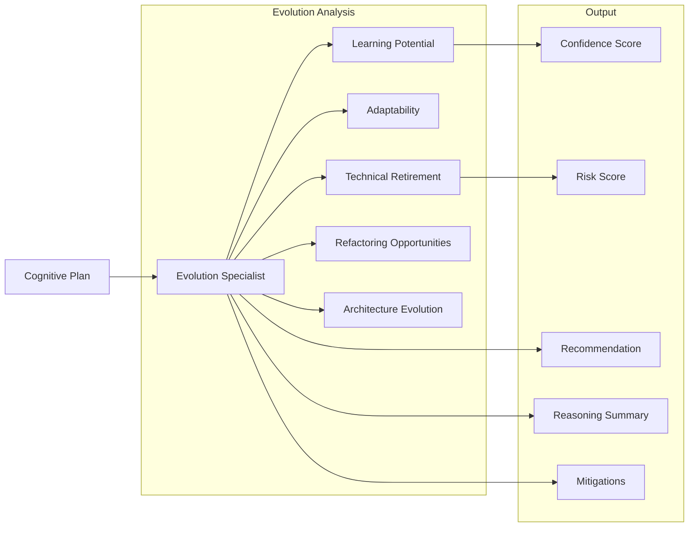
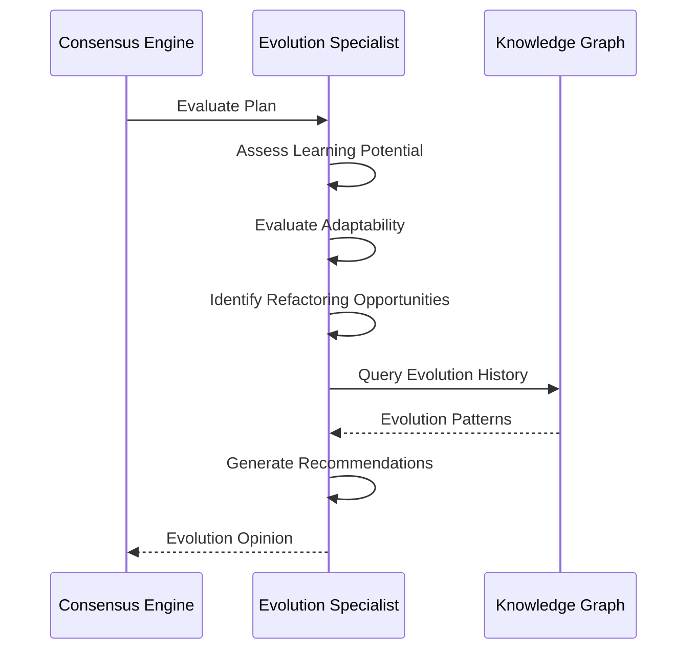

# Evolution Specialist

Especialista em evolução de sistemas, aprendizado contínuo e adaptação do Neural Hive-Mind. Avalia Cognitive Plans sob a perspectiva de aprendizado, evolução da arquitetura e melhoria contínua.

## Descrição

O Evolution Specialist analisa planos cognitivos focando em aspectos evolucionários: potencial de aprendizado, adaptabilidade do sistema, technical retirement, refactoring opportunities e evolução da arquitetura a longo prazo.

## Arquitetura

### Componentes



### Fluxo de Avaliação



### Estrutura de Diretórios

```
services/specialist-evolution/
├── src/
│   ├── main.py                      # Entry point gRPC + HTTP
│   ├── specialist.py                # EvolutionSpecialist class
│   ├── config.py                    # Configuration
│   ├── http_server.py               # HTTP server (legacy)
│   └── http_server_fastapi.py       # FastAPI HTTP server
├── tests/
├── Dockerfile
└── requirements.txt
```

## Configuração

### Variáveis de Ambiente

| Variável | Descrição | Default |
|----------|-----------|---------|
| `SPECIALIST_TYPE` | Tipo do especialista | `evolution` |
| `ENVIRONMENT` | Ambiente | `development` |
| `GRPC_PORT` | Porta gRPC | `50057` |
| `HTTP_PORT` | Porta HTTP | `8107` |
| `PROMETHEUS_PORT` | Porta métricas | `9097` |
| `SERVICE_REGISTRY_HOST` | Service Registry | `service-registry` |
| `SERVICE_REGISTRY_PORT` | Porta SR | `8007` |
| `MLFLOW_TRACKING_URI` | MLflow URI | `http://mlflow:5000` |
| `MLFLOW_MODEL_NAME` | Nome do modelo | `evolution-specialist` |
| `MLFLOW_MODEL_STAGE` | Stage do modelo | `production` |
| `LOG_LEVEL` | Nível de log | `INFO` |

## API

### gRPC Service

```protobuf
service Specialist {
    rpc EvaluatePlan(CognitivePlan) returns (SpecialistOpinion);
    rpc HealthCheck(HealthRequest) returns (HealthResponse);
    rpc GetSpecialistInfo(InfoRequest) returns (SpecialistInfo);
}
```

### HTTP Endpoints

```
GET /health                 # Health check
GET /metrics                # Métricas Prometheus
GET /info                   # Informações do especialista
POST /evaluate              # Avaliar plano (HTTP alternative)
```

## Avaliação de Planos

### Fatores de Análise

#### 1. Learning Potential

Potencial de aprendizado:

- **Coleta de dados**: O plano gera dados úteis?
- **Feedback loops**: Mecanismos de feedback existem?
- **ML features**: Features para ML podem ser extraídas?
- **Knowledge capture**: Conhecimento é capturado?

#### 2. Adaptability

Adaptabilidade do sistema:

- **Extensibilidade**: Fácil adicionar funcionalidades?
- **Configurability**: Comportamento configurável?
- **Plugin architecture**: Suporte a plugins?
- **Runtime changes**: Mudanças em runtime possíveis?

#### 3. Technical Retirement

Avaliação de technical debt:

- **Componentes obsoletos**: Identificar para remoção
- **Deprecations**: Uso de APIs deprecadas
- **Migration paths**: Planos de migração
- **Legacy code**: Código legado identificado

#### 4. Architecture Evolution

Evolução da arquitetura:

- **Modularidade**: Componentes modulares?
- **Loose coupling**: Baixo acoplamento?
- **Replacement**: Componentes substituíveis?
- **Versioning**: Estratégia de versionamento

### Reasoning Factors

```json
{
  "reasoning_factors": [
    {
      "factor_name": "learning_potential",
      "weight": 0.3,
      "score": 0.80,
      "description": "Potencial de aprendizado do sistema"
    },
    {
      "factor_name": "adaptability",
      "weight": 0.25,
      "score": 0.75,
      "description": "Capacidade de adaptação a mudanças"
    },
    {
      "factor_name": "technical_health",
      "weight": 0.25,
      "score": 0.70,
      "description": "Saúde técnica e débito técnico"
    },
    {
      "factor_name": "evolution_readiness",
      "weight": 0.2,
      "score": 0.78,
      "description": "Prontidão para evolução"
    }
  ]
}
```

## Deploy

### Docker

```bash
docker build -t specialist-evolution:latest .
docker run -p 50057:50057 -p 8107:8107 \
  specialist-evolution:latest
```

### Kubernetes

```yaml
apiVersion: apps/v1
kind: Deployment
metadata:
  name: specialist-evolution
spec:
  replicas: 2
  selector:
    matchLabels:
      app: specialist-evolution
  template:
    metadata:
      labels:
        app: specialist-evolution
    spec:
      containers:
      - name: specialist
        image: specialist-evolution:latest
        ports:
        - containerPort: 50057
```

## Desenvolvimento

### Como Executar Localmente

```bash
pip install -r requirements.txt
python src/main.py
```

### Testes

```bash
pytest tests/ -v
```

## Métricas Prometheus

- `evolution_evaluation_duration_seconds`: Tempo de avaliação
- `evolution_learning_score`: Score de aprendizado
- `evolution_adaptability_score`: Score de adaptabilidade
- `evolution_health_score`: Score de saúde técnica

## Referências

- [Architecture Specialist](../specialist-architecture/README.md)
- [Technical Specialist](../specialist-technical/README.md)
- [neural_hive_ml](../../../libraries/python/neural_hive_ml/README.md)
