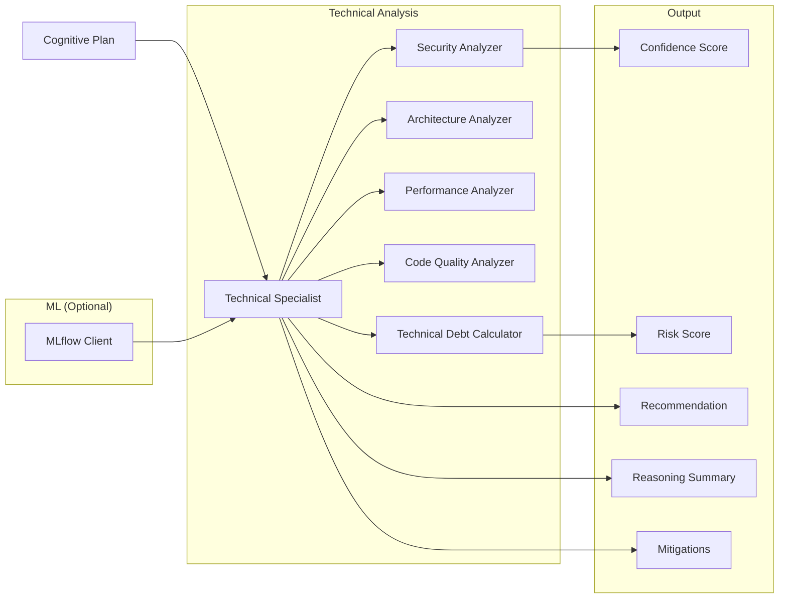
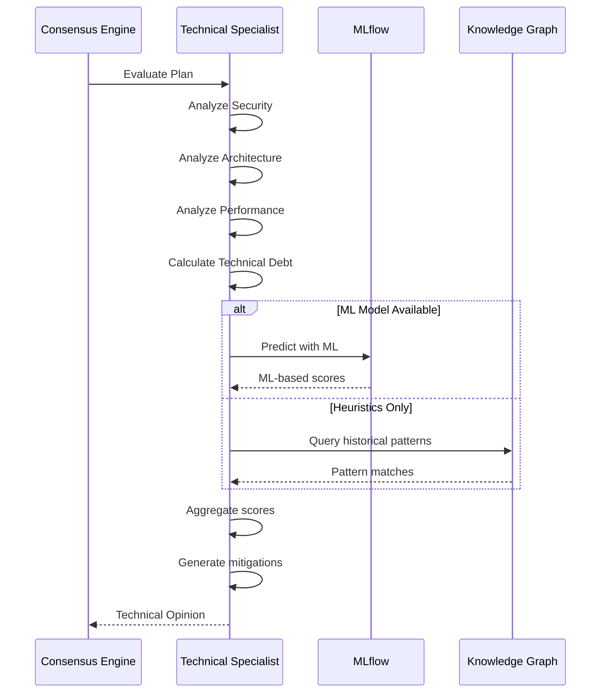

# Technical Specialist

Especialista em análise técnica, segurança, arquitetura, performance e qualidade de código do Neural Hive-Mind. Avalia Cognitive Plans sob a perspectiva técnica, identificando riscos de segurança, problemas de performance e débito técnico.

## Descrição

O Technical Specialist analisa planos cognitivos focando em aspectos técnicos: segurança da implementação, padrões de arquitetura, performance otimizada, qualidade de código e débito técnico. Fornece avaliações detalhadas com recomendações técnicas.

## Arquitetura

### Componentes



### Fluxo de Avaliação



### Estrutura de Diretórios

```
services/specialist-technical/
├── src/
│   ├── main.py                      # Entry point gRPC + HTTP
│   ├── specialist.py                # TechnicalSpecialist class
│   ├── config.py                    # Configuration
│   ├── http_server.py               # HTTP server (legacy)
│   └── http_server_fastapi.py       # FastAPI HTTP server
├── tests/
├── Dockerfile
└── requirements.txt
```

## Configuração

### Variáveis de Ambiente

| Variável | Descrição | Default |
|----------|-----------|---------|
| `SPECIALIST_TYPE` | Tipo do especialista | `technical` |
| `ENVIRONMENT` | Ambiente | `development` |
| `GRPC_PORT` | Porta gRPC | `50054` |
| `HTTP_PORT` | Porta HTTP | `8104` |
| `PROMETHEUS_PORT` | Porta métricas | `9094` |
| `SERVICE_REGISTRY_HOST` | Service Registry | `service-registry` |
| `SERVICE_REGISTRY_PORT` | Porta SR | `8007` |
| `MLFLOW_TRACKING_URI` | MLflow URI | `http://mlflow:5000` |
| `MLFLOW_MODEL_NAME` | Nome do modelo | `technical-specialist` |
| `MLFLOW_MODEL_STAGE` | Stage do modelo | `production` |
| `LOG_LEVEL` | Nível de log | `INFO` |

## API

### gRPC Service

```protobuf
service Specialist {
    rpc EvaluatePlan(CognitivePlan) returns (SpecialistOpinion);
    rpc HealthCheck(HealthRequest) returns (HealthResponse);
    rpc GetSpecialistInfo(InfoRequest) returns (SpecialistInfo);
}
```

### HTTP Endpoints

```
GET /health                 # Health check
GET /metrics                # Métricas Prometheus
GET /info                   # Informações do especialista
POST /evaluate              # Avaliar plano (HTTP alternative)
```

## Avaliação de Planos

### Fatores de Análise

#### 1. Security Analysis

Análise de segurança da implementação:

- **Validação de entrada**: Parâmetros sanitizados?
- **Autenticação/autorização**: Permissões verificadas?
- **Criptografia**: Dados sensíveis protegidos?
- **Injeção de código**: SQL/NoSQL injection risks?
- **Segredos**: Hardcoded secrets detectados?

```python
security_score = (
    input_validation * 0.25 +
    auth_check * 0.25 +
    encryption * 0.20 +
    injection_protection * 0.15 +
    secrets_management * 0.15
)
```

#### 2. Architecture Analysis

Avaliação de padrões de arquitetura:

- **Separação de responsabilidades**: Componentes acoplados?
- **Escalabilidade**: Design suporta escala?
- **Resiliência**: Fault tolerance implementado?
- **Padrões conhecidos**: GoF patterns aplicados?

```python
architecture_score = (
    separation_of_concerns * 0.3 +
    scalability * 0.3 +
    resilience * 0.25 +
    patterns_compliance * 0.15
)
```

#### 3. Performance Analysis

Análise de performance:

- **Complexidade algorítmica**: O(n), O(n²), etc.
- **Uso de recursos**: CPU, memória, I/O
- **Latência esperada**: SLO/SLA compliance
- **Otimizações**: Caching, batching, async?

```python
performance_score = (
    algorithmic_efficiency * 0.4 +
    resource_usage * 0.3 +
    latency_compliance * 0.3
)
```

#### 4. Code Quality

Qualidade do código:

- **Legibilidade**: Nomenclatura, comentários
- **Manutenibilidade**: Funções pequenas, coesão
- **Testabilidade**: Design testável
- **Débito técnico**: Code smells detectados

```python
quality_score = (
    readability * 0.3 +
    maintainability * 0.3 +
    testability * 0.2 +
    low_technical_debt * 0.2
)
```

### Reasoning Factors

```json
{
  "reasoning_factors": [
    {
      "factor_name": "security_compliance",
      "weight": 0.3,
      "score": 0.90,
      "description": "Conformidade com práticas de segurança"
    },
    {
      "factor_name": "architectural_soundness",
      "weight": 0.25,
      "score": 0.80,
      "description": "Soundness da arquitetura proposta"
    },
    {
      "factor_name": "performance_efficiency",
      "weight": 0.25,
      "score": 0.75,
      "description": "Eficiência de performance"
    },
    {
      "factor_name": "code_quality",
      "weight": 0.2,
      "score": 0.85,
      "description": "Qualidade do código gerado"
    }
  ]
}
```

## Deploy

### Docker

```bash
docker build -t specialist-technical:latest .
docker run -p 50054:50054 -p 8104:8104 \
  -e MLFLOW_TRACKING_URI=http://mlflow:5000 \
  specialist-technical:latest
```

### Kubernetes

```yaml
apiVersion: apps/v1
kind: Deployment
metadata:
  name: specialist-technical
spec:
  replicas: 2
  selector:
    matchLabels:
      app: specialist-technical
  template:
    metadata:
      labels:
        app: specialist-technical
    spec:
      containers:
      - name: specialist
        image: specialist-technical:latest
        ports:
        - containerPort: 50054
        env:
        - name: MLFLOW_TRACKING_URI
          value: http://mlflow:5000
```

## Desenvolvimento

### Como Executar Localmente

```bash
# Instalar dependências
pip install -r requirements.txt

# Executar
python src/main.py
```

### Testes

```bash
pytest tests/ -v
```

## Métricas Prometheus

- `technical_evaluation_duration_seconds`: Tempo de avaliação
- `technical_security_score`: Score de segurança
- `technical_performance_score`: Score de performance
- `technical_debt_score`: Score de débito técnico

## Referências

- [Business Specialist](../specialist-business/README.md)
- [Architecture Specialist](../specialist-architecture/README.md)
- [Guard Agents](../guard-agents/README.md)
