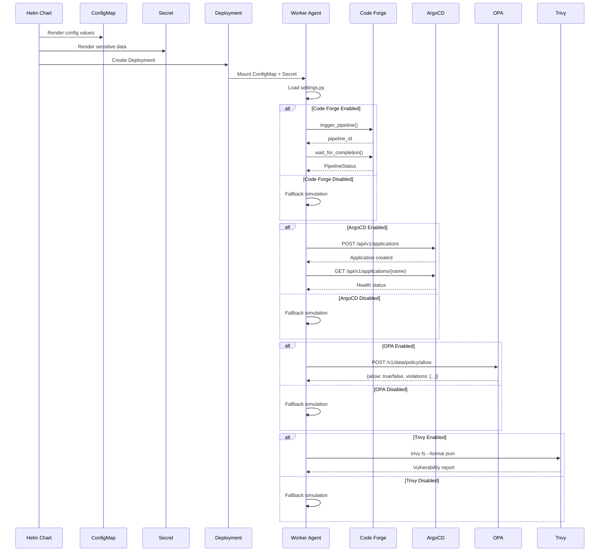

# External Tools Setup

## 1. Visão Geral



| Integração | Status | Porta | Protocolo |
|------------|--------|-------|-----------|
| Code Forge | Obrigatório | 8000 | HTTP |
| ArgoCD | Opcional | 443 | HTTPS |
| OPA | Obrigatório | 8181 | HTTP |
| Trivy | Obrigatório | CLI | - |

## 2. Code Forge Setup

- Pré-requisitos: Code Forge deployado no namespace `neural-hive-execution`.
- Configuração Helm: `config.codeForge.url`, `config.codeForge.enabled`.
- Validação: `curl http://code-forge:8000/health`.
- Troubleshooting: logs de fallback e métricas `worker_agent_build_code_forge_error`.

## 3. ArgoCD Setup

- Pré-requisitos: ArgoCD instalado com acesso à API.
- Geração de token: `argocd account generate-token --account worker-agents`.
- Configuração Helm:

```yaml
config:
  argocd:
    url: https://argocd.example.com
    enabled: true
secrets:
  argoCdToken: <base64-encoded-token>
```

- Permissões RBAC: criar AppProject `worker-agents` com permissões de deploy.
- Validação: `curl -H "Authorization: Bearer $TOKEN" $ARGOCD_URL/api/v1/applications`.
- Troubleshooting: logs `deploy_argocd_error`, `deploy_argocd_timeout`.

## 4. OPA Setup

- Pré-requisitos: OPA deployado no namespace `neural-hive-governance`.
- Políticas necessárias: `policy/allow`, `policy/resource_limits`.
- Configuração Helm: `config.opa.url`, `config.opa.enabled`.
- Exemplo de política Rego:

```rego
package policy

default allow = false

allow {
  input.resource_type == "deployment"
  input.replicas <= 10
}

violations[msg] {
  input.replicas > 10
  msg := "Replicas exceed maximum of 10"
}
```

- Validação: `curl -X POST $OPA_URL/v1/data/policy/allow -d '{"input": {...}}'`.
- Troubleshooting: logs `validation_opa_error`.

## 5. Trivy Setup

- Pré-requisitos: Trivy CLI instalado no container (já incluído no Dockerfile).
- Configuração Helm: `config.trivy.enabled`, `config.trivy.timeoutSeconds`.
- Uso: ValidateExecutor com `validation_type: sast`.
- Exemplo de parâmetros:

```json
{
  "validation_type": "sast",
  "working_dir": "/app/code"
}
```

- Validação: `trivy fs --format json /app`.
- Troubleshooting: logs `validation_sast_timeout`, `validation_sast_error`. Timeouts retornam fallback simulado (`success=true`, `metadata.simulated=true`) para manter o fluxo.

## 6. Test Execution Setup

- Whitelist de comandos: `config.testExecution.allowedCommands`.
- Segurança: validação de comandos para prevenir injection.
- Formatos de relatório suportados: JSON (pytest, jest, go test).
- Exemplo de ticket:

```json
{
  "task_type": "TEST",
  "parameters": {
    "test_command": "pytest --json-report --json-report-file=report.json",
    "working_dir": "/app/tests",
    "report_path": "report.json"
  }
}
```

## 7. Fallback Behavior

- Fallbacks seguem tabela por executor com metadata `simulated: true/false`.
- Métricas de observabilidade monitoram fallbacks para cada executor.

## 8. Troubleshooting Geral

- Checklist de conectividade: DNS, NetworkPolicy, ServiceMesh.
- Comandos úteis: `kubectl logs`, `kubectl exec`, `kubectl port-forward`.
- Métricas Prometheus: `worker_agent_*_error`, `worker_agent_*_timeout`.

## 9. Referências

- [EXECUTOR_INTEGRATION_GUIDE.md](./EXECUTOR_INTEGRATION_GUIDE.md)
- Documentação oficial: ArgoCD, OPA, Trivy.
