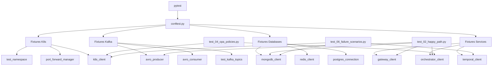
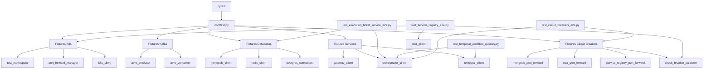

# Testes E2E - Neural Hive-Mind Fluxo C

## Visão Geral
Suite de testes end-to-end para validar o Fluxo C completo (Intent → Deploy).

## Pré-requisitos
- Cluster Kubernetes local (Kind/Minikube/Docker Desktop)
- Python 3.11+
- kubectl configurado

## Instalação
```bash
pip install -r tests/requirements-test.txt
```

## Executar Testes

### Todos os testes
```bash
pytest tests/e2e/
```

### Teste específico
```bash
pytest tests/e2e/test_02_happy_path.py::test_complete_flow_c_happy_path
```

### Apenas testes rápidos (excluir slow)
```bash
pytest tests/e2e/ -m "not slow"
```

### Com paralelização
```bash
pytest tests/e2e/ -n 4
```

## Estrutura
- `test_01_setup_validation.py`: Validação de infraestrutura
- `test_02_happy_path.py`: Fluxo completo Intent→Deploy
- `test_03_avro_serialization.py`: Validação Avro
- `test_04_opa_policies.py`: Enforcement OPA
- `test_05_ml_predictions.py`: Predições ML
- `test_06_failure_scenarios.py`: Retry, compensação, autocura
- `test_07_performance.py`: Latência e throughput

## Fixtures
Fixtures compartilhadas em `fixtures/`:
- `kubernetes.py`: Interação com K8s
- `kafka.py`: Producers/consumers Avro
- `databases.py`: MongoDB, PostgreSQL, Redis
- `services.py`: Clientes HTTP/gRPC

## Troubleshooting

### Testes falhando com timeout
- Aumentar timeout em `pytest.ini`: `timeout = 1200`
- Verificar que cluster K8s está saudável: `kubectl get pods --all-namespaces`

### Kafka não acessível
- Verificar port-forward: `kubectl port-forward -n neural-hive-kafka svc/kafka 9092:9092`

### MongoDB não acessível
- Verificar pods: `kubectl get pods -n mongodb-cluster`

## Diagrama de Arquitetura dos Testes


## Tabela de Cobertura de Testes

| Cenário | Arquivo | Testes | Duração Estimada | Prioridade |
|---------|---------|--------|------------------|------------|
| **Setup** | test_01_setup_validation.py | 8 | 2-3 min | 🔴 Crítica |
| **Happy Path** | test_02_happy_path.py | 1 (10 etapas) | 5-10 min | 🔴 Crítica |
| **Avro** | test_03_avro_serialization.py | 5 | 3-5 min | 🔴 Crítica |
| **OPA** | test_04_opa_policies.py | 5 | 5-8 min | 🟡 Alta |
| **ML** | test_05_ml_predictions.py | 6 | 10-15 min | 🟡 Alta |
| **Falhas** | test_06_failure_scenarios.py | 6 | 15-20 min | 🟡 Alta |
| **Performance** | test_07_performance.py | 6 | 20-30 min | 🟢 Média |
| **Total** | - | **37 testes** | **60-90 min** | - |

## Critérios de Sucesso
- Cobertura >80% nos serviços críticos (Orchestrator, Service Registry, Execution Ticket Service, Worker Agents)
- Taxa de sucesso >95% no CI/CD
- Suite completa executa em <90 minutos
- SLOs validados: Intent→Deploy p95 < 4h; Enforcement OPA; Predições ML; Autocura <90s

---

## Novos Testes E2E (P1.4)

### Service Registry E2E
- **Arquivo**: `test_service_registry_e2e.py`
- **Testes**: 12
- **Duração**: 15-20 min
- **Cobertura**: Registro, heartbeat, discovery, deregister, cache, pheromone scoring, circuit breaker

### Execution Ticket Service E2E
- **Arquivo**: `test_execution_ticket_service_e2e.py`
- **Testes**: 18
- **Duração**: 20-25 min
- **Cobertura**: CRUD, queries, status transitions, JWT tokens, dual persistence, índices

### Temporal Workflow Queries
- **Arquivo**: `test_temporal_workflow_queries.py`
- **Testes**: 6
- **Duração**: 10-15 min
- **Cobertura**: Query get_status(), get_tickets(), HTTP queries, error handling

### Circuit Breakers E2E
- **Arquivo**: `test_circuit_breakers_e2e.py`
- **Testes**: 8
- **Duração**: 15-20 min
- **Cobertura**: MongoDB, OPA, Service Registry circuit breakers, transições de estado, métricas

### Executar Novos Testes

```bash
# Todos os novos testes
pytest tests/e2e/test_service_registry_e2e.py \
       tests/e2e/test_execution_ticket_service_e2e.py \
       tests/e2e/test_temporal_workflow_queries.py \
       tests/e2e/test_circuit_breakers_e2e.py -v

# Apenas Service Registry
pytest tests/e2e/test_service_registry_e2e.py -v

# Apenas Execution Ticket Service
pytest tests/e2e/test_execution_ticket_service_e2e.py -v

# Apenas Circuit Breakers
pytest tests/e2e/test_circuit_breakers_e2e.py -v

# Excluir testes lentos
pytest tests/e2e/test_service_registry_e2e.py -m "not slow" -v
```

### Tabela de Cobertura Atualizada

| Cenário | Arquivo | Testes | Duração Estimada | Prioridade |
|---------|---------|--------|------------------|------------|
| **Setup** | test_01_setup_validation.py | 8 | 2-3 min | 🔴 Crítica |
| **Happy Path** | test_02_happy_path.py | 1 (10 etapas) | 5-10 min | 🔴 Crítica |
| **Avro** | test_03_avro_serialization.py | 5 | 3-5 min | 🔴 Crítica |
| **OPA** | test_04_opa_policies.py | 5 | 5-8 min | 🟡 Alta |
| **ML** | test_05_ml_predictions.py | 6 | 10-15 min | 🟡 Alta |
| **Falhas** | test_06_failure_scenarios.py | 6 | 15-20 min | 🟡 Alta |
| **Performance** | test_07_performance.py | 6 | 20-30 min | 🟢 Média |
| **Service Registry** | test_service_registry_e2e.py | 12 | 15-20 min | 🟡 Alta |
| **Execution Ticket** | test_execution_ticket_service_e2e.py | 18 | 20-25 min | 🟡 Alta |
| **Temporal Queries** | test_temporal_workflow_queries.py | 6 | 10-15 min | 🟡 Alta |
| **Circuit Breakers** | test_circuit_breakers_e2e.py | 8 | 15-20 min | 🟡 Alta |
| **Total** | - | **81 testes** | **120-170 min** | - |

### Fixtures Adicionadas

Nova fixture em `fixtures/circuit_breakers.py`:
- `mongodb_port_forward`: Port-forward para MongoDB
- `opa_port_forward`: Port-forward para OPA
- `service_registry_port_forward`: Port-forward para Service Registry
- `etcd_port_forward`: Port-forward para etcd
- `postgresql_tickets_port_forward`: Port-forward para PostgreSQL
- `redis_port_forward`: Port-forward para Redis
- `circuit_breaker_validator`: Helper para validar estado de circuit breakers

### Diagrama de Arquitetura Atualizado


